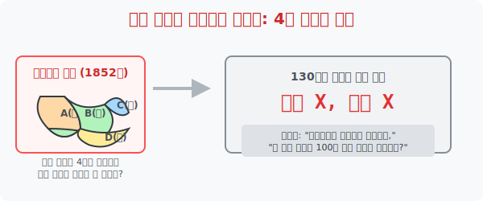
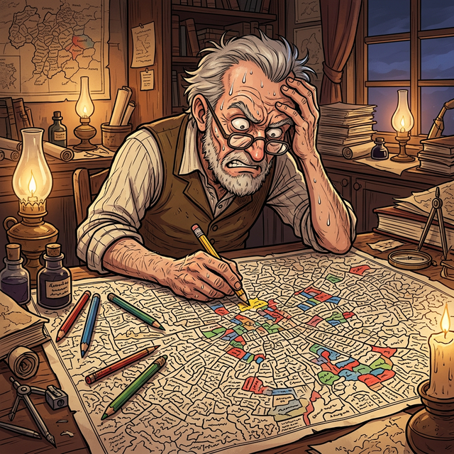

# 1. 지도를 칠하는 가장 완벽한 방법: 4색 문제의 시작 (Origin)

## [도입부] 학습 목표 (Learning Objectives)
- "아무리 복잡하게 그려진 세계 지도라도, 딱 **4가지 색연필**만 있으면 맞닿은 이웃 나라끼리 색이 평생 겹치지 않게 모조리 칠할 수 있을까?" 라는 역사상 가장 직관적이고 도발적인 난제를 영접합니다.
- 영국의 식물학도 프랜시스 구스리(Guthrie)가 영국의 주(County) 지도를 색칠하다가 던진 이 단순한 질문이 어떻게 130년 동안 전 세계 톱클래스 천재 수학자들의 무덤이 되었는지 역사를 파헤칩니다.
- 파이썬(Python)의 기초 그래프 자료구조를 셋업하며, 구역(나라)과 인접성(국경선)을 코딩으로 모델링하여 색상 검증 알고리즘을 구축할 준비를 합니다.

---

## 1. 지도를 칠하다 발견한 악마의 질문

1852년 영국의 구스리라는 형제는 여가 시간으로 영국 지도를 여러 색깔로 칠하고 있었습니다. 색칠의 가장 기본 룰은 하나였습니다. **"국경선이 맞닿아 있는 두 나라는 서로 색깔이 달라야 구분된다."** (단, 점 꼭짓점 하나로만 맞닿은 나라는 예외로 같은 색을 칠해도 됨)

칠하다 보니 신기한 현상을 발견했습니다. 아프리카 대륙처럼 나라가 정신없이 수천 개 쪼개져 있어도, 5개, 6개의 색연필을 쓸 필요가 없었습니다. **단 4개의 색연필(빨강, 파랑, 노랑, 초록)**만 있으면 그 거대하고 더러운 지도 전체를 완벽하게 구별해서 칠할 수 있었던 것입니다. 

구스리는 동생에게 물었습니다. *"이거 우연이야? 아니면 세상의 모든 지도는 4가지 색으로 무조건 칠해지는 수학적 규칙이 있는 거야?"*

동생의 교수였던 최고 수학자 드 모르간(De Morgan) 교수에게 이 질문이 넘어갔을 때, 수학계는 "금방 증명하겠지 뭐"라고 웃어넘겼습니다. 그러나 이 오만함은 곧 **130년간 풀리지 않는 처절한 악몽** 의 시작이었습니다.



<br>

## 2. 너무 쉬워서 더 미쳐버리는 난제



1852년, 영국의 식물학자 프랜시스 구스리(Francis Guthrie) 는 영국 지도를 구경하다가 문득 하찮은 상상 하나를 합니다.
*"지도에 색칠을 할 때, 국경선이 닿아있는 나라끼리는 헷갈리지 않게 다른 색을 칠해야 하잖아? 그런데 지도를 아무리 미친 듯이 복잡하게 쪼개 놔도, 결국 **빨강, 파랑, 노랑, 초록 딱 4가지 색깔**만 있으면 모든 나라를 다 칠할 수 있을 것 같은데?"**'모든 무한개의 지도 패턴'** 을 다 확인해서 4가지 색으로 가능하다는 완벽한 논리 공식을 적어내야 했습니다.
- **반증하려면:** "이 지도는 5가지 색깔이 필요한데요?" 라는 단 1개의 찌그러진 영토 그림 **(반례, Counterexample)** 하나만 도화지에 그리면 이 문제는 박살 나고 끝납니다.

온 세계 수학자와 일반인 너드(Nerd)들이 "내가 5색이 필요한 괴물 지도를 그려보마!" 라며 수십만 개의 복잡한 미로 지도를 그렸습니다. 하지만 그 어떤 엽기적인 지도를 그려도 결국엔 4가지 색 선에서 모두 평정되어 버렸습니다. **반례는 단 1개도 나오지 않았고, 그렇다고 이걸 전부 통과하는 논리 공식은 구하지 못하는** 기이한 좀비 상태가 100년 넘게 지속됩니다.

---

## 3. 💻 파이썬(Python)으로 알아보는 '인접성' 검증

인간이 도화지에 그린 '지도'를 컴퓨터가 판별하려면, "A나라와 B나라가 국경선이 닿아있는가?" 를 표현해 내는 자료구조인 딕셔너리(그래프) 모델링이 선행되어야 합니다.

### 🐍 파이썬 예제: 지도 국경선 위반 자동 색출 시스템

```python
print("--- 🗺️ 세계 지도 국경 배색 침해 스캐너 ---")

# (데이터 셋) 나라 4개가 서로 맞닿은 국경선 정보를 딕셔너리로 저장
# A는 B, C, D와 닿아있고, B는 A, C 등등...
map_borders = {
    'A': ['B', 'C', 'D'],
    'B': ['A', 'C'],
    'C': ['A', 'B', 'D'],
    'D': ['A', 'C']
}

# (데이터 셋) 누군가 색연필로 칠한 결과값 (A:빨강, B:파랑, C:빨강, D:노랑)
painted_colors = {
    'A': 'Red',
    'B': 'Blue',
    'C': 'Red',     # 🚨 에러 유발 인자! C가 A와 같은 빨간색임
    'D': 'Yellow'
}

error_found = False

print("[스캔 가동] 인접 국가 간 깔맞춤(규정 위반)이 있는지 검사합니다...\n")

for country, neighbors in map_borders.items():
    my_color = painted_colors[country]
    for n in neighbors:
        neighbor_color = painted_colors[n]
        if my_color == neighbor_color:
            print(f"💥 [경고] {country}국({my_color})과 인접한 {n}국({neighbor_color})의 색깔이 겹칩니다! 국경 구별 불가!")
            error_found = True

if not error_found:
    print("✅ 통과! 완벽한 채색입니다.")

# 결과창:
# --- 🗺️ 세계 지도 국경 배색 침해 스캐너 ---
# [스캔 가동] 인접 국가 간 깔맞춤(규정 위반)이 있는지 검사합니다...
# 
# 💥 [경고] A국(Red)과 인접한 C국(Red)의 색깔이 겹칩니다! 국경 구별 불가!
# 💥 [경고] C국(Red)과 인접한 A국(Red)의 색깔이 겹칩니다! 국경 구별 불가!
```

이처럼 파이썬에서 지도는 물감이 묻어있는 '그림' 파일이 아니라, 단어 간의 끈끈한 결속 관계가 명시된 `Dictionary` (그래프 망) 텍스트 파일 데이터로 압축 번역되어 훗날 방대한 색칠 알고리즘에 투입될 기초 체력을 형성합니다.

---

## [결론] 학습 정리 (Summary)

1. **난제의 본질**: "평면에 그려진 모든 지도는 이웃한 구역을 다르게 칠할 때 4개의 색이면 충분하다"는 단 한 줄의 명제로, 이해하기는 세상에서 가장 쉽지만 증명하기는 지옥불인 수학계 특이점 난제입니다.
2. **반례의 부재**: 세계 최고의 지능 천재들이 그토록 눈에 불을 켰음에도 "5개가 필요한 괴상한 영토"를 단 하나도 그려내지 못함으로써 이 4색 정리는 우주의 절대 진리일 것이라는 강력한 심증을 낳았습니다.
3. **컴퓨터 과학의 모태**: 나라들의 인접 여부를 다루는 이 찌그러진 도화지의 장난질은 훗날 스티브 잡스와 해커들이 세상을 지배하는 **'네트워크 알고리즘', '그래프 이론(Data Structure)'**으로 개화하는 위대한 씨앗이 됩니다.
