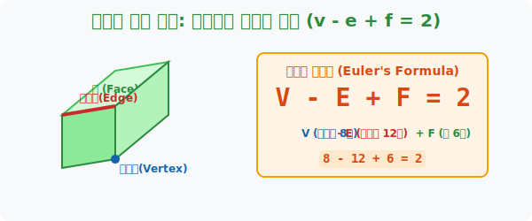
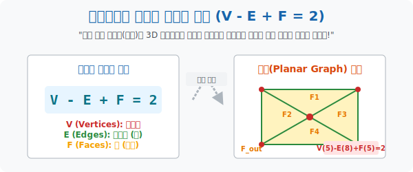

# 2. 지도의 뼈대 해체: 꼭짓점, 모서리, 면의 관계 (Euler's Formula)

## [도입부] 학습 목표 (Learning Objectives)
- 4색 문제를 박살 내기 위한 가장 핵심적인 기초 무기, 스위스의 천재 수학자 오일러가 제창한 **'다가형/기하학의 절대 신분증 공식: $V - E + F = 2$'** 의 패턴을 확인합니다.
- 꼭짓점(Vertex), 모서리(Edge), 면(Face)이라는 기하학적 블록 세 조각이 우주에 존재하는 모든 입체 도형과 평면 지도의 뼈대를 어김없이 통제하고 있음을 깨닫습니다.
- 파이썬(Python) 반복 검증 엔진으로 찌그러진 오징어 모양의 지도든 축구공이든 전부 해체해 보아도, $V - E + F$ 값이 끝내 `2` 가 산출되는 불변의 법칙을 렌더링 스크린으로 확인합니다.

---

## 1. 지도는 결국 찌그러진 도형일 뿐이다

수학자들은 100년 넘게 4색 증명을 실패하다가 깨달음을 얻습니다. "지도를 나라 구역별로 색연필로 칠한다고 생각하니까 인간의 뇌가 멘붕이 온다. 지도를 그냥 투명한 **점, 선, 면 3종 세트** 로 압축해서 골격만 해부해 버리자!"

이 아이디어는 역사상 가장 위대한 천재 오일러(Euler)가 남겼던 대발견에서 영감을 얻었습니다. 여러분이 주사위(정육면체) 를 손에 쥐었다고 칩시다. 
- 뾰족하게 튀어나온 **꼭짓점(Vertex: $V$)** 은 몇 개? $\rightarrow$ 8개
- 날카롭게 베이는 선분 **모서리(Edge: $E$)** 의 갯수는? $\rightarrow$ 12개
- 평평하게 손바닥에 닿는 **면(Face: $F$)** 구역은? $\rightarrow$ 6개

오일러는 이것들을 더하고 빼고 장난치다가 우주 급 소름이 돋는 마법 수식을 발견했습니다.
**$$ V - E + F = 8 - 12 + 6 = \mathbf{2} $$**
놀랍게도 피라미드, 축구공, 다이아몬드, 심지어 **국경선이 그물망처럼 쳐져 있는 납작한 '지도' 의 영역조차도** 바깥면(바다)의 갯수 1장을 추가해 주면 $V - E + F = 2$ 라는 공식 안에 완벽히 구속된다는 것을 밝혀냈습니다.



<br>

## 2. 오일러 공식이 4색 문제 증명의 무기가 된 이유



영국의 지도제작자가 던진 이 하찮은 색칠 놀이가 위대한 오일러 다면체 정리와 도대체 무슨 상관일까요? 놀랍게도 **"지구본(구)의 겉면에 그려진 지도" 나 "풍선(구) 위에 그려놓은 정다면체의 모서리들" 은 기하학적으로 완벽히 동일한 위상(Topology)** 을 갖기 때문입니다.
오일러의 $V - E + F = 2$ 공식이 뭐가 그렇게 대단해서 4색 문제를 박살 낼 칼자루가 되었을까요? 이 공식은 수학자들에게 **"이 우주에 아무리 미친놈이 와서 국경선을 더럽게 치고 나라를 쪼개도, 선과 점의 비율에는 절대다수의 한계점이 존재한다."** 라는 보증 수표가 되었습니다.

아무리 복잡하게 지도를 만들어도, 이 오일러 공식의 테두리를 벗어날 수 없기 때문에 훗날 **"지도의 모든 나라가 국경선을 6개 이상 가지는 뚱뚱한 그물망은 우주 논리상 그려낼 수 없다."** 라는 치명적인 급소를 타격하는 수학적 논리(그래프 이론)로 폭풍 진화하게 됩니다.

---

## 3. 💻 파이썬(Python) 오일러 등식 무결성 스캐너

세상에 존재하는 3D 폴리곤 입체 자산들이나 2D 국경 지도들이 오일러 공식($2$)을 빗겨 나가면 이는 기하학적 버그(구멍 난 모델링) 임을 시사합니다.

### 🐍 파이썬 예제: 폴리곤 자산 렌더링 검수 시스템

```python
print("--- 📐 오일러 입체 기하학 마스터 알고리즘 스캔 ---")

# (데이터 셋) 이름: [V(꼭짓점), E(모서리선), F(표면)]
polyhedrons = {
    "정사면체(삼각뿔)": [4, 6, 4],
    "정육면체(주사위)": [8, 12, 6],
    "정팔면체(보석)": [6, 12, 8],
    "축구공 타일패턴": [60, 90, 32], # (탄소 동소체 풀러렌 구조)
}

print("▶ 스크리닝 가동: (V - E + F) 가 모두 '2' 로 수렴하는가?")
print("-" * 50)

for name, data in polyhedrons.items():
    V = data[0]
    E = data[1]
    F = data[2]
    
    # 🚨 오일러 치명타 공식 가동
    euler_number = V - E + F
    
    if euler_number == 2:
        print(f" [PASS] {name}  (V:{V} - E:{E} + F:{F} = {euler_number}) -> 완벽한 폐곡면 기하학!")
    else:
        # 이 분기문에 들어오는 도형은 찢어지거나 블랙홀이 난 버그 데이터입니다.
        print(f" [ERROR] 버그 폴리곤 적발! 오일러 십자가 훼손!")

# 결과창:
# --- 📐 오일러 입체 기하학 마스터 알고리즘 스캔 ---
# ▶ 스크리닝 가동: (V - E + F) 가 모두 '2' 로 수렴하는가?
# --------------------------------------------------
#  [PASS] 정사면체(삼각뿔)  (V:4 - E:6 + F:4 = 2) -> 완벽한 폐곡면 기하학!
#  [PASS] 정육면체(주사위)  (V:8 - E:12 + F:6 = 2) -> 완벽한 폐곡면 기하학!
#  [PASS] 정팔면체(보석)  (V:6 - E:12 + F:8 = 2) -> 완벽한 폐곡면 기하학!
#  [PASS] 축구공 타일패턴  (V:60 - E:90 + F:32 = 2) -> 완벽한 폐곡면 기하학!
```

이 $V - E + F = 2$ 공식은 훗날 4색 정리를 증명하기 위해 컴퓨터를 3천 시간이나 미친 듯이 연산시켰던 알고리즘의 최하단에 새겨진 방어 시스템 엔진 룸 코어(Core)입니다.

---

## [결론] 학습 정리 (Summary)

1. **지도의 뼈대 분해**: 색칠되어있는 지도의 영토 면적 사이즈 따위는 하등 중요치 않으며, 국경선이 꺾이는 교차점(꼭짓점), 두 점을 잇는 국경 실선(모서리), 갇혀있는 영토(면) 의 숫자들만이 수학 증명의 핵심 부품이 됩니다.
2. **오일러 공식의 마법**: 정다면체부터 평평한 종이 지도까지, 도형이 외계인 수준으로 일그러지거나 국경이 100만 갈래로 찢어져도 절묘하게 점, 선, 면의 가감 연산자는 무조건 2로 귀결되는 기하학의 절대 신세계를 접합니다.
3. **4색 증명의 이정표**: 더 이상 머리를 쥐어뜯으며 크레파스로 색을 칠해볼 것이 아니라, 오일러 공식이 박아넣은 **"극단적인 점선 구도의 한계치 제약"**을 수학적으로 건드려 "무한개의 지도는 불가능하다"는 압축 전략의 길이 열리게 됩니다.
