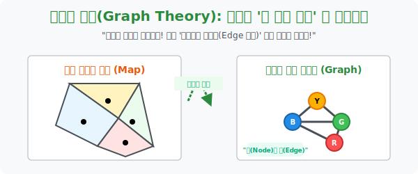

# 4. 지도를 은하계로 압축하다: 그래프 이론 (Graph Theory)

## [도입부] 학습 목표 (Learning Objectives)
- 들쑥날쑥, 크기와 모양이 천차만별인 현실의 지저분한 '지도' 그림들을 수학자들이 어떻게 통제 가능한 텍스트 데이터의 **순수 점(Node)과 선(Edge)**, 즉 **'그래프 이론'** 으로 환골탈태시켰는지 확인합니다.
- 거대한 러시아든 코딱지만 한 바티칸 시국이든 평등하게 점 하나(1 Point)로 박아버리는 이 매스매틱스적 극압축이 인공지능이 무한대로 지도를 복제하고 계산하는 속도를 1억 배 빠르게 만들었음을 관찰합니다.
- 파이썬(Python)의 `NetworkX` 형태의 기본 코드를 모델링하며, 2D 그림 파일이 배열(Matrix)과 컴퓨터 코드망으로 박제되는 놀라운 정보 압축의 섭리를 경험합니다.

---

## 1. 지도의 껍데기를 날려라 (추상화의 기적)

수학자들이 4색 문제를 100년 넘게 헤맨 이유 중 하나는 아프리카 지도, 유럽 분쟁 지역 지도 등 영토의 넓이, 해안선의 더러운 곡선 등 "색칠과는 하등 관계가 없는 그래픽 데이터"에 시선을 빼앗겼기 때문입니다.
19세기 후반, 수학의 천재들은 구불구불한 영토 그림의 껍데기를 완전히 벗겨내고 미로 같은 점성술지도, 즉 **'그래프(Graph)'** 로 압축하는 혁명적인 렌즈를 개발합니다. 

이들이 발명한 데이터 압축 룰은 딱 두 가지입니다.
- **[국가 = 꼭짓점(Node)]:** 나라 크기가 남한이든 미국이든 상관없이, 모든 나라는 우주 공간의 빛나는 **'점 딱 한 개'** 로 찍혀 버립니다!
- **[국경선 = 연결선(Edge)]:** 두 나라가 국경선을 맞대고 닿아있으면, 두 점 사이를 레이저 빔 같은 **'선'** 하나로 찍 하고 연결합니다.

이렇게 변환 엔진을 거치면, 복잡하기 짝이 없던 대한민국의 시도 지역 지도가 마치 별들을 이어놓은 점성술의 '자리(Constellation)' 별자리망 처럼 투명하고 아름다운 수백 개의 선과 점들의 네트워크로 앙상하게 렌더링 됩니다.

<br>

## 2. 그래프 이론: 색칠 문제를 '선 잇기 퍼즐'로 치환하다



4색 문제의 거장들은 더 이상 '지도(Map)' 의 울퉁불퉁한 경계선이나 강, 산의 구불구불함 따위에 집착하지 않았습니다. 
모든 지도를 **노드(Node, 꼭짓점)** 와 **엣지(Edge, 선)** 로 치환해 버렸습니다.

**"점성술의 무수한 별(국가)들에 빨/파/노/초 색깔을 입혀라. 단, 레이저 선(국경)으로 단단히 묶여 연결된 두 개의 점은 절대 같은 색깔을 빛낼 수 없게 세팅해라."**

이 **'그래프 이론(Graph Theory)'** 변환 덕분에, 20세기의 컴퓨터들은 지저분하고 메모리 용량이 터져나가는 이미지 픽셀 맵(Image Map)을 버리고 가벼운 텍스트 배열 정보만 먹고 소화하면서 4색 문제를 슈퍼컴퓨팅으로 무한 연산할 수 있는 발판을 완성했습니다.

---

## 3. 💻 파이썬(Python) 노드 네트워크(Network) 행렬화 엔진

페이스북의 인맥 친구 추천 시스템이나 내비게이션 길 찾기 최단 거리 시스템은 모조리 파이썬을 이용해 현실 세계를 '점과 선'의 망(그래프) 데이터로 번역하는 것으로부터 시작합니다.

### 🐍 파이썬 예제: 한국/중국/일본 영토의 그래프 변수 치환 로직

```python
print("--- 🌐 2D 지도의 텍스트 그래프(Graph) 데이터 무손실 압축기 ---")

# (상황) 한국, 북한, 중국, 일본, 러시아의 국경선 맞닿음 정보를
# 파이썬 컴퓨터 메모리에 '딕셔너리 리스트' 행렬 자료로 영구 박제시킴!
# 점(Node) = 국가 이름
# 선(Edge) = 리스트 안에 들어간 타국과의 연결(인접) 여부

asia_graph = {
    '남한(KOR)': ['북한(PRK)'],                                  # 일본은 국경이 해협이므로 연결안됨
    '북한(PRK)': ['남한(KOR)', '중국(CHN)', '러시아(RUS)'], 
    '중국(CHN)': ['북한(PRK)', '러시아(RUS)'],
    '러시아(RUS)': ['북한(PRK)', '중국(CHN)'],
    '일본(JPN)': []                                           # 섬나라이므로 국경선으로 닿은 점(Edge)이 0개
}

print("▶ 스캔 완료: 5개의 국가 노드(Point)가 시스템에 안착.")
print("-" * 50)

# 압축된 그래프 데이터를 뺑뺑이 돌리며 레이저 망(국경) 검문
for point_node, connected_edges in asia_graph.items():
    border_cnt = len(connected_edges)
    print(f" 🕹️ 점(Node) [{point_node}] => 총 {border_cnt} 가닥의 선(Edge)이 사방으로 뻗어 나감!")
    print(f"     -> 이어진 이웃 점들: {connected_edges}\n")

# 결과창:
# --- 🌐 2D 지도의 텍스트 그래프(Graph) 데이터 무손실 압축기 ---
# ▶ 스캔 완료: 5개의 국가 노드(Point)가 시스템에 안착.
# --------------------------------------------------
#  🕹️ 점(Node) [남한(KOR)] => 총 1 가닥의 선(Edge)이 사방으로 뻗어 나감!
#      -> 이어진 이웃 점들: ['북한(PRK)']
# 
#  🕹️ 점(Node) [북한(PRK)] => 총 3 가닥의 선(Edge)이 사방으로 뻗어 나감!
#      -> 이어진 이웃 점들: ['남한(KOR)', '중국(CHN)', '러시아(RUS)']
# 
#  ... [중략] ...
# 
#  🕹️ 점(Node) [일본(JPN)] => 총 0 가닥의 선(Edge)이 사방으로 뻗어 나감!
#      -> 이어진 이웃 점들: []
```

보잘것없어 보이는 이 텍스트 망 구조 코딩이 인류 수학사에 혁명을 가져왔습니다. 컴퓨터는 이 배열만 스캔하면 어느 나라들을 서로 묶어 색칠(할당)해야 충돌이 없는지를 1초 만에 백만 번의 경우의 수로 굴려댈 수 있는 무한의 두뇌를 얻었습니다.

---

## [결론] 학습 정리 (Summary)

1. **그래프 이론의 기적 (버리기 미학)**: 복잡계 통계학에서 그림(영토)의 넓이, 인구수, 꼬불꼬불한 해안선의 미적 찌꺼기를 전부 칼로 도려내고, 오직 **'누가 누구와 닿아 있는가?'** 라는 본질 데이터인 [노드와 선] 두 가지만 극한으로 남긴 추상화의 정점입니다.
2. **별자리가 된 지도 (네트워크)**: 4색 정리를 풀기 위해 탄생한 이 지도 망 분해법은 훗날 이 세상의 인공지능, 인터넷 케이블 망, 전염병 확산 경로 예측 알고리즘 등 세상을 통제하는 모든 'IT 네트워크 아키텍처'의 심장으로 진화했습니다.
3. **색칠 미션의 컴퓨터 재번역**: "국경이 맞닿은 두 영토는 다르게 색칠하라"는 미션이, "1개의 선(Edge)으로 직결된 두 점(Node)은 각자 다른 ID 값(Color)을 메모리에 부여받아야 한다" 로 기계어로 완벽 매칭 트랜스레이트 되었습니다.
