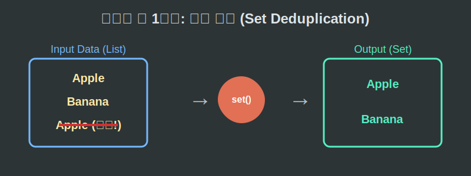

# 01. 첫 번째 수업: 집합(Set)의 탄생

수학은 우주의 모든 사물과 개념들을 논리적으로 정리하고 분류하는 학문입니다. 
우리가 서랍장을 정리할 때 '양말 칸', '티셔츠 칸'을 나누어 담듯이, 수학자들도 수많은 숫자와 대상들을 다루기 위해 **명확한 기준을 가진 바구니**를 만들어 냈습니다. 이 바구니가 바로 **집합(Set)**입니다.

---

## 학습 목표
* '집합(Set)'이 되기 위한 필수 조건인 '분명한 기준'명확성을 이해합니다.
* 파이썬(Python) 프로그래밍의 `set()` 함수가 수학의 집합론을 어떻게 완벽하게 구현하는지 확인합니다.
* 원소(Element)의 수학 기호 $\in$ 의 유래를 가볍게 짚어봅니다.

## 1. 누구에게나 공평한 '기준'

다음 중 수학적으로 **'집합'**인 것은 무엇일까요?

1. 우리 반에서 **키가 큰** 학생들의 모임
2. 우리 반에서 **잘생긴** 남학생들의 모임
3. 우리 반에서 키가 **160cm 이상**인 학생들의 모임

1번과 2번 바구니는 수학 세계에서 인정받지 못합니다. "키가 크다"거나 "잘생겼다"는 기준은 사람마다 다르기 때문입니다.
오직 3번처럼 **모든 사람이 동의할 수 있는 객관적이고 분명한 조건**이 있을 때만 완벽한 수학적 집합으로 인정받습니다.

<div align="center">
  
</div>

데이터 과학자들은 하루에도 수백만 개의 데이터를 다룹니다. 기준이 모호한 쓰레기 데이터가 섞여 들어가면 인공지능이 망가져 버리기 때문에, 현대 IT 기술에서 이 '명확한 기준(조건문)'은 논리의 생명줄과 같습니다.

## 2. 모임을 이루는 식구들: 원소 (Element)

그렇게 만들어진 '160cm 이상 학생 집합' 바구니를 $A$라고 이름 붙여 봅시다. 
이 바구니 안에 들어가는 철수(165cm), 영희(161cm) 같은 개별 아이템들을 수학에서는 **원소(Element)**라고 부릅니다. 
"철수는 집합 $A$의 식구야!" 라는 긴 말을 수학자들은 삼지창 모양의 기호 하나로 깔끔하게 압축합니다.

> 철수 $\in A \quad$ (철수는 집합 $A$에 속한다)
> 민수 $\notin A \quad$ (155cm인 민수는 집합 $A$에 속하지 않는다)

이 $\in$ 기호는 Element(원소)의 첫 글자인 $E$를 둥글게 멋 부리며 쓴 것입니다. 수학 기호들은 사실 엄청난 귀차니즘을 압축하기 위해 탄생한 암호와 같습니다.

## 3. 파이썬과 집합의 마법 (Deduplication)

이제 19세기에 탄생한 집합론이 21세기 파이썬(Python) 프로그래밍 언어에서 얼마나 아름답게 구현되는지 코드로 느껴봅시다.
파이썬의 `set()` 바구니는 수학 집합의 가장 큰 절대 규칙인 **"중복 불허"**를 소름 돋게 똑같이 따릅니다. 

마블 영화 예매자의 명단을 살펴봅시다. 아이언맨을 좋아하는 철수가 예매 버튼을 3번이나 연속해서 눌렀습니다.

<div align="center">
  
</div>

```python
# 파이썬으로 경험하는 수학의 깐깐한 집합(Set) 바구니 

# 티켓 구매 데이터 원본 (철수 세 명 중복!)
raw_data = ["철수", "영희", "민수", "철수", "철수"]

# 파이썬 수학 마법의 바구니 set()에 데이터를 던져넣어보자
ticket_set = set(raw_data)

# 과연 결과는 어떻게 될까?
print(f"가공 전 티켓 구매 내역: {raw_data}")
print(f"집합(set)으로 걸러낸 내역: {ticket_set}")

# 결과 출력
# 가공 전 티켓 구매 내역: ['철수', '영희', '민수', '철수', '철수']
# 집합(set)으로 걸러낸 내역: {'영희', '민수', '철수'}
```

파이썬의 `set`은 바구니에 데이터를 담는 순간, 알아서 똑같은 데이터를 단 한 개만 남기고 모두 삭제해 버립니다.
수학의 집합 바구니는 $\{1, 1, 2\}$라고 쓰지 않고 반드시 $\{1, 2\}$ 라고 쓰는 이 위대한 명제가 현대 프로그래머들의 야근을 막아주고 있습니다.

## 학습 정리
1. **집합(Set)의 절대 조건**: 대상이 무엇인지 누구나 알 수 있는 '분명한 객관적 기준'을 통해서만 만들어지는 완벽한 모임이다.
2. **원소(Element)**: 집합 바구니 안에 들어있는 낱개의 데이터들이며, 소속됨을 알리기 위해 $E$에서 따온 $\in$ 기호를 사용한다.
3. 파이썬의 중괄호 `{}`나 `set()` 명령론은 동일한 원소를 여러 번 담지 않는 수학적 원리를 코드로 계승하여 '빠른 중복 제거 필터'로 강력하게 활용된다.
