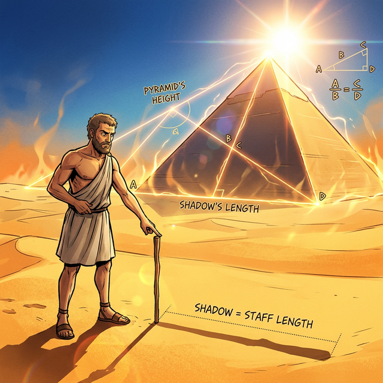

# 00. 가장 완벽한 구조, 삼각형의 탄생 (Intro)

점 세 개만 있으면 우주 어디에서든 평면을 하나 만들어 낼 수 있습니다.
삼각형은 우주에서 가장 단순한 다각형이면서 동시에 **가장 튼튼한 구조(안정성)**를 가지고 있습니다. 사각형은 모서리를 누르면 찌그러지지만, 삼각형은 세 변의 길이가 정해지는 순간 그 모양이 하늘이 두 쪽 나도 절대 찌그러지지 않습니다. 

이 때문에 현대의 3D 게임 그래픽(폴리곤), 거대한 에펠탑 같은 건축물의 뼈대(트러스 구조)는 모두 삼각형으로 이루어져 있습니다.

---

## 학습 목표
* 고대 철학자 탈레스(Thales)가 삼각형의 그림자로 피라미드의 높이를 잰 역사적 일화를 배웁니다.
* 삼각형이 현대 3D 컴퓨터 그래픽스와 건축 구조에서 왜 필수불가결한 단위로 쓰이는지 직관적으로 이해합니다.

## 1. 피라미드의 그림자를 밟은 남자

기원전 약 600년 전, 고대 그리스의 철학자이자 수학자인 탈레스는 이집트로 여행을 떠났습니다.
이집트의 파라오는 자신의 위대함을 뽐내기 위해 거대한 피라미드를 만들어 두었는데, 이 피라미드의 꼭대기까지 올라갈 수 있는 방법이 없으니 누구도 진짜 '높이'를 알지 못했습니다. 파라오는 그리스에서 온 똑똑한 학자인 탈레스에게 피라미드의 높이를 재보라고 시험했습니다.

탈레스는 해가 높이 뜬 낮 시간에 아주 짧은 지팡이 하나를 땅에 꽂았습니다. 그리고 기다렸습니다. 
**"시간이 지나 지팡이의 그림자 길이가 지팡이의 실제 길이와 똑같아지는 순간!"**

탈레스는 곧바로 달려가 모래밭에 드리워진 거대한 피라미드의 그림자 길이를 걸음걸이로 잰 후, 파라오에게 외쳤습니다. 
> "태양 빛이 만들어낸 거대한 직각삼각형(피라미드)과 제 작은 지팡이가 만들어낸 직각삼각형의 비율은 완벽하게 일치합니다. 따라서 지금 바닥에 깔린 피라미드의 그림자 길이가 바로 피라미드의 진짜 높이입니다!"

  

인류 최초로 기하학(Geometry)의 '닮음' 원리를 이용해 손에 닿지 않는 거대한 우주의 크기를 측정한 경이로운 순간이었습니다.

## 2. 컴퓨터 폴리곤(Polygon)의 기원

수천 년 전 탈레스가 연구했던 2D 삼각형의 법칙들은 현대에 와서 3차원 가상 현실 세계를 구축하는 1등 공신이 되었습니다.
여러분이 즐겨 하는 고해상도 3D 게임 속 화려한 몬스터나 자동차의 표면을 아주아주 아주 크게 확대해 보면, 전부 수백만 개의 미세한 **삼각형(Polygon, 폴리곤)**들이 거미줄처럼 이어져 만들어진 것들입니다.

컴퓨터 그래픽스 엔진(예: 언리얼 엔진, 파이썬의 OpenGL)은 빛이 떨어질 때 생기는 명암과 질감을 이 '삼각형 픽셀' 단위 하나하나에 피타고라스 정리와 삼각함수를 곱하여 순식간에 계산해 냅니다. 고대 그리스의 지식을 실리콘 반도체 칩셋이 그대로 수행하고 있는 셈입니다.

우리는 이제부터 그 마법 같은 화면 렌더링에 쓰이는 삼각형의 가장 기초적인 두 가지 스킬, **합동(Congruence)**과 **닮음(Similarity)**을 만나보러 갑니다.

## 학습 정리
1. **가장 안정적인 다각형**: 변 3개와 각 3개로 만들어진 삼각형은, 한 번 형태가 고정되면 외부 압력에도 쉽게 모양이 무너지지 않는 가장 튼튼하고 근본적인 도형이다.
2. **그림자로 잰 피라미드**: 탈레스는 빛과 그림자가 만들어내는 시각적 '닮음(비율)' 성질을 이용해 손이 닿지 않는 피라미드의 높이를 자 없이 정확히 계산해 냈다.
3. **3D 폴리곤의 뼈대**: 현대 3D 모델링은 곡선을 전부 점 3개짜리 '삼각형 픽셀(폴리곤)'들로 쪼갠 뒤, 삼각형의 합동과 닮음 공식을 컴퓨터 그래픽 카드가 연산하여 빛과 공간을 입체적으로 그려낸다.
