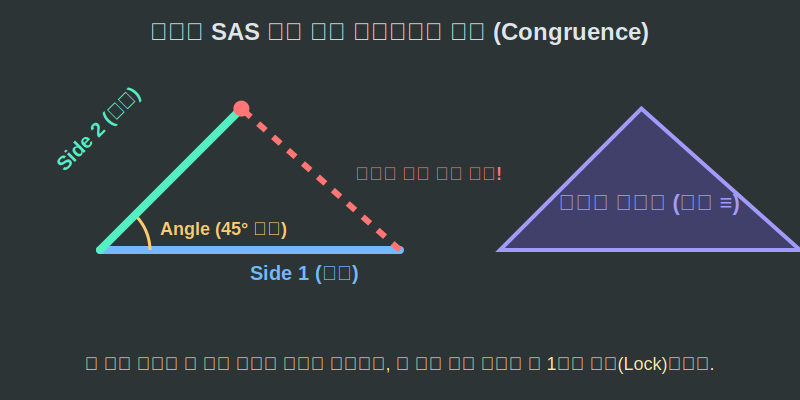

# 01. 첫 번째 수업: 복제의 마법, 삼각형의 합동 (Congruence)

스마트폰 공장에서 하루에 10만 대의 스마트폰을 똑같이 찍어낼 수 있는 이유는 무엇일까요? '완벽하게 동일한 규격의 금형(틀)'이 존재하기 때문입니다.
수학에서도 두 도형이 **크기와 모양이 완전히 똑같아서 포개었을 때 완벽히 겹쳐지는 상태**를 가리키는 전문 용어가 있습니다. 바로 **합동(Congruence)**입니다.

---

## 학습 목표
* 삼각형이 완벽하게 똑같아지기(합동) 위한 3가지 최소 조건(SSS, SAS, ASA)을 이해합니다.
* 왜 3가지 조건만으로도 나머지 각도와 길이가 모두 자동으로 결정되는지 깨닫습니다.
* 컴퓨터 그래픽스(CG) 엔진이 화면에 동일한 캐릭터(폴리곤 덩어리) 수천 마리를 복제할 때 렌더링하는 '합동'의 효율성을 엿봅니다.

## 1. 최소한의 데이터만 알려줘!

만약 여러분이 전화 통화만으로 친구에게 똑같은 삼각형을 그리게 지시해야 한다고 칩시다. 
삼각형은 기본적으로 3개의 변과 3개의 각, 즉 **총 6개의 데이터(요소)**를 가집니다. 통화로 이 6개를 다 불러주면 확실하겠지만, 데이터 통신 요금이 너무 아깝습니다. 최소 몇 개만 불러주면 친구가 그리는 삼각형이 무조건 나와 완벽하게 포개어질까요?

수학자들은 딱 **3가지의 핵심 데이터**만 주어지면, 나머지 3개는 우주 법칙에 의해 '자동으로 고정'되어 무조건 똑같은 삼각형이 완성된다는 사실을 증명했습니다. 이를 **삼각형의 3대 합동 조건**이라고 부릅니다. (변은 영어로 Side의 $S$, 각은 Angle의 $A$를 씁니다.)

1. **SSS 합동 (Side-Side-Side)**
> "세 변의 길이가 각각 $3cm, 4cm, 5cm$야!"
> 각도를 하나도 안 알려줘도 세 뼈대의 길이가 정해지면, 조립될 때 꺾이는 각도가 자동으로 칼같이 고정됩니다.

2. **SAS 합동 (Side-Angle-Side)**
> "두 변이 $3cm, 5cm$ 이고, 그 **끼인 각**이 $60^\circ$ 야!"
> 컴퍼스처럼 두 뼈대가 $60^\circ$ 로 벌려진 채 굳어버리면, 남은 두 끝점을 잇는 마지막 변의 길이는 무조건 한 가지 길이로만 강제 연결됩니다.

3. **ASA 합동 (Angle-Side-Angle)**
> "밑변이 $5cm$ 이고, 그 양 끝에서 각각 $45^\circ$ 와 $60^\circ$ 각도로 쭉 뻗어 올라가다 만나!"
> 바닥을 고정하고 양쪽 대포의 발사 각도를 고정했으니, 두 레이저 선이 만나는 꼭짓점의 위치와 남은 두 변의 길이는 단 하나로 운명 지어집니다.

이 조건들은 기계 공학에서 기계를 설계할 때 흔들리지 않는 튼튼한 '트러스 뼈대'를 어떻게 잡을지 결정하는 근본 공식이 됩니다.

  

## 2. 컴퓨터 프로그램 속 복제 마법 (Instances)

여러분은 게임을 할 때 똑같이 생긴 수백 명의 적 몬스터 부대가 뛰어오는 것을 본 적이 있을 것입니다.
이때 컴퓨터의 그래픽 카드(GPU)는 몬스터 100마리의 수십만 개 폴리곤(삼각형)의 각도와 변의 길이를 매번 100번씩 따로따로 계산할까요? 

아닙니다. 오리지널 원본 몬스터 딱 한 마리의 '삼각형 메쉬 데이터'를 만든 뒤, 그 정보(합동이 되는 기준 데이터)를 메모리에 올려놓고 화면의 위치 정보(X, Y 좌표)만 다르게 하여 **복사본(Instance)**을 무한정 뿌려댑니다. 
그래픽 엔진 입장에서는 원본 삼각형 데이터와 완벽히 똑같은 모형을 렌더링하도록 지시받은 것인데, 이것이 바로 수학에서 말하는 '합동' 조건을 코드로 구현한 **인스턴싱(Instancing)** 기술입니다.

수학의 합동은 단순한 도형 찍어내기 퍼즐이 아니라, IT 산업에서 메모리 용량을 절약하고 초고속 렌더링을 가능하게 하는 위대한 데이터 압축 기술입니다.

## 학습 정리
1. **합동(Congruence)의 정의**: 두 도형의 모양과 크기가 완벽히 같아서 포개었을 때 일치하는 상태를 뜻한다. 기호로는 짝대기 세 개인 $\equiv$ 를 쓴다.
2. **최소의 데이터, 합동 조건**: 6개의 요소(변3, 각3)를 다 몰라도, **SSS(세 변), SAS(두 변과 끼인각), ASA(한 변과 양 끝각)** 중 하나의 조건만 일치해도 두 삼각형은 완벽하게 합동이 된다.
3. 이 최소한의 고정점 철학은 컴퓨터 3D 렌더링 최적화와 직결된다.
