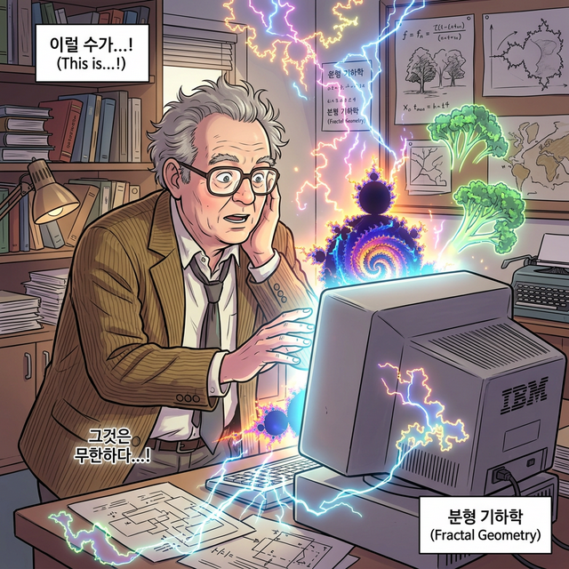

# 00. 자연의 숨겨진 코드를 읽어낸 만델브로 (Intro)

지금까지 배운 삼각형, 사각형, 원과 같은 매끄러운 도형들(유클리드 기하학)은 모니터 화면 속 인공적인 건물이나 타일을 그릴 때는 완벽하게 들어맞습니다. 
하지만 구불구불한 영국의 해안선 깊이나 벼락이 치는 번개의 줄기를 '직선'과 '곡선'으로 정확하게 측정하려 든다면 어떨까요? 불가능합니다. 자연은 그렇게 자를 대고 그은 것처럼 매끄럽지 않기 때문입니다.

---

## 학습 목표
* 기존의 정형화된 유클리드 기하학으로는 복잡하고 울퉁불퉁한 자연을 수학적으로 계산할 수 없다는 한계를 인지합니다.
* 1970년대 브누아 만델브로(Benoit Mandelbrot)가 창안한 '프랙탈 기하학'의 역사적 배경을 엿봅니다.

## 1. 해안선의 길이는 무한대?

1967년, 만델브로라는 수학자는 "영국의 해안선 길이는 과연 얼마인가?" 라는 도발적인 논문을 발표했습니다.
정답은 "재는 자의 눈금 길이에 따라 무한대로 늘어난다" 였습니다.

$1km$ 짜리 거대한 자로 바다의 형태를 대충 대충 잴 때와, $1cm$ 짜리 자를 들고 모든 바위틈과 모래알의 구불구불한 틈새를 모조리 다 따라가며 길이를 잴 때의 결과는 완전히 다릅니다. 자의 눈금이 미세해질수록 굴곡의 수는 끝도 없이 늘어나 길이는 무한대에 수렴하게 됩니다.
만델브로는 자연에 존재하는 모든 것들(구름, 산맥, 나뭇가지, 번개)이 이런 방식으로 끝없이 울퉁불퉁한 패턴을 가지고 있다고 확신했습니다.

  

## 2. 컴퓨터가 그려낸 자연의 기하학

만델브로는 이 복잡하고 불규칙해 보이는 패턴 속에 한 가지 기적 같은 룰이 있다는 것을 발견했습니다. 
바로 멀리서 볼 때의 거대한 모습과, 그것을 현미경으로 1만 배 확대했을 때 보이는 미세한 모습이 **소름 돋게 완전히 똑같이 생겼다는 사실**이었습니다. 

그는 IBM 컴퓨터 연구소에서 일하면서 엄청난 횟수의 수학 연산을 슈퍼컴퓨터에 반복시켰고, 수식이 모니터 위에 하나의 화려하고 영원히 끝이 번식하는 기괴한 패턴을 렌더링하는 것을 목격했습니다. 
수천 년간 평면(2D)과 입체(3D)에 갇혀있던 인류의 두뇌가, 처음으로 **수학 공식을 통해 완벽하게 아름다운 자연(구름, 번개, 산맥)의 모습을 시뮬레이션**해 내는 데 성공한 역사적인 날이었습니다.

우리는 이 기괴하고도 아름다운 무한 복제의 예술을 **프랙탈(Fractal)**이라고 부릅니다.

## 학습 정리
1. **유클리드 기하학의 한계**: 인공적인 직선이나 원으로는 자연의 울퉁불퉁하고 복잡한 구조(구름, 번개, 해안선)를 측정하거나 그릴 수 없다.
2. **해안선의 역설**: 측정하는 도구(자)의 단위가 미세해질수록 작은 굴곡들이 무한대로 나타나 길이가 영원히 늘어나는 현상.
3. **만델브로(Mandelbrot)**: 1970년대, 컴퓨터 시뮬레이션을 통해 단순한 수식을 무한히 반복 계산하면 대자연의 불규칙한 모습처럼 보이는 신비로운 도형(프랙탈)이 나타난다는 것을 최초로 정립한 수학자이다.
