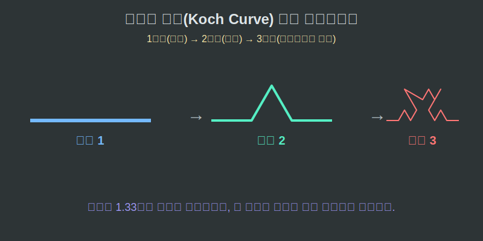

# 01. 첫 번째 수업: 영원히 끝나지 않는 거울, 자기 유사성 (Self-Similarity)

마트 야채 코너에서 '브로콜리'를 한 번 집어 들어 보세요. 커다란 브로콜리의 몸통을 툭 잘라내어 살펴보면, 부러진 작은 조각 하나가 마치 원래 컸던 브로콜리 전체의 모양과 섬뜩할 정도로 똑같이 생겼습니다. 

이처럼 전체의 모습과 부분의 모습이 완전히 똑같은 성질, 즉 "내 안에 나랑 똑같이 생긴 작은 내가 들어있다"는 프랙탈의 1법칙을 **자기 유사성(Self-Similarity)**이라 부릅니다.

---

## 학습 목표
* 프랙탈의 가장 핵심 성질인 **자기 유사성(Self-Similarity)**의 직관적 의미를 파악합니다.
* 수학자 코흐(Koch)가 무한히 변을 쪼개어 만든 '코흐의 눈송이'의 생성 패턴을 익힙니다.
* 제한된 넓이 안에 무한한 테두리(둘레)가 갇히는 기하학적 패러독스를 경험합니다.

## 1. 눈송이를 그리는 절대 규칙

1904년 스웨덴의 수학자 코흐(Helge von Koch)는 자기 유사성을 완벽하게 증명하는 괴물 같은 도형을 하나 발명해 냅니다. 이 도형은 오직 하나의 '규칙'을 무한 반복해서 만들어집니다.

> **코흐의 규칙 (Koch's Rule)**
> 직선이 하나 있으면, 그 선을 정확히 3등분으로 쪼갠다.
> 가운데 토막을 쑥 빼버리고, 그 빈자리에 $\wedge$ 모양(정삼각형 뚜껑)을 끼워 넣는다.

최초에 완벽한 정삼각형 하나(1단계)가 있었다고 칩시다.
이 삼각형의 3개의 변에 코흐의 규칙을 딱 한 번만 적용하면(2단계), 가운데가 톡톡 튀어나온 육각 별(다윗의 별) 모양이 됩니다. 
이제 변이 12개로 늘어났죠? 이 12개의 모든 짧은 선들에 코흐의 규칙을 또 적용합니다(3단계). 그러면 뾰족뾰족 튀어나온 윤곽선이 마치 아름다운 눈꽃 결정체 통통하게 진화합니다.

이 징그러운 규칙을 백 번, 천 번, 컴퓨터를 통해 무한 번($\infty$) 반복하면 가장자리가 영원히 자글자글한 '코흐의 눈송이(Koch Snowflake)' 프랙탈이 완성됩니다.

  

## 2. 넓이는 유한한데, 둘레는 무한대?

이 코흐의 눈송이는 기존 유클리드 기하학 학자들을 패닉에 빠뜨린 치명적인 모순(Paradox)을 가지고 있습니다.

규칙이 1단계씩 진행될 때마다, 기존의 직선($1$) 길이였던 변 1개가 꺾인 변 4개($\frac{4}{3}$)로 변형됩니다. 즉, 다음 단계로 넘어갈 때마다 전체 윤곽선의 길이가 $1.33$배씩 길어진다는 뜻이죠. 
이 짓을 우주가 멸망할 때까지 반복하면 이 눈송이의 **테두리(둘레) 길이는 분명 '무한대($\infty$)'로 늘어납니다.**

그런데 참 이상합니다. 윤곽선이 아무리 구불구불하게 무한정 치고 나가도, 이 눈송이 도형 전체를 커다란 도화지 안에 가둘 수 있습니다. 눈송이가 모니터 화면 크기를 벗어나지 않는다는 뜻입니다. 

**"모니터(유한한 넓이) 안에 무한대의 길이를 우겨넣을 수 있다!"**
이것이 프랙탈 코드가 가진 압축과 무한성의 소름 돋는 마법입니다. 사람의 뇌는 주먹만 한 크기(유한한 부피)지만, 뇌 표면의 주름이 프랙탈 방식으로 끝없이 접혀 있기 때문에 기억을 담는 면적은 거의 무한에 가깝게 넓어지는 것과 같은 원리입니다.

## 학습 정리
1. **자기 유사성 (Self-Similarity)**: 도형의 아주 작은 일부를 떼어서 현미경으로 확대해 봐도 처음 원래의 커다란 모양과 완벽하게 똑같이 생긴 프랙탈의 마법 성질.
2. **코흐의 눈송이**: 선을 3등분 한 뒤 가운데에 정삼각형 모양의 뿔을 계속해서 세워나가는 단순 규칙을 증식시켜 만든 인공 프랙탈 도형. 
3. **면적과 둘레의 패러독스**: 프랙탈 도형은 화면 밖을 벗어나지 않는 일정한 좁은 '넓이' 안에, 영원히 늘어나는 무한대의 쭈글쭈글한 '둘레 길이'를 압축하여 가둘 수 있다.
