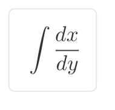

# 수학자가 들려주는 수학 이야기 07

**라이프니츠가 들려주는**
# 기수법 이야기

| 김하얀 지음 |
**(주)자음과모음**

## 저자 소개

### 김하얀

서울대학교 수학교육학과를 졸업(이학 학사)하고 서울대학원에서 수학을 전공(이학 석사)하였다. 『수학자가 들려주는 수학 이야기』 시리즈를 기획·감수하였으며, 현재 신수중학교에서 학생들을 가르치고 있다.
저서로는 『스퍼트수학』이 있다.

---

『라이프니츠가 들려주는 기수법 이야기』는 보편적 기호로 세상 모든 것을 설명하려 했던 라이프니츠를 통해 기수법의 정의와 여러 가지 숫자와 관련된 내용들을 재미있게 알려준다. 아이들은 라이프니츠 선생님과 함께 숫자의 탄생에 대해 상상해 보고, 역사의 흔적을 따라 오늘날의 숫자에 이르게 되는 과정을 살펴볼 수 있다.

또한 숫자의 역사를 살펴보면서 자연스럽게 수학의 특징과 발달 과정을 알게 되고, 특히 라이프니츠의 2진법이 오늘날 컴퓨터의 원리와 닿아 있음에 놀라게 된다.

- 표지 그림_김정진
- ILLUST_김영호
- DESIGN_공경희

라이프니츠가 들려주는 **기수법** 이야기

**수학자가 들려주는 수학 이야기 07**
# 라이프니츠가 들려주는 기수법 이야기

ⓒ 김하얀, 2008

초판 1쇄 인쇄일 | 2008년 1월 31일
초판 1쇄 발행일 | 2008년 2월 05일

지은이 | 김하얀
펴낸이 | 강병철
펴낸곳 | (주)자음과모음

책임 편집 | 박창원
편집 | 이지연, 이유나
기획 진행 | 박정수
그림 | 김영호
디자인 | 전의숙
제작 | 김동영

출판등록 | 2001년 5월 8일 제20-222호
주소 | 128-840 서울시 마포구 서교동 395-172 상록빌딩 2층
전화 | 편집부(02)324-2347, 영업부(02)2648-7224
팩스 | 편집부(02)324-2348, 영업부(02)2654-7696
e-mail | jamo7@paran.com
Home page | www.jamo21.net

ISBN 978-89-544-1547-7 (04410)
     978-89-544-1541-5 (set)

값 11,000원

* 잘못된 책은 교환해 드립니다.

# 수학자가 들려주는 수학 이야기 07

**라이프니츠가 들려주는**
# 기수법 이야기

| 김하얀 지음 |
**(주)자음과모음**

## 추천사

### 수학자라는 거인의 어깨 위에서
### 보다 멀리, 보다 넓게 바라보는 수학의 세계!

수학 교과서는 대개 '결과' 로서의 수학을 연역적으로 제시하는 경향이 강하기 때문에 학생들은 수학이 끊임없이 진화해 왔다는 생각을 하기 어렵습니다. 그렇지만 수학의 역사는 하나의 문제가 등장하고 그에 대해 많은 수학자들이 고심하고 이를 해결하는 가운데 새로운 아이디어가 출현해 온 역동적인 과정입니다.

〈수학자들이 들려주는 수학 이야기〉는 수학 주제들의 발생 과정을 수학자들의 목소리를 통해 친근하게 이야기 형식으로 들려주기 때문에 학생들이 수학을 '과거 완료형' 이 아닌 '현재 진행형' 으로 인식하는 데 도움이 될 것입니다.

학생들이 수학을 어려워하는 요인 중의 하나는 '추상성' 이 강한 수학적 사고의 특성과 '구체성' 을 선호하는 학생의 사고의 특성 사이의 괴리입니다. 이런 괴리를 줄이기 위해서 수학의 추상성을 희석시키고 수학 개념과 원리의 설명에 구체성을 부여하는 것이 필요한데, 〈수학자들이 들려주는 수학 이야기〉는 수학 교과서의 내용을 생동감 있게 재구성함으로써 추상적인 수학을 구체성을 갖는 수학으로 변모시키고 있습니다. 또한 중간중간에 곁들여진 수학자들의 에피소드는 자칫 무료해지기 쉬운 수학 공부에 있어 윤활유 역할을 할 수 있을 것입니다.

〈수학자들이 들려주는 수학 이야기〉의 구성을 보면 우선 수학자의 업적을 개략적으로 소개하고, 6~9개의 강의를 통해 수학 내적 세계와 외적 세계, 교실 안과 밖을 넘나들며 수학 개념과 원리들을 소개한 후 마지막으로 강의에서 다룬 내용들을 정리합니다. 이런 책의 흐름을 따라 읽다 보면 각 시리즈가 다루고 있는 주제에 대한 전체적이고 통합적인 이해가 가능하도록 구성되어 있습니다.

〈수학자들이 들려주는 수학 이야기〉는 학교 수학 교과 과정과 긴밀하게 맞물려 있으며, 전체 시리즈를 통해 학교 수학의 많은 내용들을 다룹니다. 예를 들어 『라이프니츠가 들려주는 기수법 이야기』는 수가 만들어진 배경, 원시적인 기수법에서 위치적 기수법으로의 발전 과정, 0의 출현, 라이프니츠의 2진법에 이르기까지를 다루고 있는데, 이는 중학교 1학년의 기수법의 내용을 충실히 반영합니다. 따라서 〈수학자들이 들려주는 수학 이야기〉를 학교 수학 공부와 병행하면서 읽는다면 교과서 내용을 소화 흡수를 도울 수 있는 효소 역할을 할 수 있을 것입니다.

뉴턴이 'On the shoulders of giants' 라는 표현을 썼던 것처럼, 수학자라는 거인의 어깨 위에서는 보다 멀리, 넓게 바라볼 수 있습니다. 학생들이 〈수학자들이 들려주는 수학 이야기〉를 읽으면서 각 수학자들의 어깨 위에서 보다 수월하게 수학의 세계를 내다보는 기회를 갖기를 바랍니다.

홍익대학교 수학교육과 교수 | 『수학 콘서트』 저자 **박 경 미**

## 책머리에

### 세상 진리를 수학으로 꿰뚫어 보는 맛,
### 그 맛을 경험시켜 주는 '기수법' 이야기

"숫자는 누가 만든 거야?"

조카가 수학 선생인 나에게 수학에 관해 처음 한 질문입니다. 돌이켜보면 나도 아주 어린 시절 이런 의문을 가졌던 것 같습니다. 한글은 세종대왕이 만들었다는데, 숫자는 누가 만든 걸까? 더군다나 숫자는 세계 공통이라는데……

그런데 이런 의문은 대부분 적절히 해결되지 못한 채 덧셈, 뺄셈 등을 계산하고 숫자를 익히면서 어느덧 숫자의 기원에는 더 이상 관심을 두지 않게 되었습니다.

숫자의 탄생에 대해 상상해 보고, 역사의 흔적을 따라 오늘날의 숫자에 이르게 되는 과정을 살펴보는 것은 수학이란 무엇인가를 생각해 볼 수 있는 좋은 기회가 됩니다. 수학이 단순히 숫자의 학문이 아닌 것은 틀림없지만, 숫자의 역사 속에는 수학의 특징과 발달 과정이 고스란히 담겨 있기 때문입니다.

본 책은 낙천주의자 라이프니츠의 입을 통해 수의 역사, 기수법의 역사를 공부합니다. 라이프니츠는 다 함께 평화롭게 사는 것을 꿈꾼 철학자이자 수학자, 여행가, 정치가였습니다. 라이프니츠는 세계의 모든 것을 설명할 수 있는 도구로 2진법을 고안하게 되었습니다. 그리고 2진법

을 연구하던 중 중국 주역의 원리가 자신이 고안한 2진법의 원리와 일치한다는 것을 알고 더욱 2진법 연구에 확신을 갖게 됩니다. 위대한 철학자, 수학자의 연구라 하기엔 소박하고 허무맹랑하기까지 한 이 2진법에 대한 생각이 오늘날 컴퓨터의 원리와 닿아 있다는 것을 알게 되면 다시 한 번 그의 천재성에 감탄하지 않을 수 없을 것입니다.

기수법은 중학교 1학년의 첫 단원에서 배우게 됩니다. 수의 역사에 대해 배우고 수학이란 무엇인가를 생각해 볼 수 있는 정말 귀중한 시간임에도, 학교 현장에서는 적절한 교재를 찾을 수 없고 시간에 쫓기다 보니 단순한 계산 연습에 그치고 마는 경우가 많습니다.

이 책을 읽는 독자가 중학교 입학을 앞둔 학생이라면 수학이란 무엇인가를 생각할 수 있는 작은 계기가 되어 수학에 흥미를 느끼게 되었으면 좋겠고, 고등학생이라면 여섯 번째, 일곱 번째 수업을 통해 숫자에 담겨 있는 철학을 느꼈으면 좋겠습니다.

마지막으로 좋은 시리즈를 기획해서 독서교육의 열풍에도 적절한 교재를 찾지 못하던 학교 현장과 학생들에게 작은 선물을 할 수 있도록 해주신 자음과모음 관계자분들에게 감사의 말을 전합니다.

그리고……, 우리 신랑, 고맙고 미안하고 사랑합니다.

2008년 1월 **김 하 얀**

## 차례

- 추천사
- 책머리에
- 길라잡이
- 라이프니츠를 소개합니다

---

### 1 첫 번째 수업
원시 시대의 수

### 2 두 번째 수업
기수법의 시작

### 3 세 번째 수업
위치기수법

### 4 네 번째 수업
진법의 변환과 계산

### 5 다섯 번째 수업
고대의 숫자

### 6 여섯 번째 수업
인도의 숫자와 0의 발견

### 7 일곱 번째 수업
라이프니츠와 2진법

## 길라잡이

### 1 이 책은 달라요

『라이프니츠가 들려주는 기수법 이야기』는 숫자의 기원과 현재의 기수법에 이르게 된 역사 속의 이야기를 통해 숫자의 원리를 알려줍니다. 수돌, 수짱, 셈신 세 학생은 수란 무엇인가에 대한 고민을 통해 수학적 사고력을 키우고, 라이프니츠 선생님의 강의를 들으면서 동양의 문화가 현대의 숫자에 어떤 영향을 미쳤는지, 그리고 2진법이 어떻게 컴퓨터의 발달을 이끌었는지를 알게 됩니다.

### 2 이런 점이 좋아요

1. 무심코 사용하는 숫자 속에 담겨 있는 수학 이야기를 들려줍니다.
   숫자가 단순히 계산만 하는 도구가 아니라 세계 곳곳 역사의 고민이 담겨 있는 문화라는 사실을 알게 합니다.
2. 중학생에게는 수업 시간에 배우는 내용을 원리부터 계산 연습까지

알기 쉽게 설명합니다. 수행평가 문제로 많이 등장하는 기수법에 대한 풍부한 수학사적 자료가 담겨 있습니다.
3. 고등학생에게는 수학의 가장 큰 특징인 추상성이 숫자 속에 어떻게 담겨 있는지 알게 해 줍니다. 수리 논술 대비로 쉽게 읽을 수 있는 교재입니다.

### 3 교과 과정과의 연계

| 구분     | 단계 | 단원          | 연계되는 수학적 개념과 내용              |
| -------- | ---- | ------------- | ---------------------------------------- |
| 초등학교 | 3-가 | 길이와 시간   | 시간, 분, 초의 전환                      |
| 초등학교 | 4-가 | 시간과 무게   | 시간, 분, 초의 전환                      |
| 초등학교 | 6-가 | 분수와 소수   | 분수를 소수로 바꾸는 원리                |
| 중학교   | 7-가 | 집합          | 집합, 일대일 대응의 개념                 |
| 중학교   | 7-가 | 자연수의 성질 | 거듭제곱                                 |
| 중학교   | 7-가 | 기수법        | 기수법의 원리, 진법의 전환, 2진법의 계산 |
| 중학교   | 8-가 | 유리수        | 유리수와 유한소수, 무한소수의 관계       |

### 4 수업 소개

**첫 번째 수업_원시 시대의 수**

인류의 역사에서 수가 어떻게 시작되었는지 공부하면서 수학의 특징인 추상성을 알아갑니다.
- **공부 방법**: 수가 어떻게 시작되었을까 고민해 보는 시간을 가져 봅니다. 수학의 특징인 추상성이란 무엇일까를 생각해 봅니다.
- **관련 교과 단원 및 내용**
  - 7-가 '집합' 단원의 집합 개념, 일대일 대응 개념을 익힙니다.
  - 7-가 '집합과 자연수' 단원의 수행평가 자료로 활용합니다.
  - 고등학교 수리 논술 자료로 수학의 추상성에 대해서 익힙니다.

**두 번째 수업_기수법의 시작**

학생들이 숫자를 만드는 경험을 통해서 인류 역사 속의 고민을 느끼고 숫자의 원리를 공부합니다.
- **공부 방법**: 수돌, 수짱, 셈신이가 되어 숫자를 만들어 보고, 라이프니츠 선생님이 던지는 질문에 같이 고민을 해봅니다.
- **관련 교과 단원 및 내용**

  - 7-가 '기수법' 단원 기수법의 원리를 익힙니다.
  - 초등학교 '측정' 단원의 단위가 다른 수의 계산 개념을 익히는 데 도움이 됩니다.

**세 번째 수업_위치기수법**

셈신이의 숫자를 통해 위치기수법의 원리를 알아보고, 현대의 숫자에 대해 공부합니다.
- **공부 방법**: 수업 속의 활동에 함께 참여합니다.
- **관련 교과 단원 및 내용**
  - 7-가 '기수법' 단원의 기수법의 원리를 익힙니다.
  - 7-가 '자연수의 성질' 단원의 거듭제곱의 개념을 익힙니다.

**네 번째 수업_진법의 변환과 계산**

하나의 수를 다양한 진법으로 변환하는 방법을 공부합니다.
- **공부 방법**: 필기구를 가지고 선생님이 내 주시는 문제를 함께 풀면서 공부합니다.
- **관련 교과 단원 및 내용**
  - 7-가 '기수법' 단원의 진법의 변환, 전개식을 익힙니다.

**다섯 번째 수업_고대의 숫자**

실제 역사 속에 나타난 고대의 숫자를 공부합니다.

- **공부 방법**: 앞 시간에 배운 기수법의 원리, 진법의 변환 등을 활용해 고대의 숫자를 익힙니다.

- **관련 교과 단원 및 내용**
  - 7-가 '기수법' 단원의 기수법의 원리를 익힙니다.
  - 7-가 '기수법' 단원의 수행평가 자료로 활용합니다.
  - 3-가, 4-가 '측정' 단원의 시간, 분, 초 사이의 전환에 대해 익힙니다.
  - 6-가 '분수와 소수' 단원의 분수를 소수로 바꾸는 원리를 익힙니다.
  - 8-가 '유리수' 단원의 유리수와 유한소수, 무한소수의 관계를 익힙니다.

**여섯 번째 수업_인도의 숫자와 0의 발견**

역사 속에 0이 등장하면서 현대의 숫자가 완성하게 되는 과정을 공부합니다.

- **공부 방법**: 동양적 사상이 어떻게 현대 숫자에 영향을 미쳤는가를 생각해 봅니다.

- **관련 교과 단원 및 내용**
  - 7-가 '기수법' 단원의 기수법의 원리를 익힙니다.
  - 7-가 '기수법' 단원의 전개식을 공부합니다.
  - 7-가 '기수법' 단원의 수행평가 자료로 활용합니다.
  - 고등학교 수리 논술 자료로 동양적 사상과 0의 등장의 관계를 생각할 수 있습니다.

**일곱 번째 수업_라이프니츠와 2진법**

동양적 사상과 2진법의 관계를 알아봅니다. 2진법을 연습하고 현대 컴퓨터의 발달에 2진법이 어떻게 영향을 미쳤는지 공부합니다.

- **공부 방법**: 현대 사회에 없어서는 안 될 컴퓨터에 2진법이 어떤 영향을 미쳤고, 동양적 사상과는 어떤 관계인지에 초점을 맞추어 읽습니다.

- **관련 교과 단원 및 내용**
  - 7-가 '기수법' 단원의 2진법 계산을 익힙니다.
  - 7-가 '기수법' 단원의 수행평가 자료로 활용합니다.
  - 고등학교 수리 논술 자료로 동양적 사상과 2진법, 컴퓨터의 관계를 생각해 봅니다.

## 라이프니츠를 소개합니다
### Gottfried Wilhelm Leibniz(1646~1716)

나는 평화롭게 사는 것을 꿈꾸는
철학자이자 수학자, 여행가, 정치가입니다.

나는 2진법을 고안하여
오늘날 컴퓨터 발전의 기초를 다졌어요.

"0과 1만으로 이 세상을 설명한다"
멋지지 않나요?

*(그림: 적분 기호가 적힌 종이를 들고 뛰어가는 라이프니츠의 모습)*

여러분, 나는 라이프니츠입니다

안녕하세요?

앞으로 일곱 번의 수업을 통해 기수법을 강의할 라이프니츠입니다. 여러분들은 나를 어떤 사람으로 알고 있나요? 어떤 친구들은 철학자로 알고 있을 테고, 어떤 친구들은 수학자로 알 겁니다. 또 어떤 친구들은 발명가나 저술가, 논리학자라고 생각할 겁니다.

나는 1646년에 독일 라이프치히에서 태어났습니다. 철학교수이신 아버지 덕분에 어려서부터 다방면의 지식을 쌓을 수 있었지요. 15살 때에는 라이프치히 대학 법학과에 입학하여, 많은 철학서를 읽었습니다. 이때에 나는 철학의 이해를 위해서는 수학이 필요하다는 것을 알게 되었습니다. 법학 공부에도 전념했

으나, 내가 너무 어리다는 이유로 대학에서 학위 수여를 거부하더군요. 몇 년 뒤 다른 대학에서 학위 수여와 법률학 교수 자리를 제안했지만, 이미 더 큰 뜻이 있던 나는 거절했습니다.

이후 과학계의 인물들과 수학자들을 만나면서 수학 연구를 계속했습니다. 뿐만 아니라 철학 논문을 쓰고 많은 여행을 했으며 교회의 통합을 위해 노력했습니다.

인류의 역사에서 수학자로 이름을 날린 사람은 적지 않습니다. 그러나 나처럼 연속적인 양과 흩어져 있는 양에 관한 영역 모두에서 업적을 남긴 사람은 거의 없지요. 이것은 내가 늘 관심을 두었던 보편성에 대한 연구와 무관하지 않습니다. 무슨 말이냐고요? 지금부터 나의 연구에 대해서 설명하겠습니다.

여러분들은 미적분학이라는 학문을 들어보았을 것입니다. (미적분학: 미분학과 적분학을 아울러 이르는 말) 이 미적분학을 발명한 사람이 나랍니다. 사실 미적분학을 누가 발명했는가에 대해서는 나와 뉴턴을 두고 말들이 많지요. 우리는 각자 비슷한 연구를 하고 있었지만, 논문은 내가 먼저 발표했습니다. 하지만 뉴턴은 이미 20년 전부터 이 연구를 시작했다고 주장했지요.

우리가 감정적으로 다투진 않았지만, 뉴턴의 나라 영국과 내가 속한 독일 사람들이 우리가 죽고 나서 많이들 다퉜나 보더군

요. 그러나 미적분학을 누가 먼저 발명했든지 간에, 미적분학의 기본 정리와 미적분에서 쓰이는 $dx$, $dy$, $\int$ 등의 기호는 모두 나의 작품입니다. 뉴턴이 미적분학에 남긴 업적이 나보다 크다고 주장할지라도 현대의 모든 사람들이 사용하는 미적분 기호가 나에 의해서 완성되었다는 것에는 이의가 없을 겁니다.

나는 평생 다방면에 걸쳐서 연구를 했습니다. 다양한 학문을 접하면서 모든 진리를 관통하는 보편성에 대해서 생각하게 되었지요. 그리고 이 세상의 많은 현상들을 설명할 보편적 기호가 있을 것으로 믿었습니다. 나의 미적분 기호를 현대에 모든 이들이 사용하는 것도 이런 연구의 결과이기도 합니다. 함수의 개념과 용어도 내가 처음 사용했지요.

또한 세상을 설명할 보편적 기호로 2진법을 고안하였습니다.

"0과 1만으로 이 세상을 설명한다."

이 얼마나 멋진 생각입니까. 이런 생각 속에서 여러분이 매일 사용하는 컴퓨터가 탄생하게 되었답니다.

2진법이 무엇이기에 컴퓨터를 태어나게 했냐고요? 수돌이, 수짱이, 셈신이와 함께 기수법을 공부하고 나면 궁금증이 해결될 겁니다. 자, 그럼 지금부터 기수법의 여정을 시작하겠습니다.

## 만화 읽기

- **엄마**: 우리 아들 최고!
- **아빠**: 15살에 라이프치히 대학 법학과에 입학하다니 장하다!
- **어린 라이프니츠**: 엄마, 아빠! 훌륭한 법학 교수가 되겠습니다.
- **10대 라이프니츠**: 법 공부도 재밌지만 철학 공부도 무척이나 재밌는걸.
- **성장한 라이프니츠**: 그런데 철학을 정확히 이해하려면 수학 지식이 필요해. 수학이야말로 정말 재밌는 학문이야. (수학 책을 읽으며)
- **대학 관계자**: (몇 년 후...) 라이프니츠 자네는 우수한 성적으로 졸업했지만 너무 어려서 학위를 줄 수가 없네.
- **청년 라이프니츠**: 알겠습니다.
- **다른 대학 교수**: 라이프니츠 우리 대학으로 오게. 학위는 물론 법학 교수 자리까지 마련해 두었네.
- **청년 라이프니츠**: 고맙습니다만 저는 법학에는 이제 큰 관심이 없습니다.
- **청년 라이프니츠**: 이렇게 된 거 재밌는 철학과 수학 공부에 전념하자. 야호 내가 미적분을 개발해 냈다. ($\int \frac{dx}{dy}$ 가 적힌 종이를 들며)
- **장년 라이프니츠**: 이 세상을 설명하는 데 많은 숫자는 필요치 않아. 0과 1 단 두 숫자만 있으면 돼. (손가락으로 0과 1을 표시하며)

**[2진법]** 2진법이 나중에 세상을 바꾸게 될 거야.

*(컴퓨터 모니터 속의 라이프니츠)*
라이프니츠의 2진법은 세상을 바꾸게 될 컴퓨터를 태어나게 했습니다.

