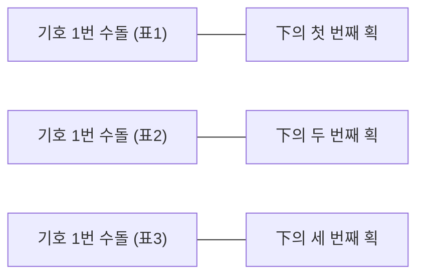
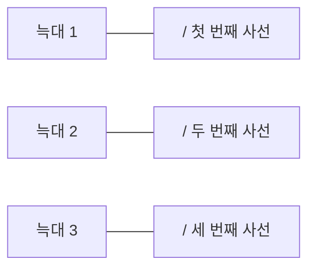
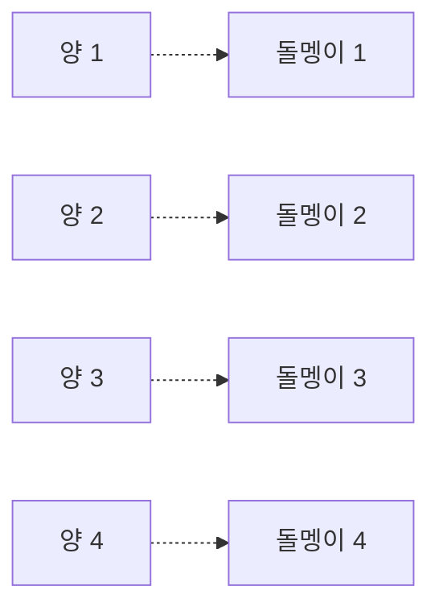
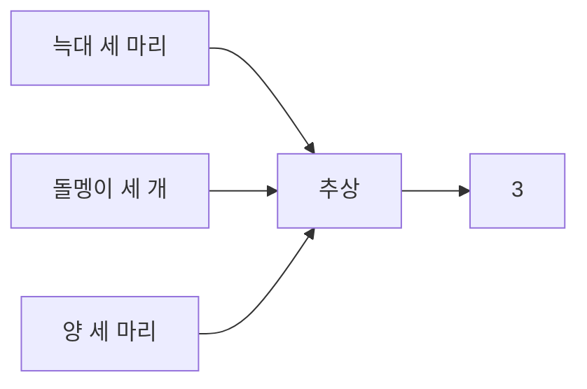
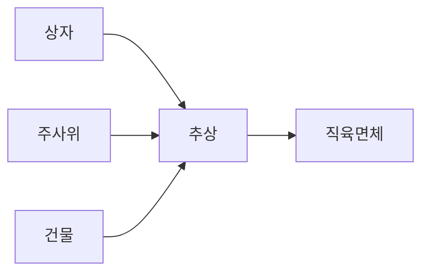

# 첫 번째 수업
## 원시 시대의 수

원시 부족이 수를 세는 방법에서 수의 추상화 과정을 알 수 있습니다.

## 첫 번째 학습 목표
1. 수가 어떻게 시작되었는지 생각할 수 있습니다.
2. 원시 부족의 수에 대해 알 수 있습니다.

## 미리 알면 좋아요

### 1 집합
조건에 맞는 대상을 분명하게 구별할 수 있는 모임입니다.
예를 들어, 수학점수가 80점 이상인 학생의 모임은 집합이 될 수 있지만, 수학을 잘하는 학생의 모임은 집합이 아닙니다. 수돌이가 생각하기에 수학점수가 85점인 수짱이는 수학을 굉장히 잘하는 학생이지만, 셈신이의 생각에는 85점은 못하는 학생의 점수일 수 있습니다. 이렇게 기준이 분명하지 않은 모임은 집합이 될 수 없습니다.

### 2 원소
집합을 이루는 대상 하나하나를 말합니다.
예를 들어, 이번 시험에 수짱이의 수학점수는 85점, 셈신이는 100점을 받았다면 '수짱, 셈신'은 '이번 시험에서 수학점수가 80점 이상인 학생의 모임'이라는 집합의 원소가 됩니다.

## 라이프니츠가 첫 번째 수업을 시작했다

강의가 시작되려면 30분이나 남았지만, 그 유명한 라이프니츠 선생님을 만난다는 설렘으로 아이들은 일찍부터 강의실에 도착해 있었습니다. 모두들 흥분된 표정으로 자신이 아는 라이프니츠 선생님과 기수법에 대해서 이야기했습니다.

"미적분'이라고 들어 봤어? 그걸 만든 분이 라이프니츠 선생님이야."

"그 정도는 기본이지. 미적분 기호에 대해서는 알고 있니? $dx$, $dy$, $\int$ 같은 거 말이야. 이것들도 다 라이프니츠 선생님이 만드신 거야."

"그렇구나……. 근데 기수법이 뭐야? 라이프니츠 선생님이 강의하신다기에 오긴 했는데, 기수법이 대체 뭐지?"

"기수법을 한자로 써 봐. 기록할 기(記)자에, 셀 수(數), 법 법(法)! 그러니까……, 숫자를 기록하는 방법을 말하지."

"아……, 그렇구나! 근데 미적분 기호를 만드신 라이프니츠 선생님하고 기수법이 무슨 관계야?"

"음……, 그, 그건…, 나중에 말해 줄게. 그건 그렇고, 우리, 회장 뽑아야 하는 거 아니야? 앞으로 한 반에서 공부해야 하는데, 회장이 있어야 할 것 같아."

"그래 그래!"

아이들은 회장을 뽑자는 의견에 동의하여 투표를 시작했습니다.

아이들이 추천한 후보들은 수돌, 수짱, 셈신. 개표가 시작되고, 칠판에는 다음과 같이 적혔습니다.

| 기호 1번 수돌 | 기호 2번 수짱 | 기호 3번 셈신 |
| :-----------: | :-----------: | :-----------: |
|      下       |      正       |     正正T     |

개표가 모두 끝날 때쯤, 라이프니츠 선생님이 교실로 들어오셨습니다.

"와, 오셨다!"

"안녕하세요!"

"선생님, 안녕하세요!"

안녕하세요. 그런데 왜 이렇게 시끌벅적하죠? 뭘 하고 있었나요?

"회장을 뽑고 있었어요!"

음, 셈신이 표가 제일 많은 걸로 봐서 셈신이가 회장이 된 모양이군요. 축하해요. 내 인사보다는 셈신이의 당선 소감부터 들어보아야겠는데요.

셈신이가 앞으로 나가 당선 인사를 했습니다.

"라이프니츠 선생님의 기수법 반 회장으로 뽑아 주셔서 감사합니다. 앞으로 선생님을 도와 우리 반 학생 모두가 기수법의 황제가 되는 그날까지 열심히 노력하겠습니다!"

하하, 회장 셈신이가 있어서 든든한걸요. 여러분이 스스로 회장

을 뽑는다는 것은 그만큼 이 반에 애정이 있다는 것이고, 즐겁게 공부할 준비가 되어 있다는 뜻이죠? 저도 잘 부탁해요. 여러분들이 내 이름은 모두 알고 있는 것 같네요. 그럼 여러분의 이야기를 들어볼까요?

라이프니츠 선생님이 반 아이들 한 명 한 명과 인사를 했습니다.

모두 반가워요. 이렇게 똘똘하게 생긴 여러분은 무엇을 공부하려고 모였지요?

"기수법이요!"

그래요. **기수법**이란 수를 적는 방법을 말합니다. 이번 시간과 다음 시간에 이 기수법이 어떻게 시작되었는지에 대해 공부할 거예요. 그럼 수를 적는 방법이 어떻게 시작되었는지부터 여러분의 생각을 한번 들어 볼게요.

수짱이가 나와서 이야기를 시작했습니다.

"다른 문자가 생겨난 것과 마찬가지였을 것 같아요. 문자가 없는 시절에 사회가 조금씩 발전하면서, 말만으로는 기억하는 데에

한계가 있었을 거예요. 약속을 잊어버린 적도 많았을 거고요. 그래서 동굴의 벽 같은 데에 뾰족한 도구로 표시를 하면서 그런 표시들이 점점 문자로 발달했다고 알고 있어요. 이런 과정은 수를 적는 방법의 발달도 마찬가지 아닐까요?"

문자의 발달에 대해서 수짱이가 아주 잘 얘기해 줬어요. 그런데 수의 발달은 일반적인 언어의 발달과 다른 면이 있답니다. 물론 문자가 생기기 전의 일이니 유물이나 현재의 언어에 남아 있는 흔적으로 추측할 뿐이지만요.

무슨 말씀이신지……, 아이들은 눈만 깜빡거리고 있었습니다.

조금 복잡하다고요? 자 이제부터 원시 시대로 가 볼까요?

라이프니츠는 동물 뼈 사진을 한 장 꺼내서 칠판에 붙였습니다.

*(그림: 라이프니츠가 동물 뼈 사진이 있는 칠판을 가리키는 모습)*

원시 시대 사람들은 우선, 음식물의 양을 표시하기 위해 벽이나 바위에 선을 '긋기' 시작했어요. 'tally(탤리)'라는 영어 단어가 있는데 이는 '계산, 셈'이라는 뜻이죠. 이 낱말은 원래 '막대' 또는 '눈금'이라는 뜻이에요. 이 단어의 기원으로 추측하면 음식물 수를 세기 위해서 막대 같은 곳에 눈금으로 표시했다는 것을 알 수 있죠. 실제로 여러 유물들에서 동물의 뼈에 눈금을 그어 세었다는 기록이 발견되곤 합니다.

수돌이가 알겠다는 듯이 중얼거렸습니다.

"아……, 저 눈금들이 셈을 한 표시구나……."

셈신이가 말했습니다.

"아까 우리가 회장 선거를 할 때, 正으로 표시한 것도 tally로 볼 수 있을 것 같아요."

그렇죠! 흔히 개수를 셀 때, 사선을 긋거나 正자로 표시를 하곤 하죠. 숫자의 시초라고 볼 수 있는 tally는 사실 현대의 사람들도 흔히 이용하는 방법이에요. 외상을 한다고 할 때 드라마 같은 데

서 '그어 두쇼'라고 말하는 걸 들어 봤나요? '긋는다'는 말은 외상 매출한 양을 벽이나 장부에 그어서 표시한 것에서 유래했다고 생각할 수 있겠죠. 실제로 영국 재무성에서는 1800년대까지 이 tally가 쓰였다고 하네요.

이러한 tally의 방법은 셈의 기본으로서의 일대일 대응의 시작이라고 할 수 있습니다.

"일대일 대응이요?"

*(만화: 교실 풍경)*
- **아이들**: "선생님! 안녕하세요?"
- **선생님**: "뭘 하고 있었죠?"
- **아이들**: "기수법 반 회장을 뽑고 있었어요. 방가방가"
- **선생님**: (칠판을 보며) "흐음~"
    - 기호1번 수돌: 下
    - 기호2번 수짱: 正
    - 기호3번 셈신: 正正T
- **선생님**: "여러분들과 기수법을 공부하기로 했는데 여러분들은 이미 기수법을 잘 알고 있군요."
- **아이들**: (어리둥절) "뭐가 기수법이지?", "아! 우리가 기수법을 알고 있나?", "글쎄..."

예. 조금 전의 회장 선거를 생각해 보세요. 수돌이 표가 하나 나올 때마다 칠판의 수돌이 이름 밑에 획을 하나 긋죠. 두 번째 표가 나오면 또 획 하나를 긋습니다. 표 하나와 획 하나가 일대일 대응되고 있는 거예요. 개표가 모두 끝나면 수돌이의 득표수는 칠판에 표시된 획의 수로 알 수 있죠. 즉 수돌이가 받은 표의 집합과 칠판에 그은 正자의 획의 집합 사이에 일대일 대응 관계가 성립한 거랍니다.

**[기호 1번 후보가 얻은 표]** .............. **[칠판에 그어진 획]**

원시 부족이 자신들이 잡은 늑대의 수를 세면서 동굴 벽 등에 눈금을 긋는 것도 잡은 늑대의 집합과 동굴 벽 눈금 집합의 원소 사이에 일대일 대응 관계를 만든 거예요.

**[늑대의 집합]** ........................ **[동굴 벽 사선의 집합]**

일대일 대응에 의한 셈은 물론 tally 말고도 다양해요.

문헌상의 기록이 있기 전의 일들을 알기 위해 현재의 언어를 연구한다고 앞에서 얘기했었죠? '계산, 미적분'이라는 뜻을 가진 'calculus(캘큘러스)'라는 단어에는 '돌멩이'라는 뜻이 있답니다. 어떤 연관성이 느껴지지 않나요?

수돌이가 혹시나 하는 표정으로 말했습니다.

"돌멩이로 계산을 했을까요?"

하하, 선생님의 생각과 같군요. 원시 시대에 주변에 보이는 것이 돌멩이였을 테니, 긋는 것 말고 돌멩이를 이용하는 것도 일반적이었을 것으로 추측됩니다.

이제부터 옛날이야기를 들려 줄게요. 호머 시대의 이야기랍니다. 율리시스에 의해서 장님이 된 거인 폴리페머스는 자신의 동굴 앞에서 아침마다 양을 내보냈어요. 한 마리 나올 때마다 돌멩이를 하나씩 집어 들었죠. 저녁때가 되어 양들이 돌아오면, 동굴로 한 마리 들여보낼 때마다 들고 있던 돌멩이를 내려놓았습니다. 이런 식으로 돌멩이를 전부 내려놓으면 그날 나갔던 양들이 전부 돌아왔다는 것을 알 수 있었죠.

*(만화)*
- **소년 A**: "네가 키우는 양은 모두 몇 마리니? (돌멩이를 내밀며) 이만큼이야."
- **소년 B**: "와! 많은데.... 난 (돌멩이를 만지작거리며) 이만큼인데. 누가 더 많은 거지?"
- **소년 A**: "하나씩 대응시켜 보자!"
- **소년 B**: "그래, 나중에 돌멩이가 남는 사람이 더 많은 거야!"

이 이야기는 문헌상에 셈의 방법으로써 일대일 대응 개념이 나타난 최초의 기록입니다.

**[양의 집합]** ...................................... **[돌멩이의 집합]**

아프리카의 어떤 부족은 자신이 죽인 멧돼지의 수를 계산하기 위해서 멧돼지의 어금니를 모은다고 해요. 이것도 자신이 죽인 멧돼지와 어금니 사이의 일대일 대응 관계로 이해할 수 있겠죠.

인류 수학의 발달 과정은 어린아이가 수학을 익혀가는 과정과 비슷해요. 여러분들이 어렸을 때 벽에 낙서하던 그림을 생각해 보세요. 원시인들의 동굴 벽화와 많이 닮았죠?

*(그림: 원시인들의 동굴 벽화 사진)*

원시 시대 사람들이 셈을 하기 시작했을 때의 모습은 여러분의 동생 모습을 보면 상상할 수 있을 거예요.

수짱이가 말했습니다.

"눈금으로 표시하거나 돌멩이를 이용하는 것이 셈의 시작일 것"

이라 하셨는데, 그 당시 사람들도 손가락이 있었을 텐데요. 늑대 세 마리를 셀 때에는 손가락으로 세는 것이 더 쉽지 않았을까요? 아이들이 물건을 셀 때 보통은 돌멩이보다는 손가락을 사용하잖아요. 저희도 그렇고요."

맞아요. 작은 수를 셀 때에는 손가락을 이용하는 것이 훨씬 편리했을 겁니다. 그러다가 큰 수를 셀 일이 생기면서 tally나 돌멩이 등을 이용해 표시하기 시작했고, 이후에 그것을 소리 내서 세기 위해서 '말'이 발달했을 거예요.

"드디어 하나, 둘, 셋이 탄생했어요!"

하하, 수돌이가 중요한 말을 해 줬네요. 하지만 처음부터 하나, 둘, 셋을 사용한 것은 아니에요. 초기에는 각각의 물체의 집합에 대해 다른 말로 불렀지요. 무슨 뜻이냐고요?

세 마리의 늑대와 세 마리의 양은 모두 숫자 '3'이잖아요? 그런데, 두 집합에는 수의 이름이 다르게 사용된 것이죠. 같은 '열 개'라도 그 집합을 이루는 물체가 무엇이냐에 따라 '열 개'에 해당하는 각각 다른 단어를 사용했답니다. 여러분은 아직 배우지 않았을 거예요. 영어에서는 같은 '두 개'라도 한 쌍의 신발에는 'pair'라는 말이 사용되지만, 한 쌍의 꿩에는 'brace'라는 말이

사용된답니다. 어떤 물건을 세느냐에 따라 다르게 말하던 흔적이 남아 있는 것이죠.

이처럼 하나, 둘, 셋이라고 세기까지는 오랜 시간이 걸렸어요. 여러분은 언제부터 수를 세기 시작했는지 기억하나요? 아기가 처음 수를 세기 시작하면 엄마들은 우리 아기가 천재인 것처럼 느낀답니다. 그건 정말 대단한 일이거든요. 인류도 돌멩이 세 개와 늑대 세 마리가 '3'이라는 공통의 성질이 있다는 사실을 인지하는 데에 긴 시간이 필요했어요. 사실 구체적인 물체들 속에서 수를 **추상**해 내는 일은 동물들과 구별되는 인간만의 능력이랍니다.

> **추상**
> 대상으로서의 속성 전체로부터 특정성질이나 공통지표를 분리하고, 골라내는 정신작용을 말한다. 예를 들어 빨간 넥타이로부터 '빨강' 혹은 '형태(形)'만을 추출(抽出)하는 것, 또 빨간 우체통, 잘 익은 토마토 등에서 공통적인 '빨강'을 골라내고, 적(赤)·청(靑)·황(黃)으로부터 '색(色)'을 빼내는 것을 말한다.

"추상이라고 말씀하셨나요?"

예. '추상'에 대해 얘기하기 전에 잠깐 다른 얘기를 해 볼게요. 과연 동물들도 수를 알까요?

수돌이가 신이 나서 말했습니다.

"며칠 전에 TV에서 원숭이가 나오는 것을 본 적이 있어요. 원숭

이에게 바나나를 주고 원숭이가 딴 곳을 보는 사이에 바나나 한 개를 숨겼거든요. 그런데 자신의 바나나 중에 하나가 없어진 것을 어떻게 알았는지 여기저기를 찾아보던데요. 이건 원숭이도 수를 안다는 뜻……?"

그래요. 단순한 TV 프로그램 속에도 수학을 발견할 수 있답니다. 그 속에서 수학을 찾아내서 생각을 넓혀가는 수돌이가 진짜 수학자네요. 실제로 많게는 다섯 개 정도까지 수를 구별하는 동물들이 있다고 알려져 있어요. 새의 종류에 따라 다르지만 새들은 몇 개 정도까지는 자신의 알이 없어진 것을 알아챈다고 합니다.

까마귀에 얽힌 이야기를 들려 줄까요? 옛날 어느 귀족이 성 안의 탑에 둥지를 튼 까마귀를 없애려고 했어요. 그런데 이 까마귀는 어찌나 약삭빠르던지 사람이 까마귀를 잡으려고 탑으로 들어가면 멀리 날아갔다가, 사람이 탑에서 나오는 것을 지켜본 다음에야 돌아오곤 했답니다. 이런 일이 반복되던 어느 날, 귀족은 좋은 생각을 떠올렸어요. 두 명이 함께 탑 안으로 들어갔다가, 한 명은 남겨두고 다른 한 명만 탑 밖으로 나오게 하는 것이었습니다. 까마귀가 사람이 나온 것으로 착각해서 탑으로 돌아올 때 남아 있던 사람이 까마귀를 잡을 계획이었죠.

그런데 이 영리한 까마귀는 사람들을 비웃듯이 두 명 모두 나오

*(만화)*
- **까마귀**: "까악" (탑에서 날아감)
- **귀족**: "내가 탑 안에만 들어가면 달아났다가, 탑을 나오면 돌아오니 도무지 잡을 수가 없네." (속마음: 저 성탑 안의 까마귀를 잡아야 하는데...)
- **귀족**: "아! 옳지! 좋은 방법이 생각났다. 지까짓 게 그래봤자 까마귀지."

- (설명: 성 안으로 두 명이 들어갔다가 한 명이 나간다.)
- **귀족**: (탑 안에서 창밖을 보며 속마음으로) "까마귀는 숫자를 모르니까 내가 여깄는줄 모를 거야."

- **귀족**: (기다리다가 밖을 보며 속마음으로) "아무리 기다려도 까마귀 녀석이 돌아오질 않네."
- **까마귀**: "까악 까악" (음표. 나무에서 딴청 피우고 있음)

- **귀족**: (속마음으로) "사람을 네 명까지 늘려도 까마귀가 알아채고 성으로 돌아오지를 않네."
- **귀족**: "이대로 포기할 순 없어. 한 명만 더 해서 다섯 명이 들어갔다가 네 명이 나오도록 하자."

- **까마귀**: "까악 까악" (탑 창문으로 돌아옴)
- **귀족**: "으악" (까마귀를 붙잡음) "잡았다!! 까마귀가 숫자를 다섯까지 헤아릴 수가 없지."

기를 기다린 다음에 탑으로 돌아오더랍니다. 약이 오른 귀족은 이번에는 세 명이 탑으로 들어가 두 명만 나오게 했어요. 그런데 이번에도 까마귀는 세 명 모두 나온 다음에 돌아왔다고 하네요. 귀족은 포기하지 않고 네 명이 들어갔다가 세 명만 나오게 했어요. 까마귀는 이번에도 속지 않았어요.

마침내, 다섯 명이 들어갔습니다. 한 명, 두 명, 세 명, 네 명이 나오자, 드디어! 까마귀가 탑으로 돌아왔습니다! 그리고 귀족은 까마귀를 잡을 수 있었죠.

이 이야기 속의 까마귀는 1, 2, 3, 4는 구별하지만, 4와 5를 구별하지 못하는 것이죠. 아무튼 까마귀가 4이하의 수를 구별한다는 것을 알 수 있어요. 이렇게 몇몇 동물들은 작은 수에 한해서 수를 구별한다고 알려져 있답니다.

수짱이가 실망스럽다는 듯이 말했습니다.

"그러면 인류가 그렇게 오랜 시간이 걸려서 얻어 냈다고 하는 수를 동물들도 알고 있다는 건가요?"

하하, 수짱이가 좋은 질문을 했어요. 동물이 수를 아는 것과 사

람이 수를 세는 것에는 중요한 차이점이 있답니다. 조금 전에 '추상'에 대해서 얘기했었죠. 동물들은 자신의 알이 세 개에서 두 개로 바뀐 사실은 알아도, 알이 세 개인 것과 둥지 옆의 나무 세 그루가 같은 '3'이라는 사실을 알 수 없어요. 인류가 음식물 등의 표시를 위해서 긁어서 표기하거나 돌멩이를 모았으며, 그것들을 말하기 위해서 소리를 냈다고 했죠? 물체들의 집합 각각을 세기 위해 각기 다른 소리를 사용하다가, 즉 세 마리의 늑대와 세 마리의 양을 세기 위해서 다른 소리를 내다가 그것들에서 '3'이라는 공통성질을 '추상' 해 낸 것을 비로소 인류가 수, 수학을 시작했다는 것을 의미하는 거랍니다.

아마도 우리가 사용하고 있는 수의 이름은 어떤 구체적인 물체

> **집합**
> 조건에 맞는 대상을 분명하게 구별할 수 있는 모임.

들의 **집합**을 가리키는 말이었을 거예요. 여러분들 영어로 5가 뭔지 아나요?

"five 파이브요!"

그래요. five는 다섯을 나타내는데 그것 말고 '손, 주먹' 이라는 뜻도 있답니다. '손가락 다섯 개'를 가리키는 말에서 '5개의 집합'을 가리키는 단어로 사용된 것이죠.

**회장인 셈신이가 말했습니다.**

"다들 추상이 뭔지 아직 잘 이해하지 못하는 것 같아요. 추상에 대해서 좀 더 말씀해 주시겠어요?"

다섯 마리의 늑대, 다섯 마리의 양, 다섯 개의 돌멩이, 다섯 개의 손가락……, 이들의 공통점이 뭐죠?

"다섯이요!"

"5요!"

그래요. 각각 다른 집합이지만 여기에는 '5'라는 공통점이 있어요. 이렇게 공통적인 성질을 이끌어 내는 것을 '추상'이라고 합니다. 이런 추상성은 수학의 가장 큰 특징 중의 하나예요. 예를 들

어 상자, 주사위, 건물은 각기 다른 물체들이죠. 이들에게서 공통된 성질만을 생각하면 직육면체의 개념을 얻게 됩니다. 즉 구체적인 물체에서 직육면체라는 추상화가 이루어진 겁니다.

> **직육면체**
> 각 면이 직사각형인 평행육면체로, 직육면체의 마주 대하는 3쌍의 면은 평행이고 합동이다.

원시 시대의 모습을 알아볼 때에는 문명사회와 접촉이 덜 된 부족들의 언어를 살펴보는 것이 도움이 됩니다. 물체의 집합을 가리키는 말이 그 수를 가리키는 말로 발전한 흔적이 보이는 예는 여러 가지가 있답니다. 말레이시아에서는 수 1, 2, 3을 '한 개의 돌, 두 개의 돌, 세 개의 돌'이라고 하고, 자바에서는 '한 알의 곡식, 두 알의 곡식, 세 알의 곡식'이라고 한다네요.

**수돌이가 신나서 말했습니다.**

"그럼 '난 베프가 세 명이다'를 자바에서는 '난 베프가 세 개의 돌이다'라고 해야겠네요. 너무 웃겨요."

**모두들 1, 2, 3을 가지고 말장난을 하느라 여기저기서 낄낄대는 소리가 이어졌습니다.**

"난 동생이 두 개의 돌이야. 넌 누나가 곡식 한 알이지?"

하하하, 어떤 원시 부족은 신체를 이용해 수를 나타내기도 한답니다. 파푸아 부족의 성경에는 '어떤 사람은 한 사람, 양손, 5와 3년 동안 아팠다'라고 번역한 구절이 있다고 해요. 이것은 원래 '어떤 사람은 38년 동안 아팠다'라는 뜻이라고 하네요. 즉 38이라는 수가 '한 사람, 양손, 5와 3'으로 번역된 것인데, '양손'이 10을 가리키고, '한 사람'이 20을 가리키고 있어요. 어떻게 이런 말이 생겨났을지 상상이 가나요?

**수돌이가 다시 자랑스럽게 대답했습니다.**

"음……, 양손에는 손가락이 10개잖아요? 그러니까 양손은 10을 나타내는 거죠. 그리고 한 사람의 손가락과 발가락을 합해서

20개니까 한사람은 20을 나타내는 거고요."

그래요. 수돌이가 아주 잘 설명했어요. 손가락 이름이 그대로 수를 가리키는 예는 여러 곳에서 살펴볼 수 있습니다. 남아메리카의 카마유라 부족은 '삼일 간'을 '가운데손가락 날들'로 부릅니다. 즉 가운뎃손가락이 3을 가리키는 말인 셈이죠.

**수짱이가 말했습니다.**

"구체적인 물체를 가리키는 말에서 수를 가리키는 말로 발전했다는 선생님의 말씀을 이해하겠는데요, 수는 무수히 많잖아요. 그 무수히 많은 수 모두에 각각 다른 물체의 이름을 붙이는 것은 불가능하지 않나요? 기억하는 것도 힘들고요."

네. 그렇습니다. 아까도 이야기했듯이 수를 신체를 이용해 표현하는 것은 여러 부족들에게서 발견되는 특징이랍니다. 지금 칠판에 적는 것은 파푸아 부족의 언어예요.

**라이프니츠가 다음과 같이 칠판에 적었습니다.**

원시 시대 사람들은 수를 표현하기 위해 눈금을 새긴 막대나 돌

1 오른손 새끼손가락             12 코
2 오른손 약지                 13 입
3 오른손 가운뎃손가락         14 왼쪽 귀
4 오른손 집게손가락           15 왼쪽 어깨
5 오른손 엄지손가락           16 왼쪽 팔꿈치
6 오른쪽 손목                 17 왼쪽 손목
7 오른쪽 팔꿈치               18 왼손 엄지손가락
8 오른쪽 어깨                 19 왼손 집게손가락
9 오른쪽 귀                   20 왼손 가운뎃손가락
10 오른쪽 눈                  21 왼손 약지
11 왼쪽 눈                    22 왼손 새끼손가락

멩이를 이용했다고 했었죠? 그러나 그 방법은 막대나 돌멩이를 갖고 다녀야 해서 불편했을 거예요. 따라서 일부러 갖고 다닐 필요가 없는 신체를 이용해 수를 표현하게 되었을 거예요.

**셈신이가 말했습니다.**

"신체의 각 부분에 수를 대응시켜서 많이 편했겠네요. 하지만 손가락은 열 개뿐이고, 발가락까지 다 해도 스무 개이니 더 큰 숫

자를 표현하려면 어려웠겠어요."

그래요. 문명과 접하지 않은 부족들 중에는 1과 2만을 구별하고 그 이후는 모두 '많다'라고 말하는 경우가 있답니다. 원시 시대에도 처음에는 큰 수를 셀 일이 거의 없었겠죠. 하지만 문명이 발달하면서 큰 수가 필요해지고 음식물을 배분해야 하는 족장에게는 큰 수들의 이름을 이름을 외우는 것이 중요한 문제였을 거예요.

자, 이제 여러분들이 그 시대의 사람, 이왕이면 족장이라고 생각해 보세요. 문명이 어느 정도 발달해서 큰 수가 필요하고, 수의 명칭을 정해야 한다. 또 그것을 사람들에게 알려야 하고, 부족인들은 그것을 외워야 한다.

족장으로서 어려움이 느껴지나요? 이 문제를 어떻게 해결해야 할까요?

**활발하게 수업을 받던 아이들이 골똘히 생각에 잠겼습니다.**

머리가 복잡한가요? 잠시 쉬고 다음 시간에 이 이야기를 계속하기로 해요.

*(만화)*
- **여선생님**: (곰가죽을 입고 돌도끼를 든 소년, 호랑이가 뛰어노는 상황을 상상하며) "미개인들에게 숫자를 어떻게 가르쳐 주지."
- **여선생님**: (손가락을 꼽으며) "그래! 손가락 셈으로 가르쳐 주면 되겠다."

- (설명: 여선생님이 원시 소년과 마주 보고 있다.)
- **여선생님**: (엄지손가락을 펴 보이며) "하나!"
- **소년**: (엄지손가락을 펴 보이며 땀을 뻘뻘 흘리며 긴장한 표정으로) "하나 !!!!"

- **여선생님**: (엄지와 검지를 펴 보이며) "둘!"
- **소년**: (엄지와 검지를 펴 보이며 큰 소리로) "두울"

- **여선생님**: (손가락 세 개를 펴 보이며) "셋! 이건 '셋'이라는 겁니다."
- **소년**: (손가락을 보며 당황한 표정으로) "허걱" "너무 많아서 모르겠어요. 우리는 하나, 둘보다 크면 무조건 '많다'예요."

- **여선생님**: (당황해하며 땀을 흘리며 혼잣말로) "누구나에게 손가락 셈이 통하는 건 아니군."
- **소년**: (다른 원시 소년에게 자신이 만든 무기를 보여주며) "'셋'이라니? 그게 뭐야…. 그냥 '많다'면 되지"
- **다른 원시 소년**: (무기를 보고 감탄하며) "너무 어려운 문제야!"

**첫 번째 수업 정리**

1. **기수법**이란 수를 적는 방법을 말합니다.

2. **tally(탤리)**란 원시 시대 사람들이 수를 세기 위해 벽이나 동물의 뼈, 나무막대에 그어서 표시한 것을 말합니다. 현대에도 이런 탤리의 흔적을 여러 곳에서 찾아볼 수 있습니다.

3. 각각의 수를 표현하기 위해서 물체들을 이용했는데, 손가락을 이용한 원시 부족이 많았습니다.

4. 인류가 수를 **추상**해 낸 것이 수학의 시작이라고 할 수 있습니다. 세 마리의 늑대와 세 마리의 양은 각기 다른 집합이지만, '3'이라는 그들의 공통 성질을 추상할 수 있습니다.

