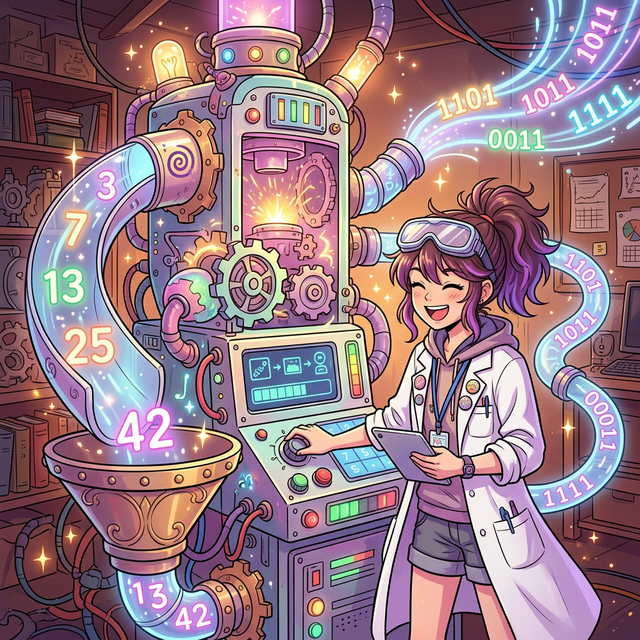

# 04. 네 번째 수업: 이종 언어 간의 번역, 진법 변환 (Base Conversion)

---

## 학습 목표
* 10진법으로 쓰인 일상적인 숫자를 컴퓨터가 이해할 수 있는 2진법으로 변환하는 수학적 원리를 배웁니다.
* 몫이 0이 될 때까지 계속해서 2로 나누고, 그 나머지를 거꾸로 읽어 올라가는 계산법을 익힙니다.
* 파이썬의 진법 변환 명령어인 `bin()` 과 `int()` 를 써서 컴퓨터가 우리 대신 계산하는 속도를 체감합니다.

## 1. 10진수와 2진수의 번역

<div align="center">
  
</div>

외국인 친구를 사귀려면 그 친구 나라의 언어를 배워야 하듯, 컴퓨터에게 명령을 내리고 싶다면 컴퓨터의 언어, 즉 **2진법(Binary)**을 알아야 합니다. 우리가 매일 쓰는 수 체계인 10진법의 숫자를 2진법으로 바꾸는 과정(번역)을 **진법 변환(Base Conversion)**이라고 합니다.

10진수 숫자가 하나 주어졌을 때, 과연 컴퓨터 내부에서는 이것을 어떤 0과 1의 조합으로 바꿀까요? 
가장 확실하고 쉬운 방법은 **"원하는 진법의 숫자로 더 이상 나눌 수 없을 때까지 계속 나누는 것"**입니다.

## 2. 다른 진법의 숫자를 10진수로 읽는 법 (전개식)

만약 외계인이 와서 **$243_{(5)}$** 라는 숫자를 주었다고 해봅시다. 5진법으로 적힌 이 숫자는 도대체 우리가 아는 몇 개의 사탕을 의미할까요? 
이전 시간에 배운 위치기수법(전개식)을 그대로 적용하면 됩니다. 5진법이므로 각 자리의 방은 $5^0, 5^1, 5^2$ 의 크기를 가집니다.

* **$2 \times 5^2$** (25가 2개 = 50)
* **$4 \times 5^1$** (5가 4개 = 20)
* **$3 \times 5^0$** (1이 3개 = 3)

이것을 모두 더하면 $50 + 20 + 3 = \mathbf{73}$ 이 됩니다. 따라서 5진법 숫자 $243_{(5)}$는 우리가 매일 쓰는 10진법 숫자 **$73$**과 완전히 똑같은 양을 의미합니다!

## 3. 애니메이션으로 보는 진법 변환 (10진수 13을 2진수로!)

이번엔 반대로, 우리가 13개의 사탕을 가지고 있다고 해봅시다. 
이 10진수 13을 오직 '0'과 '1' 두 가지 상태만 가지는 2진법의 세계로 변환해 보겠습니다. 2진법으로 가려면, 당연히 **2로 계속 나누어야 합니다.**

<div align="center">
  
</div>

1. 13을 **2**로 나누면 $\to$ 몫은 6, **나머지는 1**
2. 6을 **2**로 나누면 $\to$ 몫은 3, **나머지는 0**
3. 3을 **2**로 나누면 $\to$ 몫은 1, **나머지는 1**
4. 마지막 몫인 **1**은 더 이상 2로 나눌 수 없습니다. 끝!

자, 이제 **마지막 남은 몫부터 시작해서, 그동안 생겼던 나머지들을 아래에서 위로 거꾸로 주욱 읽어 올라갑니다.**
$\to$ **1, 1, 0, 1**

따라서, 10진수 $13$은 2진수 표기법으로 $\mathbf{1101_{(2)}}$ 이 됩니다.
($_{(2)}$ 처럼 작은 괄호를 써주면 "나 1101 아니야, 나 2진수로 읽어줘!" 라는 수학적 약속입니다.)

## 3. 파이썬(Python)은 진법 변환의 달인

사람이 종이에 2로 계속 나누는 계산을 하다 보면 실수할 때가 많습니다. 하지만 컴퓨터 내부의 뇌인 파이썬 프로그래밍 언어에게 이건 1초도 안 걸리는 식은 죽 먹기입니다.

파이썬에는 10진법을 2진법(Binary)으로 변환해 주는 **`bin()`**이라는 마법 같은 명령어가 있습니다. 또한 반대로 2진법을 다시 우리가 아는 10진법 정수(Integer)로 돌려놓는 **`int(숫자, 진법)`** 명령어도 존재합니다.

```python
# 1. 10진수 13을 2진수로 변환하기
number = 13
binary_result = bin(number)

print(f"10진수 {number}은(는) 2진수로 {binary_result} 입니다.")
# 출력 결과: 10진수 13은(는) 2진수로 0b1101 입니다.
# ('0b'는 컴퓨터가 "이건 2진수(binary)입니다!"라고 알려주는 마크입니다.)

# 2. 이번엔 반대로 2진수를 10진수로 복구해 볼까요?
# 방금 얻은 '1101'이라는 2진법 문자열을 10진수 정수로 바꿉니다.
recovered_number = int('1101', 2)

print(f"2진수 1101은(는) 다시 10진수 {recovered_number}(으)로 돌아왔습니다.")
# 출력 결과: 2진수 1101은(는) 다시 10진수 13(으)로 돌아왔습니다.
```

정말 놀랍죠? 프로그래밍을 배우면 수학책에서 열심히 풀었던 나눗셈 꼬리표를 딱 한 줄의 코드로 해결할 수 있게 됩니다. 이것이 여러분이 인공지능과 코딩을 함께 배워야 하는 이유입니다!

---

## 학습 정리
1. **나눗셈 연쇄법칙**: 10진수를 2진수로 바꾸기 위해서는, 목표 숫자가 더 이상 2로 나뉘지 않을 때까지 계속 2로 나누고 그 **나머지를 아래에서부터 위로 읽어 올리면** 완성됩니다.
2. **역 변환**: 나눗셈의 반대는 곱셈이듯, 다시 10진수로 돌아오고 싶다면 각 자리의 위치에 맞게 $2^0, 2^1, 2^2...$ 를 곱해서 더해 주면 됩니다.
3. **파이썬 내장함수**: 10진수 $\to$ 2진수는 파이썬의 `bin()` 함수를, 2진수 $\to$ 10진수는 `int("2진수", 2)` 함수를 사용하면 컴퓨터가 자동으로 '번역' 해줍니다.
