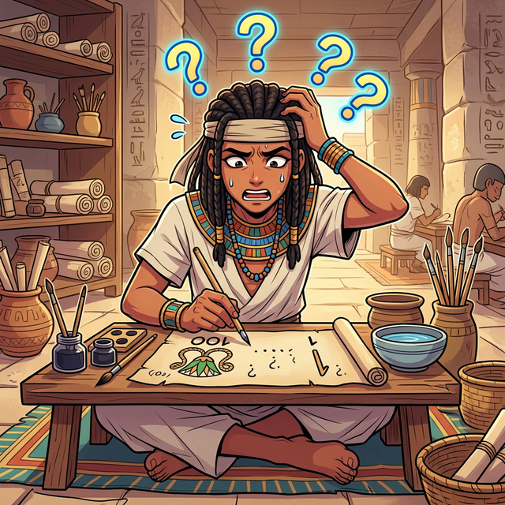

# 05. 다섯 번째 수업: 고대의 기수법과 가법적 원리의 한계

---

## 학습 목표
* 고대 이집트, 로마인들이 사용했던 기호 기반 숫자 표기법을 살펴봅니다.
* 위치와 상관없이 기호의 값을 모두 더하는 '가법적(Additive) 기수법'의 특징을 이해합니다.
* 가법적 기수법이 훌륭한 위치기수법(Positional System)에 밀려 현대 수학에서 사라진 이유를 분석합니다.

## 1. 이집트와 바빌로니아의 거대한 숫자들

우리가 앞서 111이라는 숫자가 '자리'마다 가치가 다르다는 사실(위치기수법)을 배웠습니다. 그렇다면 고대인들도 이런 천재적인 생각을 했을까요?

고대 이집트 사람들은 수백만, 수천만 개의 돌을 쌓아 피라미드를 지을 만큼 놀라운 건축 기술을 가졌지만, 그들이 쓰던 기수법은 조금 답답했습니다. 이집트인들은 1은 '수직 막대기', 10은 '말굽', 100은 '밧줄방울', 1000은 '연꽃' 등 단위마다 전용 픽토그램(그림)을 하나씩 그려서 표현했습니다.

예를 들어 **'321'**을 쓰려면?
연꽃(100)을 3번 그리고, 말굽(10)을 2번 그리고, 막대(1)를 1번 그렸습니다. 
만약 **'999'**라면? 무려 27개의 기호를 칠판 가득 그려야만 했습니다. 이런 방식을 **가법적(더하기) 기수법**이라고 부릅니다. 그림이 어디에 놓이든 상관없이 눈에 보이는 기호의 값을 모두 합치기만 하는 방식이죠.

### 더 똑똑했던 바빌로니아(메소포타미아)의 쐐기문자

반면, 고대 메소포타미아 인들은 진흙 점토판에 '쐐기(V 자 모양)'를 눌러 숫자를 적었습니다. 놀랍게도 이들은 기원전에 이미 **위치기수법**을 깨달았습니다! 다만 10진법이 아니라 **60진법**을 썼죠. 
오른쪽 첫 번째 쐐기는 1을 뜻하고, 그 다음 왼쪽 쐐기는 60을, 그 왼쪽은 3600($60^2$)을 의미했습니다. 그래서 그들의 수학과 천문학이 고대에서 가장 압도적으로 발달할 수 있었습니다. 현대의 1시간이 60분이고 원이 360도인 이유가 바로 이 메소포타미아인들 덕분입니다.

### 산가지를 이용한 고대 중국의 위치기수법
동양에서는 어땠을까요? 고대 중국에서는 대나무 막대기인 **'산가지(산대)'**를 바닥에 늘어놓으며 계산을 했습니다. 중국 역시 1의 자리, 10의 자리, 100의 자리를 위치로 구별하는 10진 위치기수법을 일찍이 사용했습니다. 헷갈리지 않게 1의 자리는 세로로, 10의 자리는 가로로, 다시 100의 자리는 세로로 규칙적으로 막대기를 놓았습니다.

## 2. 지금까지 살아남은 고대의 숫자: 로마 숫자

이집트의 밧줄과 연꽃은 사라졌지만, 이 '가법적' 기수법의 후손 중 하나는 놀랍게도 21세기인 지금도 살아남아 우리 곁에 있습니다. 바로 시계판이나 책의 목차에서 자주 보는 **로마 숫자 (Roman Numerals)**입니다.

  

로마 숫자의 기본 기호는 아주 단순합니다.
* $\mathbf{I} = 1$
* $\mathbf{V} = 5$
* $\mathbf{X} = 10$

우리가 쓰는 숫자 '8'을 로마 숫자로 쓰면 $\mathbf{VIII}$ (5 + 1 + 1 + 1) 가 됩니다. 기호들의 값을 있는 그대로 더합니다. (단, $IV$ 처럼 작은 숫자가 큰 숫자 앞에 오면 예외로 덧셈이 아닌 뺄셈 $5-1=4$ 를 의미합니다.)

## 3. 로마 숫자는 왜 수학 교과서에서 쫓겨났을까?

로마 제국은 엄청나게 거대했고 훌륭한 역사를 자랑했지만, 그 대단한 로마인들 중에서 역사에 이름을 남긴 '위대한 수학자'는 단 한 명도 없습니다. 그 이유는 바로 그들이 치명적으로 불편한 이 **로마 숫자**를 고집했기 때문입니다.

간단한 덧셈을 보여드릴까요?
현대 숫자: $13 + 18 = 31$
로마 숫자: $\mathbf{XIII} + \mathbf{XVIII} = \mathbf{XXXI}$

덧셈까지는 어떻게 막대기 개수를 모아서 한다고 쳐도, 곱셈이나 나눗셈으로 넘어가면 그야말로 재앙이 펼쳐집니다. $\mathbf{CXXIV} \times \mathbf{XXXIV}$ 같은 계산은 암산으로는 절대 불가능해서, 결국 주판 같은 도구의 도움을 받아야만 했습니다. 

컴퓨터가 로마 숫자로 사칙연산을 하도록 코딩한다면, 각 문자가 뜻하는 값을 하나하나 분해해서 배열(Array)에 넣은 다음, 순서에 따라 덧셈인지 뺄셈인지 판단(`if/else`)하는 아주 복잡하고 느린 반복문 로직을 짜야 합니다. 인류의 발전과 우주 탐험을 이끈 현대 수학의 눈부신 발전 앞에서는 결국 자리의 가치를 이용하는 **'위치기수법(현재의 1~9 시스템)'**이 압승을 거둘 수밖에 없었던 것입니다.

## 4. 아직 발명되지 않은 '그 숫자'

  

가법적 기수법의 가장 큰 문제점은 또 하나 있었습니다. 
101을 써야 하는데, 이집트인은 100(연꽃) 하나, 1(막대) 하나를 그렸습니다. 만약 누군가가 연꽃과 막대 사이를 띄어 쓰지 않으면, 이것은 그냥 100과 1이 있는 건지, 101인지, 심지어 110 중에서 10단위를 빼먹은 건지 헷갈리는 치명적인 버그(Bug)가 발생합니다.

빈자리가 있다는 것을 분명히 표시해야만 이 모든 문제가 영원히 해결된다는 사실!
이를 위해 인류가 발명(또는 발견)한 가장 충격적이고 파괴적인 숫자. 다음 시간에는 세상을 뒤흔든 궁극의 치트키 **'0'의 발견**을 만나보러 인도로 떠나보겠습니다.

---

## 학습 정리
1. **가법적 기수법 (Additive System)**: 기호가 놓인 위치(자리)에 상관없이 눈에 표시된 문자의 기호 값을 전부 더하기만 하는 단순한 방식입니다. (고대 이집트, 로마 등)
2. **로마 숫자의 몰락**: 문자를 일일이 나열해야 하므로 아주 큰 수를 표현하기 어렵고, 특히 곱셈과 나눗셈 같은 고급 수학 연산을 하기에는 불가능할 정도로 불편했습니다.
3. **빈자리의 부재**: 덧셈 기수법은 '아무것도 없다'는 것을 나타내는 빈자리를 뜻하는 기호가 없었기 때문에 수학이 발전하는 데 큰 걸림돌이 되었습니다.
