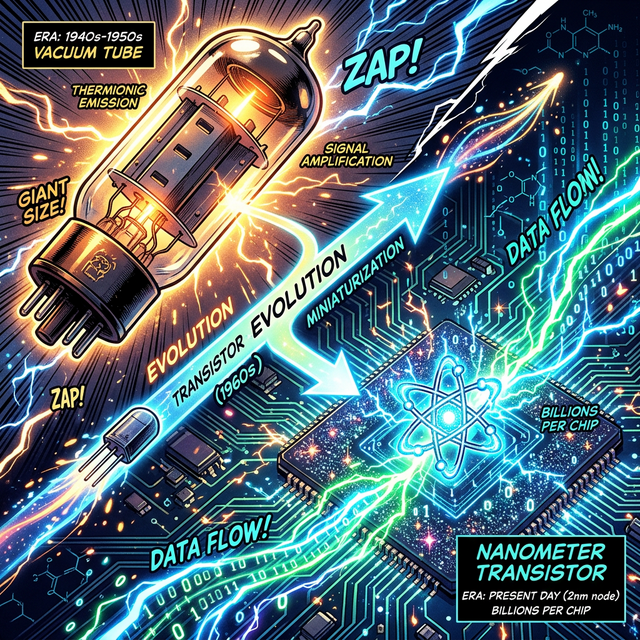
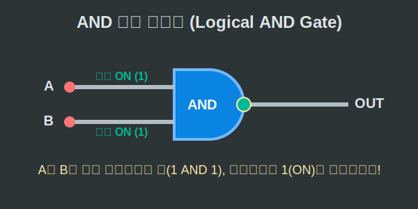

# 08. 여덟 번째 수업: 0과 1의 물리적 실체, 논리 회로와 트랜지스터

지금까지 우리는 2진법이 단 두 개의 숫자(0과 1)만으로 우주의 모든 수를 완벽하게 담아낼 수 있는 수학적 혁명이라는 것을 배웠습니다. 그렇다면 수학자들의 머릿속에만 있던 이 추상적인 $0$과 $1$을, 컴퓨터라는 단단한 쇳덩어리가 어떻게 알아듣고 계산하는 걸까요?

숫자가 눈에 보이는 전기가 되어 컴퓨터의 혈관을 타고 흐르는 구조, 즉 **스위치에서 트랜지스터, 그리고 논리 회로(Logic Gates)**로 이어지는 하드웨어의 놀라운 진화를 살펴봅시다.

---

## 학습 목표
* 0과 1을 상태로 표현하는 물리적 스위치(진공관, 트랜지스터)의 발전 과정을 이해합니다.
* 전기의 흐름을 제어하여 덧셈과 논리를 판단하는 디지털 논리 게이트(AND, OR, NOT)를 배웁니다.
* 과거의 데이터를 잊지 않고 저장하는 메모리의 기원, 플립플롭(Flip-Flop)과 이를 파이썬 객체로 구현해 봅니다.

## 1. 0과 1을 가두는 마법의 방: 스위치부터 진공관까지

수학의 2진수 0과 1은 컴퓨터 세계로 넘어오면 아주 단순한 물리적 상태로 번역됩니다.
* **1 (True)** = 전기가 흐른다 (스위치 ON / $5$V 볼트)
* **0 (False)** = 전기가 흐르지 않는다 (스위치 OFF / $0$V 볼트)

초기 계산기는 말 그대로 손으로 눌러서 켜고 끄는 기계식 스위치를 썼습니다. 하지만 전구를 1초에 수천 번 손으로 켰다 끌 수는 없겠죠? 그래서 과학자들은 **진공관(Vacuum Tube)**이라는 돌연변이 전구를 발명했습니다. 전기의 힘만으로 1초에 수만 번 스위치를 켰다 끄게 된 것입니다. 

하지만 진공관은 열이 너무 났고 자주 터졌습니다. 이를 극복하기 위해 등장한 인류 최고의 발명품이 바로 엄지손톱보다 작은 **트랜지스터(Transistor)**입니다. 반도체 물질로 만들어져 기계적인 움직임 없이 전기의 흐름을 완벽하게 끊거나 이어주는 이 마법의 소자는, 오늘날 여러분의 스마트폰 CPU 안에 무려 **수백억 개** 단위로 꽉꽉 채워져 있습니다!

<div align="center">
  
</div>

## 2. 생각하는 스위치: 디지털 논리 게이트 (Logic Gates)

트랜지스터 하나는 그저 선을 잇거나 끊는 멍청한 역할만 합니다. 하지만 트랜지스터들을 아주 교묘하게 엮어서 "전기 회로"를 구성하면, 수학적인 '논리 판단'과 '덧셈'을 할 수 있는 두뇌가 탄생합니다! 우리는 이것을 **논리 게이트(Logic Gate)**라고 부릅니다.

1. **AND 게이트 (교집합)**: 입력 A와 입력 B가 **모두 1일 때만** 1을 뱉어냅니다. (건전지 2개를 직렬로 연결할 때와 같습니다. 둘 다 스위치를 눌러야 불이 켜집니다.)
2. **OR 게이트 (합집합)**: 입력 A나 B **둘 중 하나라도 1이면** 1을 뱉어냅니다. (건전지를 병렬로 연결한 것과 같습니다. 어느 쪽으로든 전기가 통하면 불이 켜집니다.)
3. **NOT 게이트 (여집합 / 1의 보수)**: 들어온 신호를 $180^\circ$ 청개구리처럼 다르게 바꿔버립니다. 0이 들어오면 1로, 1이 들어오면 0으로 뒤집습니다.

이 3가지 기본 블록만 있으면 덧셈이든 곱셈이든 심지어 우주선을 화성으로 보내는 궤도 계산이든 모든 연산이 가능해집니다. (이들을 결합한 반가산기와 전가산기가 컴퓨터 CPU의 수학 공장이 됩니다.)

<div align="center">
  
</div>

## 3. 과거를 기억하는 뇌세포: 플립플롭 (Flip-Flop) 회로

컴퓨터가 연산만 잘한다고 만능은 아닙니다. 덧셈을 했으면 그 결과를 어딘가에 **'저장(Memory)'**해야 합니다. 그런데 전기는 끊기는 순간 모든 정보가 사라지는데, 도대체 램(RAM)은 어떻게 0과 1을 기억하는 걸까요?

비밀은 출력선에서 나온 전기를 다시 자기 자신의 입력선으로 집어넣는 놀라운 기법, 즉 문을 열고 들어가서 안에서 걸어 잠그는 **'플립플롭(Flip-Flop)' 회로 구조**에 있습니다! 한 번 1 상태가 들어가면, 우리가 명시적으로 "리셋(Reset)" 스위치를 누르기 전까지 전기가 뱅글뱅글 돌며 계속 1 상태를 유지(Save)합니다. 이것이 바로 컴퓨터 메모리(SRAM)의 1비트 세포입니다.

## 4. 파이썬으로 논리 게이트와 메모리 직접 만들기

파이썬의 마법을 통해, 방금 배운 하드웨어 로직을 순수 코드로 창조해 볼까요?

```python
# 파이썬으로 구현한 논리 게이트(Logic Gate)와 플립플롭 기억 소자

# 1. 논리 게이트 (AND, OR, NOT) 구현 - 파이썬의 비트 연산자 활용
def AND_gate(a, b):
    # a와 b 모두 참(1)일 때만 1을 반환 (파이썬 & 연산자)
    return a & b

def OR_gate(a, b):
    # a와 b 중 하나라도 참(1)이면 1을 반환 (파이썬 | 연산자)
    return a | b

def NOT_gate(a):
    # 0이면 1로, 1이면 0으로 뒤집기 (xor를 활용한 토글 트릭)
    return a ^ 1 

print("--- 논리 게이트 테스트 ---")
print(f"1 AND 1 = {AND_gate(1, 1)}") # 출력: 1
print(f"1 AND 0 = {AND_gate(1, 0)}") # 출력: 0
print(f"NOT 0   = {NOT_gate(0)}")    # 출력: 1


# 2. 1비트를 기억하는 메모리 세포, 'SR 플립플롭' 클래스 만들기
class SR_FlipFlop:
    def __init__(self):
        self.Q = 0  # 초기 메모리 상태는 비어있음 (0)
        
    def pulse_signal(self, Set, Reset):
        """
        Set(세팅) 스위치를 누르면 1이 저장되고 영원히 유지됩니다!
        Reset(초기화) 스위치를 누르면 다시 0으로 지워집니다.
        """
        # 논리 회로의 상호 맞물림 구조를 파이썬 코드로 간략히 모델링
        if Set == 1 and Reset == 0:
            self.Q = 1   # 기억 등록!
        elif Set == 0 and Reset == 1:
            self.Q = 0   # 기억 삭제!
        # 둘 다 0일 때(입력이 없을 때)는 이전 self.Q 값이 그대로 '유지'됩니다.
        
        return self.Q

print("\n--- 플립플롭(1 Bit 메모리) 기억 테스트 ---")
memory_cell = SR_FlipFlop()
print(f"초기 상태: {memory_cell.Q}") # 출력: 0

# Set 스위치 ON! (1을 주입)
print(f"값 1 기록 펄스 전송 -> 상태: {memory_cell.pulse_signal(Set=1, Reset=0)}")

# 아무 입력도 주지 않는다 (Set=0, Reset=0).. 꺼질까?
print(f"전원만 투입한 대기 상태 유지 -> 상태: {memory_cell.pulse_signal(Set=0, Reset=0)}")
# => 놀랍게도 값이 지워지지 않고 1을 '기억(Memory)'하고 있습니다!

# Reset 스위치 ON! (값 지우기) 
print(f"리셋 펄스 전송하여 지우기 -> 상태: {memory_cell.pulse_signal(Set=0, Reset=1)}")
```

파이썬 코드에서 보듯, 물리적인 전선의 연결 상태(Logic)는 그대로 컴퓨터 소프트웨어의 조건문(`if`, `&`, `|`)으로 완벽하게 번역됩니다. 하드웨어 트랜지스터와 소프트웨어 코딩은 사실 똑같은 논리학의 양면이었던 것입니다.

## 학습 정리
1. **트랜지스터**: 0과 1의 수학적 2진수 값을 전기 신호(ON/OFF)로 구현하여 컴퓨터의 세포벽을 이루는 반도체 스위치.
2. **논리 게이트 (Logic Gates)**: 트랜지스터를 조합하여 전기의 흐름만으로 더 큰 논리적 판단(AND, OR, NOT)을 수행하는 두뇌 구조. 
3. **플립플롭 (Flip-Flop)**: 출력이 입력으로 피드백을 주어 전기가 차단되지 않는 이상 정보를 뱅뱅 돌리며 유지하는 '메모리(RAM)' 기록의 본질.
