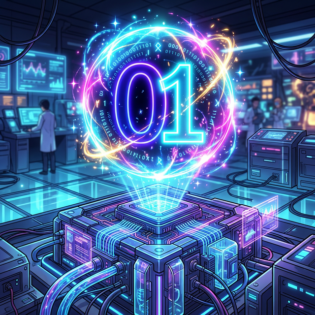

# 09. 에필로그 (Epilogue): 숫자의 미래, 큐비트(Qubit)

---

## 학습 목표
* 지금까지 배운 0, 진법, 기수법이 현대 인공지능까지 도달한 거대한 여정을 되돌아봅니다.
* 0과 1만을 처리하는 고전적 2진법 컴퓨터를 넘어, 양자 컴퓨터(Quantum Computing) 시대의 '우주적 셈법'에 대해 가볍게 체험합니다.

## 1. 뼈다귀의 흔적에서 스마트폰까지

여러분과 함께한 **'기수법'**의 긴 모험이 끝났습니다.
어떠셨나요? 항상 공책에 문제를 풀기 위해 무심코 적어 내려갔던 '2, 5, 0' 같은 숫자 하나하나 속에, 사실은 수천 년 전 인류의 거대한 철학과 피땀 어린 눈물이 들어 있었습니다.

* **동물의 뼈에 새긴 빗금**(일대일 대응) 하나에서 시작하여,
* 손가락 열 개를 보고 묶어버린 **10진법**, (2강)
* 길게 쓰기 싫어서 자리마다 가치를 다르게 부여한 **위치기수법 지수($10^n$)**, (3강)
* 로마인들을 패배하게 만든 **'0'의 엄청난 빈자리 권력**, (5~6강)
* 그리고, 손가락이 없는 전자기기들을 위해 0과 1만을 남겨준 최고 효율의 **2진법 컴퓨터(Python)**까지! (7강)

수학은 하늘에서 뚝 떨어진 외우기 귀찮은 공식이 아닙니다. 이 모든 과정은 살아남기 위해 조금이라도 더 인간의 에너지를 절약하려던, **'인류 최고의 데이터 압축 기술(코딩)'**의 역사였습니다.

## 2. 컴퓨터 과학의 끝없는 숫자 진화 (양자 컴퓨터)

  

그렇다면 진법의 역사는 여기서 끝일까요? 라이프니츠의 2진법(0과 1)이 영원히 우주를 지배할까요? 
놀랍게도 인간의 호기심은 그 이상을 향해 나아가며 **양자 컴퓨터(Quantum Computer)**의 세계를 열어젖히고 있습니다.

기존의 파이썬 코딩이나 스마트폰은 오로지 0 아니면 1, 둘 중 하나의 상태만 가질 수 있는 **비트(Bit)**를 썼습니다.
하지만 양자 물리학이 만들어낸 **큐비트(Qubit)**는?
0이기도 하면서, 동시에 1이기도 한! (0과 1의 **중첩, Superposition** 상태) 믿을 수 없는 동시 상태를 가집니다.

  

## 3. 세상을 코딩하는 다음 세대의 수학자

동그라미 모양의 인도 숫자 `0` 하나가 전 세계 수학과 과학을 뒤흔들어 놓은 것처럼, 2진법의 한계를 뛰어넘은 양자 기수법의 발전은 앞으로 우리가 상상조차 할 수 없는 새로운 인공지능 시대를 열 것입니다.

이 글을 읽고 있는 여러분은 이미 타이지, 위치기수법, 파이썬 진법 번역을 능숙하게 넘나드는 '기수법 사령관'이 되었습니다. 이제 여러분이 일상에서 만날 모든 숫자들이 조금은 다르게 느껴지길 바라면서, 훗날 양자 컴퓨터 시대에 10진수와 큐비트를 자유롭게 변환하는 위대한 프로그래머가 되기를 응원합니다!

수고하셨습니다. 다음 모듈에서 또 재미난 코딩-수학 이야기로 만납시다!

---

## 학습 정리
1. **타이지부터 양자 컴퓨터까지**: 숫자는 단순히 점수 매기는 기호가 아니라, 문명과 기술 발전에 가장 큰 축을 담당한 '데이터 압축과 표현술'입니다. 
2. **0과 1, 그리고 큐비트(Qubit)**: 고전 컴퓨터의 Bit가 0 아니면 1의 확정적 상태였다면, 미래 컴퓨터의 Qubit는 0과 1이 확률적으로 겹쳐 있는 마법 같은 세 번째 상태를 활용합니다.
3. **수학과 프로그래밍**: 지금 여러분이 교과서에서 배우는 숫자의 원리는 훗날 인공지능과 데이터 공학을 지배하는 가장 강력한 무기가 될 것입니다.
