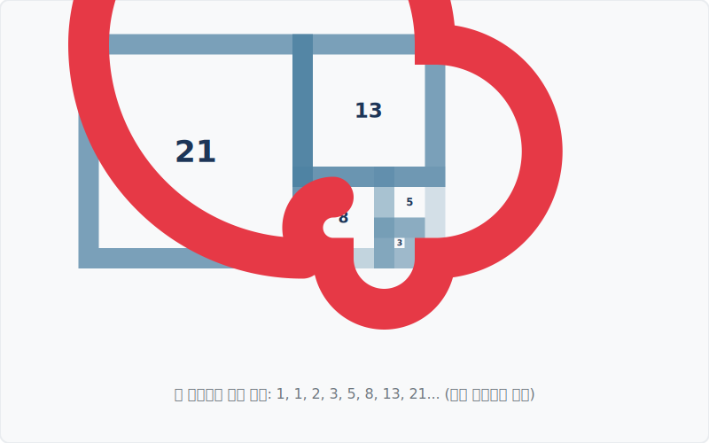

# 07. 기하학적 모습, 황금 나선 (Golden Spiral)

## 1. 학습 목표 (Learning Objectives)
* 수식으로 접했던 피보나치수열이 2차원 평면(Geometry)에서 어떤 모양으로 그려지는지 시각적으로 이해합니다.
* 앵무조개, 태풍의 반경 등 거대한 자연물들이 '황금 나선' 모양을 띠는 형태학적 이유를 알아봅니다.

## 2. 황금 사각형과 나선
가로와 세로의 길이 비가 정확히 $1 : 1.618$ 인 직사각형을 우리는 **'황금 사각형(Golden Rectangle)'**이라고 부릅니다. 이 사각형은 아주 독특한 성질을 가지고 있습니다. 사각형 내부에서 가장 큰 정사각형을 잘라내면, 남은 자투리 사각형 역시 원래 사각형과 완벽하게 닮은 $1 : 1.618$ 비율의 황금 사각형이 됩니다.

이 분할 과정을 계속해서 무한히 반복하면서 정사각형들의 모서리를 부드러운 곡선으로 연결해보면, 중심을 향해 뱅글뱅글 돌아들어가는 깊고 아름다운 소용돌이 모양이 만들어집니다. 이를 수학계에서는 **황금 나선(Golden Spiral)**이라고 부릅니다.

*(참고: 황금 나선은 한 변의 길이가 피보나치 수인 1, 1, 2, 3, 5, 8, 13... 인 정사각형들을 덧붙여 나갈 때 그려지는 곡선과 거의 완벽하게 일치합니다.)*

## 3. 자연에서 관찰되는 황금 나선의 프랙탈(Fractal) 구조
이 나선의 가장 강력한 특징은 '아무리 확대하거나 축소해도 모양이 절대 변하지 않는다는 것'입니다. (이러한 자기유사성을 **프랙탈**이라고 합니다).

자연계에서는 이 황금 나선을 정말 흔하게 발견할 수 있습니다.
- 달팽이와 앵무조개의 껍데기
- 매 머리 깃털 모양, 수컷 양의 둥글게 말려들어간 뿔
- 허리케인(태풍)의 거대한 구름 소용돌이
- 우주 공간에 펼쳐진 은하수(Spiral Galaxy)의 팔 모양

앵무조개는 성장하면서 집(껍데기)을 넓혀가야 하는데, 자신의 몸통 구조(비율)를 그대로 유지하면서 공간을 확장하기 위해 황금 나선 형태로 껍질을 말아서 자라납니다. 생존을 위해 가장 자연스럽고 수학적으로 흔들림이 없는 안정된 비율을 채택한 것입니다.

## 4. 학습 정리 (Summary)
1. **황금 사각형의 반복 분할**: 황금 사각형 내부를 계속 정사각형으로 잘라내면 무한히 황금 사각형이 복제됩니다.
2. **황금 나선**: 정사각형 모서리를 부드럽게 이으면 원점을 향해 감겨 들어가는 불변의 소용돌이 곡선이 탄생합니다.
3. **거시 우주와 미시 생물학의 일치**: 파이($\Phi$)의 비율로 생성되는 나선형 궤도는 생물학적 성장률과 우주의 확장 구조 모델에 가장 에너지 효율이 높은 공간 규칙으로 적용됩니다.
