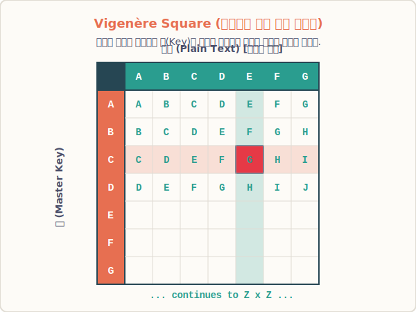

# 03. 빈도 분석법을 찢어발긴 다중 치환 (Vigenère)

## 1. 학습 목표 (Learning Objectives)
* 글자마다 1:1로 매칭되는 단순함을 벗어나, 글자의 위치에 따라 동적으로 암호화 톱니바퀴 규칙이 변하는 다중 치환 암호 체계를 이해합니다.
* 16세기 유럽을 지배했던 '비제네르 사각형(Vigenère Square)'의 매핑 십자 교차도를 시각화 자료를 통해 살펴봅니다.

## 2. 'E'가 더 이상 'X'가 아닐 때 일어나는 일
앞선 빈도 분석법의 철퇴를 피하기 위해 스파이 가문과 수학자들은 새로운 방어막을 고안해 냅니다.
"똑같은 'E' 글자라도, 첫 번째 단어에 쓰일 때는 'X'로 위장시키고 세 번째 단어에 쓰일 때는 'Q'로, 열 번째에 쓰일 때는 'K'로 위장시키자!"

이처럼 글자 하나당 회전하는 시저 바퀴의 칸수를 시시각각 바꿔버리는 미친 아이디어가 등장합니다. 글자가 나오는 자리가 계속 바뀌니, 아무리 텍스트 더미를 모아놓아도 막대그래프 통계(빈도율 13% 독점)가 생겨나지 않고 26개 알파벳이 완전히 균등하고 랜덤하게 분산되어 버립니다. **통계학의 눈을 멀게 만들어 버린 다중 치환 암호(Polyalphabetic Cipher)**의 탄생입니다.

## 3. 난공불락의 표, 비제네르 사각형
1553년에 집대성되어 무려 300년이라는 기나긴 세월 동안 대영제국을 포함한 지구상의 어떤 수학자도 뚫어내지 못한 악명 높은 표가 있습니다.
보안이 워낙 강력해 '해독 불가 암호(Le Chiffre Indéchiffrable)'라고 불린 **비제네르 암호(Vigenère Cipher)**입니다.

비제네르 암호를 쓰려면, 위와 같은 26x26 거대 알파벳 십자 행렬표가 있어야 합니다. 그리고 발송자와 수신자 사이에 은밀한 '키워드(Key)'가 필요합니다.

**[작동 과정 예시]**
- 키워드(Master Key)를 `CAT` 이라고 정했습니다. 이 키워드를 평문 밑에 스탬프처럼 반복해서 쭉 찍어나갑니다.
- 암호로 만들 평문: `HELLO APPLE`
- 자물쇠 톱니바퀴: `CATCA TCATC`

1. 첫 글자 **H**를 바꿀 때는 키가 **C** 입니다. 위 표에서 가로축 **H**와 세로축 **C**가 직각으로 스쳐 불꽃이 튀는 교차점의 글자를 읽습니다. 정답은 `J` 입니다.
2. 두 번째 글자 **E**를 바꿀 때는 키가 **A** 입니다. 가로축 **E**, 세로축 **A**가 만나는 교차점을 읽으면 이건 키를 안 밀었으므로 그대로 `E`가 나옵니다.
3. 세 번째 글자 **L**을 바꿀 때는 키가 **T** 입니다. 깊이 내려가 교차점을 찾으면 `E`가 나옵니다.

놀랍게도 아까 2번째 글자는 평문이 **E** 였는데도 암호문은 **E** 가 튀어나왔고, 3번째 글자는 평문이 **L** 이었는데 암호문이 똑같은 **E**로 변장하고 튀어나왔습니다! 즉 한 문서 안에 같은 문자 'E'가 수백 군데 뿌려졌다고 쳐도 어떤 건 H로, 어떤 건 V로 매번 다르게 숨어 나오니 적군 통계학자들의 `matplotlib` 빈도 그래프는 완전히 먹통 플랫(Flat) 선이 되어버리고 맙니다.

## 4. 학습 정리 (Summary)
1. **다중 치환 암호**: 하나의 알파벳을 상황(문자 위치)에 따라 톱니바퀴 규칙을 제각각 다르게 적용하여 여러 글자로 분산 치환시키는 고급 기술입니다.
2. **비제네르 사각형**: $x$축과 $y$축의 교차 조합을 행렬로 그려놓은 $26 \times 26$ 보수 진법표이며, 반복되는 키워드 스탬프로 암호 패턴을 수시로 교란시켰던 전무후무한 고전 암호의 제왕이었습니다.
