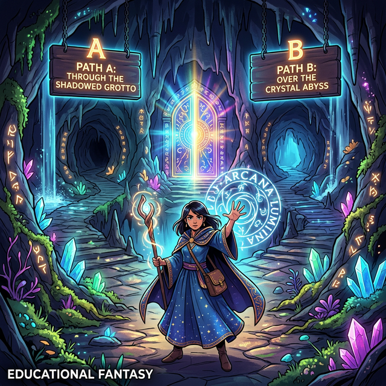

# 06. 증명하지 않고 증명하기: 영지식 동굴 (Zero-Knowledge Proof)

## 1. 학습 목표 (Learning Objectives)
* 현대 블록체인과 가상화폐(코인) 기술에서 가장 열광하는 고급 암호학의 정점, '영지식 증명(ZKP)'의 개념을 탐구합니다.
* 논리적 비유인 '알리바바의 마법 동굴' 스토리를 통해 비밀(비밀번호) 자체를 알려주지 않고도, 내가 찐(?) 주인임을 서버에 100% 입증하는 방법을 알아챕니다.

## 2. 알리바바의 환상적인 마법 동굴
"비밀번호를 알려주지 않으면서, 네가 비밀번호를 안다는 것을 나에게 증명해 봐!"
어지러운 말장난 같지만, 만약 지문이나 해킹으로 비밀번호 자체가 유출되는 사건을 원천 차단하려면 이 기괴한 기능이 반드시 필요합니다. 세계적인 여성 암호학자 샤피 골드바서(Shafi Goldwasser)는 이를 **영지식 증명(Zero-Knowledge Proof)**이라 명명하고, 한 편의 우화로 이를 쉽게 설명했습니다.

위 그림처럼 거대한 알리바바 산에 동굴이 있습니다. 입구는 하나지만 안으로 들어가면 왼쪽 통로(A)와 오른쪽 통로(B)로 갈라져 둥근 도넛 형태를 이룹니다. 도넛의 가장 안쪽(반대편)에는 마법의 돌문이 길을 쾅! 하고 막고 있어서 오직 '열려라 참깨'라는 마법의 주문(비밀키)을 외친 사람만이 돌문을 스르륵 통과해 반대편 길로 빠져나올 수 있습니다.

**[영지식 증명의 과정]**
마법사(나)는 구경꾼(서버)에게 진짜 주문을 들려주기 싫습니다. (비밀키 노출 방지)
1. 구경꾼이 눈을 가리고 뒤를 돈 사이, 마법사가 도넛 동굴 속 왼쪽(A)이나 오른쪽(B) 중 아무 곳으로 몰래 들어갑니다 (마법사는 주문을 알기 때문에 도넛 안쪽 돌문을 통과해 자유롭게 반대편으로 넘나들 수 있습니다).
2. 구경꾼이 눈을 뜨고, 동굴 입구에 대고 크게 외칩니다. **"오른쪽(B) 출구로 걸어 나오시오!"**
3. 마법사가 돌문을 여유롭게 관통하여 오른쪽(B) 통로로 터벅터벅 걸어 나옵니다.
4. 구경꾼은 놀랍니다. '어? 우연히 오른쪽(B)에 있다가 나온 걸 수도 있잖아? 한 번 더 해보자!'
5. 이 황당한 숨바꼭질을 40번 반복합니다. 

단 한 번의 실수도 없이, 마법사는 구경꾼이 홧김에 내지르는 수십 번의 '무작위 방향' 요구를 100% 만족시키며 지정된 통로로 기어나옵니다.

## 3. 영(Zero)의 지식이 입증되는 마법
확률 수학으로 볼까요? 우연히 마법사가 구경꾼이 부를 방향 쪽에 숨어있어서 문을 안 열고 꽁수 통과할 확률은 1/2(50%)입니다.
하지만 숨바꼭질을 40번 반복했을 때 우연히 다 때려 맞출 확률은 $(\frac{1}{2})^{40}$, 즉 **1조 분의 1**이라는 불가능한 숫자로 추락합니다.

구경꾼(서버)은 속으로 확신합니다.
> **"나는 이 사람으로부터 <열려라 참깨>라는 단어(지식, Knowledge)를 0(Zero) 만큼 단 1글자도 듣거나 보지 못했지만, 1조 분의 1의 수학적 확률 검증을 통해 이 사람이 100% 마법 주문을 외울 줄 아는 진정한 문지기임을 증명받았다!"**

이것이 비밀 정보(지갑 키, 주민등록번호, 암호 등)를 통신망에 단 1바이트도 흘려보내지 않으면서도 수백 번의 무작위 검증 프로토콜을 던져 내가 본인임을 완벽하게 증명하는 영지식 증명의 찬란한 구조입니다.

## 4. 학습 정리 (Summary)
1. **영지식 증명(Zero-Knowledge Proof)**: 프라이버시(데이터)를 단 하나도 보이지 않으면서도 내가 해당 정보를 가지고 있다는 사실을 상대방의 까다로운 무작위 검증 루틴을 통해 수학적으로 확정시키는 기법입니다.
2. **보안의 절대 반지**: 서버가 내 암호를 DB에 저장해 뒀다가 털리는 고전 시대를 넘어서, 최신 블록체인 거래나 전자투표 시스템에서 개인정보를 완벽하게 보호하는 차세대 알고리즘입니다.
