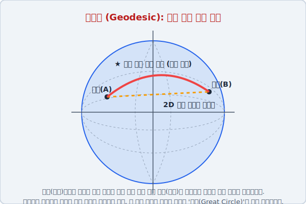

# 02. 직선의 배신: 곡면 위의 최단 거리 (측지선)

## 1. 학습 목표 (Learning Objectives)
* 평면에서 두 점을 잇는 가장 짧은 선은 '직선'이지만, 둥근 곡면 세계에서는 '휘어진 곡선'이 가장 빠르다는 모순을 타파합니다.
* 지구(공 모양)의 하늘을 나는 비행기 항로와 **측지선(Geodesic)**의 수학적 원리를 시각 자료를 통해 파악합니다.

## 2. 뉴욕에서 파리까지 가는 진짜 지름길
미국의 뉴욕에서 유럽의 파리로 가는 비행기 표를 끊었다고 상상해 봅시다. 
우리가 학교에서 배우는 네모 반듯한 '세계 지도(메르카토르 도법)'를 쫙 펼쳐놓고, 뉴욕과 파리에 점을 찍은 뒤 자를 대고 찍 긋습니다. 
"응, 이쪽 방향으로 핸들을 꺾지 않고 곧장 날아가면 제일 빨리 도착하겠군!"

하지만 현실의 비행기 기장님은 그 자를 대고 그은 직선 항로로 비행기를 운전하지 않습니다. 왜냐하면 우리가 사는 세상은 각진 사각형 지도가 아니라, 축구공처럼 부풀어 오른 **'구면 곡률 공간(지구)'** 이기 때문입니다.

위의 일러스트레이션을 볼까요?
네모난 지도를 믿고 점선(평면 기준 일직선)을 따라 날아가면 구부러진 지구의 배 부분이 불룩 튀어나와 있어서 비행기가 더 먼 길을 둘러가게 됩니다.
가장 빠른 지름길은, 비행기의 궤도가 약간 북극 지방을 향해 **둥글게 활처럼 휘어지면서 날아가는 빨간 선 코스**입니다.

## 3. 대원(Great Circle)과 측지선
수학에서는 구와 같은 곡면 위에 있는 어떤 두 점 $A$와 $B$ 사이를 잇는 가장 짧은 최단 경로를 가리켜 직선이 아닌 **측지선(Geodesic)**이라고 부릅니다.
지구본 위에서 측지선은 항상 **'대원(Great Circle)'**의 일부가 됩니다. 대원은 지구의 한가운데 중심을 뎅강 썰어서 두 조각을 냈을 때, 그 단면에 생기는 가장 거대한 형태의 원 궤도를 뜻합니다 (예: 적도).

결론적으로 비유클리드 세상(공 위의 기하학)에서는 **직선이라는 개념 자체가 존재하지 않으며, 모든 최단 거리는 둥글게 휘어진 원호(Arc)**가 될 수밖에 없습니다.

## 4. 학습 정리 (Summary)
1. **측지선 (Geodesic)**: 곡면(구부러진 시공간) 위를 떠다니는 빛이나 물체가 이동하는 물리적으로 가장 짧고 빠른 루트(선)입니다. 평면 기하학의 '직선'이 곡면 기하학으로 수입되면서 붙은 이름입니다.
2. **비행 항로의 비밀**: 세계 지도를 가로지르는 비행기가 일직선으로 가지 않고 위쪽으로 둥글게 원호 코스를 밟는 이유는, 지구가 비유클리드 기하학의 법칙이 지배하는 **구면(Sphere) 구조**를 가졌기 때문입니다.
