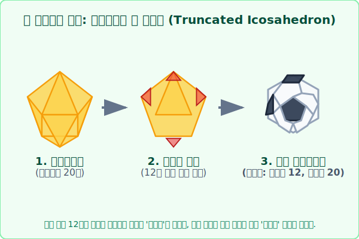

# 06. 신의 조각을 깎아 만든 스포츠: 아르키메데스 다면체와 축구공

## 1. 학습 목표 (Learning Objectives)
* 완벽한 플라톤 입체 클럽에서 규제를 한 단계 완화하여 더 다양하고 화려한 패턴을 만들어 낸 **'아르키메데스 다면체 (준정다면체)'**의 개념을 이해합니다.
* 전 세계인이 열광하는 **축구공(Soccer Ball)**의 흑백 가죽 디자인이 기하학적으로 어떻게 설계되었는지 절단 시뮬레이션으로 밝혀냅니다.

## 2. 완벽한 도자기를 깎아내다: 준정다면체의 탄생
플라톤 클럽의 5형제(정다면체)들은 '피부가 오직 한 종류의 다각형으로만 덮여 있어야 한다'는 꽉 막힌 규율을 고집했습니다.
하지만 고대 그리스의 융통성 있는 최고 천재 수학자 **아르키메데스(Archimedes)**는 이 규제를 슬쩍 풉니다.
> **"음... 피부를 한두 종류의 다른 정다각형(예: 정오각형 + 정육각형 믹스)이 섞이게 덮어줘도 디자인이 예쁘고 대칭만 잘 맞으면 인정해 줘야 하는 거 아니야?"** 

그는 날카로운 칼(무)을 들고 기존 정다면체의 뾰족한 뿔(꼭짓점)들을 똑같은 비율로 뎅강 썰어버리는 조각을 시작합니다. 
그러자 놀라운 일이 벌어졌습니다! 1종류의 면으로만 꽉 막혀 있던 도형에서 잘려 나간 상처 부위가 덧나면서 **'새로운 제2의 다각형 면'**이 생겨나 알록달록한 혼혈 도형들이 쏟아져 나온 것입니다. 이를 **아르키메데스 다면체(Archimedean Solids)** 또는 조건이 완화됐다고 하여 **준정다면체**라고 부릅니다. 이들은 우주에 정확히 **13종류**가 존재합니다.

## 3. 정이십면체 수술과 1970 텔스타 축구공
이 혼혈 다면체 클럽에서 가장 위대한 슈퍼스타는 바로 아디다스가 1970년 멕시코 월드컵에서 선보인 최초의 공인구 '텔스타(Telstar)' 축구공입니다. 
당시 흑백 TV에서 공이 굴러가는 궤적을 뚜렷하게 보여주기 위해 수학자들과 디자이너들이 협업한 결과물이 바로 **'깎은 정이십면체(Truncated Icosahedron)'** 기하학 구조였습니다.

1. 바탕 뼈대는 물(Water)의 상징이자 플라톤 입체 중 공 모양에 가장 가까운 **[정이십면체]** 입니다. (20개의 정삼각형 피부로 구성됨)
2. 가장 뾰족하게 찔리는 모서리 끝단 꼭짓점을 일본도 카타나로 팍 치듯이 일정하게 썰어버립니다. 정이십면체의 총 꼭짓점 개수는 **12개**이므로 12번의 칼질이 들어갑니다.
3. **[블랙홀 생성]** 12군데의 꼭짓점이 잘려나간 단면의 상처 자리에는 새로운 구멍인 **'검정색 정오각형(12개)'** 가죽이 자라납니다!
4. **[화이트 그라운드]** 원래 뼈대였던 20개의 뾰족했던 '정삼각형' 은, 자신이 가지고 있던 3개의 뾰족한 꼭짓점을 모두 잘리기 때문에 이빨이 빠진 **'하얀색 정육각형(20개)'**으로 강제 진화 진화해 버립니다!

이렇게 검은색 오각형 12장과 하얀색 육각형 20장, 총 32개의 둥글스름한 가죽을 기워 넣자 내부에 공기를 조금만 불어넣어도 가장 완벽한 구(Sphere) 형태로 팽창하는 첨단 스포츠 과학의 축구공이 탄생했습니다.

## 4. 학습 정리 (Summary)
1. **아르키메데스 다면체 (준정다면체)**: 2가지 이상의 정다각형 면이 대칭적으로 섞여 이루어진 다면체로, 기존 정다면체의 모서리나 꼭짓점을 깎아내어(Truncate) 인공적으로 만들어냅니다 (총 13개).
2. **축구공의 모델 (깎은 정이십면체)**: 정삼각형 20개짜리 다면체의 모서리를 정교하게 썰어내어 $\rightarrow$ 오각형 절단면 12개 ➕ 육각형 허물 20개 = 도합 32면체로 진화시킨 둥근 기하학의 예술품입니다.
