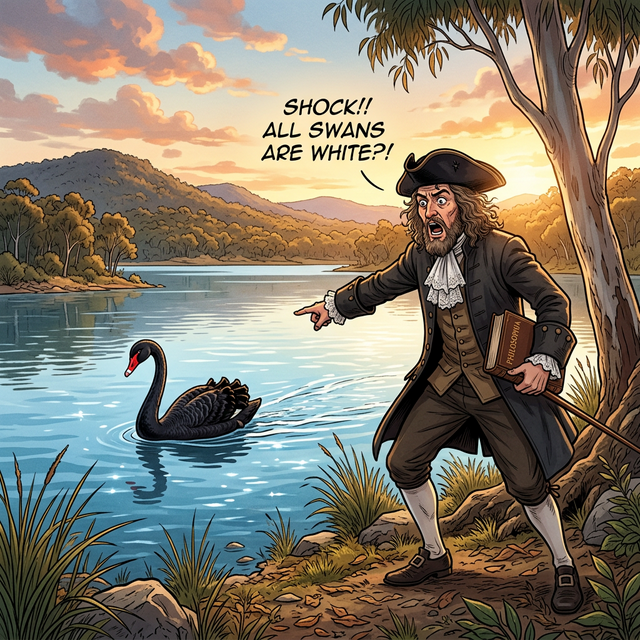

# 02. 논리의 화살: 조건문과 반례의 백조

## 1. 학습 목표 (Learning Objectives)
* 조건 두 개를 스카치테이프로 묶어 새로운 거대한 명제를 탄생시키는 **"만약 $p$이면 $q$이다" ($p \rightarrow q$)** 조건문의 구조를 분해합니다.
* 수백만 번 맞아도, 단 한 번의 예외로 전체 명제를 부숴버리는 철학적 파괴자 **'반례(Counterexample)'**의 개념을 깨닫습니다.

## 2. 조건끼리의 퓨전: 화살표($\rightarrow$) 명제
이전 챕터에서 '조건'은 그 자체로 참/거짓을 알 수 없는 미완성 문장이라고 배웠습니다.
그런데 논리학자들은 이 카멜레온 같은 '조건' 두 개를 이어서 거대한 하나의 완성된 '명제'를 만들어냅니다.

* **조건 $p$ (가정, 앞)**: $x = 2$ 이다
* **조건 $q$ (결론, 뒤)**: $x^2 = 4$ 이다

두 조건을 **"~ 이면(If), ~ 이다(Then)"** 화살표 아교로 접착해 봅니다.
> **"$p \rightarrow q$ (명제)"**: "만약 $x$가 $2$ 이면(가정), 무조건 그 $x$를 제곱한 값은 $4$ 이다(결론)."

이 결합된 거대한 문장은 이제 완벽하게 객관적 판별이 가능한 형태가 되었습니다. $\rightarrow$ 방금 만든 이 명제는 영원히 **'참(True)'** 인 명제가 됩니다!

#### 포함 관계로 참/거짓 증명하기
아까 배운 '진리집합' 벤 다이어그램 렌더링으로 이 화살표의 참거짓을 수학적으로 증명할 수 있습니다.
* $p$ 의 진리집합 $P = \{ 2 \}$
* $q$ 의 진리집합 $Q = \{ 2, -2 \}$
* 앗! **$P$가 $Q$ 안에 완전히 쏙 들어가는 부분집합($P \subset Q$)** 관계이군요! 가정이 결론의 거대한 치마폭에 감싸여 완전히 종속되어 있으면 이 화살표($p \rightarrow q$)는 100% 참(True)이 됩니다.

## 3. 명제 파괴 공작원: 반례 (Counterexample)
> **명제**: "만약 어떤 새가 **백조**($p$)라면, 그 새의 깃털은 무조건 **하얀색**($q$)이다." $(p \rightarrow q)$

과거 17세기 이전 유럽의 철학자와 과학자들은 위 명제가 1000% 우주의 진리이자 '참(True)'인 명제라고 확신했습니다. 평생 하얀색 백조 밖에 못 봤기 때문이죠.
그런데, 유럽인들이 오스트레일리아 대륙(현 호주)을 탐험하다가 끔찍한 충격을 받습니다. 강가에 우아하고 시크한 **새까만 깃털의 백조(Black Swan)** 가 둥둥 떠다니고 있던 것입니다!

이 단 한 마리의 돌연변이 '블랙스완'의 등장으로, 수천 년간 믿어왔던 "모든 백조는 희다"라는 거대한 진리 명제는 산산조각 나며 즉각 **'거짓(False)' 명제**로 판정이 뒤바뀝니다!
* 가정($p$, 백조이다)은 만족하면서 동시에
* 결론($q$, 하얗다)을 거스르고 어긋나는(까맣다) **단 하나의 이단아 예외**!!

이처럼 아무리 백만 번 맞아떨어져도 논리를 단박에 부숴버리는 치명적 예외 케이스 1개를 우리는 **'반례(Counterexample)'**라고 부르며, 명제가 거짓임을 증명하는 가장 위대한 무기로 삼습니다. (경제학에서도 훗날 '블랙스완 현상'이라는 용어로 상식이 박살 나는 대사건을 지칭하게 됩니다).

## 4. 학습 정리 (Summary)
1. **$p \rightarrow q$ (조건문 명제)**: "만약 가정($p$)이 성립한다면, 반드시 결론($q$)도 성립한다"는 형식의 논리 구조입니다. (진리집합 포함 관계가 $P \subset Q$ 일 때 참이 성립합니다)
2. **반례 (Counterexample)**: 명제가 **'거짓'**임을 폭로하기 위해 찾아내는 구멍입니다. 조건($p$)은 통과했지만, 결론($q$)에는 어긋나버리는 예외 요소를 하나라도 찾아 제시하면 그 명제는 무참히 박살 납니다.
