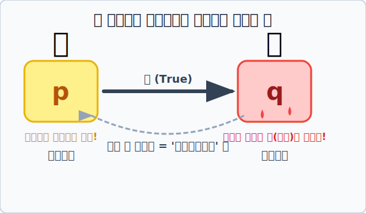

# 04. 화살표 암기법: 충분조건과 필요조건

## 1. 학습 목표 (Learning Objectives)
* $\rightarrow$ 화살표 방향에 따른 두 조건의 결합 관계를 나타내는 용어인 **'충분조건'**과 **'필요조건'**의 개념을 명확히 익힙니다.
* 가장 헷갈리는 이 두 용어를 총탄(화살)과 피(Blood)를 이용한 **시각적 하드코어 암기법 SVG**를 통해 평생 잊지 않도록 시각화합니다.
* 두 조건이 완벽한 데칼코마니(동의어)일 때 쓰는 **'필요충분조건( $\leftrightarrow$ )'**을 살펴봅니다.

## 2. 누가 쏘고, 누가 맞는가?
명제 **$p \rightarrow q$** (만약 $p$이면 $q$이다) 가 '참(True)'이라고 가정해 봅시다. 
이때, 주인공 $p$ 입장과 목적지 $q$ 입장은 서로 부르는 명칭이 다릅니다.

* 화살표의 꼬리에 있는 **$p$** : "나는 $q$가 되기 위한 **충분조건**이다."
* 화살표의 머리에 있는 **$q$** : "나는 $p$이기 위한 **필요조건**이다."

학생들이 가장 많이 틀리고 헷갈리는 부분입니다. "대체 누가 필요고 누가 충분이야?!"
이럴 땐 아래의 강렬한 **'총(\u2b62)과 피(\U0001fa78)' 암기법** 하나면 모든 것이 해결됩니다.

1. **쏘는 놈 ($p$)**: 총알이 아주 **"충분"**하니까 $\rightarrow$ 앞으로 화살표 총을 쏩니다! (**$p$는 충분조건**)
2. **맞는 놈 ($q$)**: 화살표에 푹 찔렸으니 아파서 **"피(필요)"**를 뚝뚝 흘립니다! (**$q$는 필요조건**)

화살이 날아가는 방향만 보면 누가 쏘고 누가 맞는지, 즉 누가 충분조건이고 필요조건인지 1초 만에 파악할 수 있습니다.

## 3. 동전의 양면, "필요충분조건 ($p \leftrightarrow q$)"
가끔 $p \rightarrow q$ 도 참인데, 거꾸로 쏘는 $q \rightarrow p$ 스왑 명제(역)도 동시에 참인 아주 특별하고 희귀한 케이스가 있습니다.
* $p$: "$x$는 짝수이다"
* $q$: "$x$는 2의 배수이다"

이건 이쪽으로 쏴도 참, 저쪽으로 쏴도 참입니다! 즉 $p$와 $q$가 완벽하게 똑같은 진리집합 사이즈, 사실상은 **100% 동의어(어휘만 다를 뿐 뜻이 같음)**라는 뜻입니다.
이때 화살표는 어느 한쪽으로 치우치지 않고 양방향 $\leftrightarrow$ 나침반이 되며, 서로가 서로에게 총알과 피가 되어주는 영혼의 듀오 **"필요충분조건"** 이라고 부릅니다. 

## 4. 학습 정리 (Summary)
1. **충분조건(쏘는 $p$)과 필요조건(맞는 $q$)**: $p \rightarrow q$ 가 참일 때, 화살을 출발시키는 $p$는 충분조건, 화살의 타겟이 되어 피를 흘리는 $q$는 필요조건입니다. 집합 포함 관계로 보면 총을 쏘는 주인공 꼬마($p$)가 덩치 큰 과녁판($q$) 안에 쏙 들어가는 $P \subset Q$ 형태입니다.
2. **필요충분조건 ($p \leftrightarrow q$)**: 두 조건이 향하는 화살표가 양방향으로 모두 '참'인 경우로, 사실상 $p$와 $q는 완전히 똑같은 동의어($P = Q$) 임을 뜻합니다.
