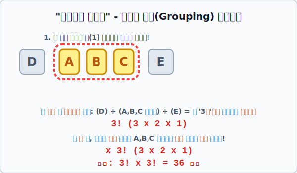

# 04. 이웃하여 줄 서는 묶음(Grouping) 테크닉

## 1. 학습 목표 (Learning Objectives)
* 수많은 원소 중 특별히 "얘네들은 반드시 꼭 붙어있어야 해!"라는 조건이 달린 경우의 수 문제를 해결하는 수학적 테크닉을 익힙니다.
* 사람을 거대한 한(1) 덩어리로 묶박아버리고 돌리는 **아이템 묶음(Grouping) 배열 논리**를 SVG 그래픽과 함께 체화합니다.

## 2. 절대 떨어질 수 없는 단짝 친구
반장 선거에 당선된 5명의 학생(A, B, C, D, E)이 선생님과 일렬로 서서 단체 사진을 찍으려고 합니다. 그런데 아주 골치 아픈 조건이 하나 붙었습니다.

> "A, B, C 이 세 명은 미치도록 친한 단짝 친구라서 **무조건 옆에 딱 붙어서(이웃하여)** 사진을 찍게 해주세요!"

전체 5명을 일렬로 아무렇게나 세우는 경우의 수는 배운 대로 간단하게 **$5! = 120\text{가지}$** 입니다. 하지만 저 3명이 절대 떨어지지 않고 붙어 다니게 하려면 이 $5!$ 의 무작위 배열 시스템은 붕괴합니다. 이럴 땐 어떻게 사고를 전환해야 할까요?

## 3. 거대한 포대 자루에 가둬라!
해결책은 아주 엽기적이고 간단합니다. A, B, C 세 명을 보이지 않는 거대한 밧줄로 꽁꽁 묶어서, 아예 **'거대한 한 명(1덩어리)'** 인 것처럼 취급해 버리는 것입니다!

**[Step 1. 덩어리 치환]**
* 이웃해야 하는 A, B, C를 거대한 하나의 박스(팩) $\mathbf{[ABC]}$ 로 봅니다.
* 그러면 남은 학생 D, E와 함께 사진을 찍는 사람은 사실상 **$[ABC]$, $D$, $E$ 이렇게 총 3명(덩어리)** 이 됩니다!
* 세 덩어리가 일렬로 줄을 서는 경우의 수: $\mathbf{3! = 6\text{가지}}$

**[Step 2. 밧줄 안에서의 암투 (내부 배열)]**
* 박스 $\mathbf{[ABC]}$ 가 첫 번째에 서든, 중간에 서든, 끝에 서든 간에... 밧줄로 묶여 있는 저 $\mathbf{[ABC]}$ 세 명 안에서도 지들끼리 "내가 A보다 왼쪽에 설래!" 하며 순서를 바꾸는 경우의 수가 폭발합니다.
* 묶인 3명끼리 자리 바꾸기: $\mathbf{3! = 6\text{가지}}$

**[Step 3. 곱의 법칙 연쇄 폭발]**
* 큰 덩어리의 배열 사건(3!)과 그 안에서 내부 교체되는 사건(3!)은 동시에 일어나는 '세트' 사건입니다.
* 최종 정답: $\mathbf{3! \times 3! = 36\text{가지}}$ 사진 컷

우리는 이처럼 코딩이나 수학 논리에서 예외적인 결합 조건이 주어졌을 때, 낱개의 데이터를 거대한 팩(Pack) 객체나 배열(Array) 덩어리로 묶어서 치환한 뒤 큰 판을 먼저 돌리고, 나중에 세부를 조율하는 **'그룹핑(Grouping) 알고리즘'**을 아주 빈번하게 사용하게 될 것입니다.

## 4. 학습 정리 (Summary)
1. **이웃하는 경우의 수**: 반드시 붙어있어야 하는 대상들을 거대한 하나의 묶음 객체(1덩어리)로 취급하여 먼저 전체 배열 팩토리얼($!$)을 돌립니다.
2. **내부 배열 증폭**: 큰 덩어리의 배치가 끝났다면, 묶음 내부에서 그들끼리 자리를 맞바꾸며 발생하는 팩토리얼($!$)을 곱의 법칙으로 얹어주어(Multiply) 최종 결괏값을 도출해 내는 수학적 설계 기법입니다.
