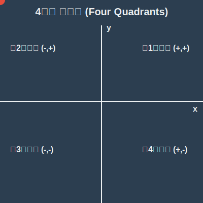

# 02. 두 번째 수업: 파리와 2차원 사분면 (Four Quadrants)

1차원의 좁은 선형 세계를 벗어나, 마침내 상하좌우로 자유롭게 이동할 수 있는 **2차원(2D, Dimension) 평면**의 세계로 진입합니다.

이 편평한 세계에 좌표를 부여하려면 가로축 1개로는 부족하겠죠? 그래서 수학자 데카르트는 가로축과 세로축 2개의 수직선을 십자가 모양으로 교차시켰습니다.

---

## 학습 목표
* 가로($x$)축과 세로($y$)축이 교차하는 **좌표평면(Coordinate Plane)**의 원리를 배웁니다.
* 평면의 네 구역을 뜻하는 **사분면(Quadrant)**의 부호($+, -$) 특징을 외우지 않고 직관적으로 이해합니다.
* 파이썬 라이브러리로 2차원 평면에 점을 찍어 봅니다.

## 1. 2차원 좌표평면과 순서쌍

가로로 뻗은 수직선을 **$x$축**, 세로로 뻗은 수직선을 **$y$축**이라고 부릅니다. 이 둘이 $90^\circ$ 직각으로 만나는 점의 좌표가 바로 **원점 $O(0, 0)$** 입니다.

천장을 기어 다니던 파리의 위치를 상상해 보세요. 파리가 가로줄 3번째 위치에 있고, 세로줄 5번째 위치에 있다면 이렇게 적습니다.
**$(3, 5)$**

이것을 수학에서는 **순서쌍(Ordered Pair)**이라고 부릅니다. 
항상 괄호를 열고 쉼표로 두 숫자를 구분하며, 순서는 전 세계 공통 약속으로 **$(x\text{좌표}, y\text{좌표})$** 의 순서로 적습니다. 알파벳 순서대로 $x$가 먼저 오고 $y$가 나중에 온다고 생각하면 쉽습니다!

*주의!* $(3, 5)$ 와 $(5, 3)$ 은 가로와 세로의 이동량이 다르므로 완전히 다른 두 점입니다.

## 2. 십자가가 만든 4개의 방: 사분면 (Quadrant)

$x$축과 $y$축이 교차하면 텅 빈 평면은 4개의 거대한 조각 피자처럼 나뉩니다. 우측 상단부터 시계 반대 방향으로 1, 2, 3, 4 번호를 붙여 **사분면**이라고 부릅니다.

각 사분면은 축을 기준으로 $+$ 방향인지 $-$ 방향인지에 따라 고유한 부호 특징을 같습니다.

1. **제1사분면 (+, +)**: 원점을 기준으로 오른쪽(+)으로 가고 위(+)로 간 구역. 가장 기본적이고 긍정적인 구역입니다.
2. **제2사분면 (-, +)**: 왼쪽(-)으로 가고 위(+)로 간 구역.
3. **제3사분면 (-, -)**: 왼쪽(-)으로 가고 아래(-)로 간 구역. 완전한 마이너스(-)의 세계입니다.
4. **제4사분면 (+, -)**: 오른쪽(+)으로 가고 아래(-)로 간 구역.

<div align="center">
  
</div>

> **축 위의 점은 어느 사분면일까?**
> $x$축이나 $y$축이라는 선 자체 위에 있는 점, 예를 들어 $(3, 0)$ 이나 $(0, -5)$ 는 그 어떤 사분면에도 포함되지 않습니다. 방 안이 아니라 '벽'에 붙어있는 것과 같습니다!

## 3. 거울 저편으로: 대칭 (Symmetry)

2차원 평면에서는 '거울 모드(대칭 이동)'를 쉽게 만들 수 있습니다. 어떤 점 $P(2, 3)$ 이 있다고 해볼까요.

* **$x$축 대칭 (위아래 뒤집기)**: 가로축인 $x$축을 거울 삼아 반사하면, 좌우 위치는 그대로인데 위아래 높이만 반대가 됩니다. $\rightarrow (2, -3)$ ($y$의 부호 반대)
* **$y$축 대칭 (좌우 뒤집기)**: 세로축인 $y$축을 거울 삼아 반사하면, 높이는 그대로인데 좌우 위치가 반대가 됩니다. $\rightarrow (-2, 3)$ ($x$의 부호 반대)
* **원점 대칭 (대각선 뒤집기)**: $x$축 대칭 후 한 번 더 $y$축 대칭을 한 것과 같습니다. $\rightarrow (-2, -3)$ ($x, y$ 부호 모두 반대)

---

## 4. 파이썬(Python)으로 사분면 한눈에 그리기

2차원 좌표는 영상 처리, 로봇 공학 등 수많은 IT 기술의 핵심입니다. 파이썬 코드로 사분면과 각 사분면에 점을 찍어 보겠습니다.

```python
import matplotlib.pyplot as plt

# 각 사분면의 점 정의
points = {
    'Q1 (2, 3)': (2, 3, 'red'),
    'Q2 (-3, 1)': (-3, 1, 'blue'),
    'Q3 (-2, -4)': (-2, -4, 'green'),
    'Q4 (4, -2)': (4, -2, 'purple')
}

plt.figure(figsize=(6, 6))

# 점 찍기 반복문
for label, (x, y, color) in points.items():
    plt.plot(x, y, marker='o', color=color, markersize=10)
    plt.text(x + 0.3, y + 0.3, label, fontsize=12, color=color)

# x축과 y축 뼈대 만들기 (기준선)
plt.axhline(0, color='black', linewidth=1.5) # x축
plt.axvline(0, color='black', linewidth=1.5) # y축
plt.grid(color='gray', linestyle='--', linewidth=0.5)

# 축 조절 및 출력
plt.xlim(-5, 5)
plt.ylim(-5, 5)
plt.title("2D Coordinate Plane and 4 Quadrants")
plt.show()
```

코드를 실행하면 십자가 모양의 축을 중심으로 빨강, 파랑, 초록, 보라색의 점들이 각자의 사분면 방에 위치한 것을 시각적으로 확인할 수 있습니다. 인공지능이 이미지를 인식할 때도, 사진 속 모든 픽셀들을 바로 이런 거대한 2D 좌표 평면 안의 숫자로 배열하여 이해합니다!

## 학습 정리
1. **좌표평면과 순서쌍**: $x$축과 $y$축이 직각으로 만나는 2차원 공간. $(x, y)$처럼 순서를 지어 나타낸다.
2. **4개의 사분면**: 우측 상단 1사분면을 시작으로 반시계 방향으로 1~4 구역으로 나뉜다. 축은 구역에 포함되지 않는다.
3. **대칭**: 기중이 되는 축의 반대 문자 부호가 바뀐다. ($x$축 대칭은 $y$부호가 반대, $y$축 대칭은 $x$부호가 반대)
