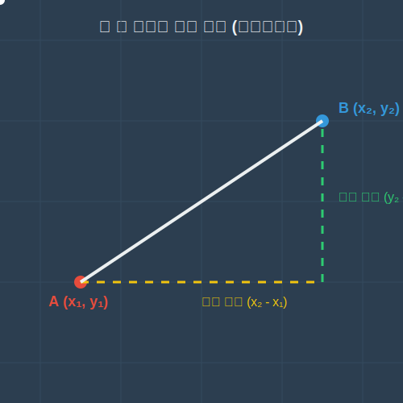

# 08. 여덟 번째 수업: 두 점 사이의 거리 (Distance Between Points)

텅 빈 공간에서 요원 A의 위치와 요원 B의 위치를 알고 있다면, 두 사람 사이의 '직선거리'는 어떻게 알아낼 수 있을까요? 
과거에는 줄자를 들고 직접 쟀겠지만, 이제 우리는 좌표의 마법사이므로 줄자 없이 오직 숫자만으로도 그 거리를 초정밀하게 계산할 수 있습니다. 피타고라스의 혼령을 소환할 때입니다.

---

## 학습 목표
* 1차원 수직선 위에서 가장 직관적으로 두 점의 거리를 구하는 방법을 깨우칩니다.
* 2차원 좌표평면에서 두 점 사이의 거리를 구하는 공식을 **피타고라스의 정리**를 이용해 완벽히 이해합니다.
* 파이썬 코드로 방대한 지도 데이터들의 최단 거리를 단숨에 계산해냅니다.

## 1. 1차원 수직선의 거리: 큰 것에서 작은 것을 빼라!

가장 단순한 1차원으로 돌아가 봅시다.
* 스파이더맨의 위치: 점 $A(2)$
* 람보의 위치: 점 $B(7)$

이 둘 사이의 거리는 어떻게 될까요? 손가락으로 칸을 세보면 $3, 4, 5, 6, 7$ 이므로 딱 5칸 차이가 납니다.
이를 수학적으로는 아주 우아하게 **(큰 좌표) $-$ (작은 좌표)** 로 계산합니다. 
$7 - 2 = 5$

만약 음수가 섞여 있다면 어떨까요?
$A(-3)$ 에 있고 $B(1)$ 에 있다면? 역시 (큰 것) - (작은 것) 입니다.
$1 - (-3) = 1 + 3 = 4$

> **절댓값 기호 ($| |$)**
> 항상 거리를 '양수'로 만들기 위해 절댓값이라는 마법의 벽돌을 세웁니다.
> $\overline{AB} = |(-3) - 1| = |-4| = 4$ 
> 순서에 상관없이 서로 빼고 기호를 벗기면 항상 거리가 나옵니다.

<div align="center">
  
</div>

## 2. 2차원 좌표평면의 거리: 피타고라스 소환술

이제 허공에 대각선으로 떠 있는 점 $A(1, 2)$ 와 $B(4, 6)$ 사이의 대각선 거리를 구해 보겠습니다.
여기서는 단순히 큰 것에서 작은 것을 뺄 수가 없습니다. 대각선이기 때문이죠.

데카르트의 제자답게 우리는 좌표평면 위에 상상 속의 직각삼각형을 스케치합니다.
1. A점에서 가로로 보조선을 긋고, B점에서 세로로 수직 보조선을 그어 교차점 $C(4, 2)$ 를 만듭니다.
2. 이제 가로 선분 AC의 길이는 1차원이므로 $4 - 1 = 3$ 입니다.
3. 세로 선분 BC의 길이 역시 1차원이므로 $6 - 2 = 4$ 입니다.

마법처럼 빗변의 길이를 구하는 **피타고라스의 정리 ($a^2 + b^2 = c^2$)** 가 등장합니다!
가로($3^2$) + 세로($4^2$) = 빗변($c^2$)
$9 + 16 = 25$
따라서 대각선 거리 빗변 $c$는 길이니까 양수인 **5**가 됩니다.

<div align="center">
  
</div>

**[두 점 사이의 거리 공식]**
이 과정을 모든 사람에게 적용하는 일반 공식으로 만들면 다음과 같이 살벌한 모습이 됩니다. 점 $(x_1, y_1)$과 $(x_2, y_2)$가 있을 때:
$$\text{거리} = \sqrt{(x_2 - x_1)^2 + (y_2 - y_1)^2}$$
너무 복잡해 보이지만, 방금 우리가 한 **(가로 차이)$^2$ + (세로 차이)$^2$ 에 루트 씌우기** 에 불과합니다!

---

## 3. 파이썬(Python)으로 내비게이션 최단 경로 계산하기

구글 지도나 게임 AI는 플레이어와 수천 마리의 몬스터 사이의 거리를 계산해야 합니다. 파이썬에서는 `math` 모듈이 이 피타고라스 계산을 빛의 속도로 대신해 줍니다.

```python
import math
import matplotlib.pyplot as plt

# 1. 두 점의 좌표 설정
A = (1, 2)
B = (4, 6)

# 2. X, Y 좌표 차이 계산
dx = B[0] - A[0]
dy = B[1] - A[1]

# 3. 거리 공식 (피타고라스 정리) 계산
distance = math.sqrt(dx**2 + dy**2)
print(f"점 A와 B 사이의 직선 거리는: {distance}")

# 4. 시각화 (직각 삼각형 그리기)
plt.figure(figsize=(5,5))

# 점 A와 점 B 대각선 긋기
plt.plot([A[0], B[0]], [A[1], B[1]], 'ro-', label=f"Distance: {distance}")

# 직각삼각형 보조선 가이드 긋기 (가로 선, 세로 선)
plt.plot([A[0], B[0]], [A[1], A[1]], 'b--') # 가로 dx = 3
plt.plot([B[0], B[0]], [A[1], B[1]], 'g--') # 세로 dy = 4

# 점에 이름 표기
plt.text(A[0]-0.3, A[1], "A (1, 2)", fontsize=12)
plt.text(B[0]+0.1, B[1], "B (4, 6)", fontsize=12)
plt.text((A[0]+B[0])/2 + 0.2, A[1]-0.4, "dx = 3", color='b')
plt.text(B[0]+0.2, (A[1]+B[1])/2, "dy = 4", color='g')

plt.xlim(0, 7)
plt.ylim(0, 8)
plt.grid(True)
plt.title("Distance between Two Points in 2D")
plt.legend()
plt.show()
```

이 연산은 파이썬 뿐만 아니라 수많은 게임의 충돌 판정 체계인 픽셀 간 직선거리에 필수로 쓰이는 가장 강력한 좌표 공식입니다.

## 학습 정리
1. **수직선의 거리**: (큰 좌표) - (작은 좌표). 혹은 절댓값을 씌워 $|x_2 - x_1|$ 로 계산한다.
2. **좌표평면의 거리**: 피타고라스의 정리를 이용하여 가로 차이와 세로 차이를 각각 제곱하여 더한 뒤, 제곱근(루트)을 씌운다.
3. **도형 공식 유도**: 복잡한 수식 덩어리가 아니라 직각삼각형 빗변 길이를 구하는 원리 그 자체임을 기억하라.
