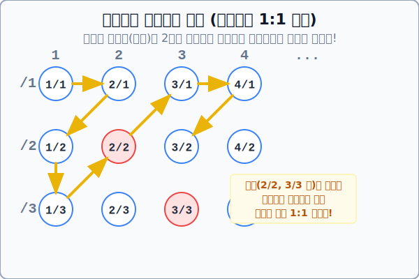

# 04. 조밀성의 끝판왕: 유리수의 기수 대결

## 1. 학습 목표 (Learning Objectives)
* 정수 사이사이 빈틈을 끝없이 채우고 있는 '유리수(분수)' 집합의 어마어마한 조밀성(Denseness)을 이해합니다.
* 그럼에도 불구하고 이 거대한 유리수조차 칸토어의 천재적인 기하학적 **'지그재그 나열법'** 에 의해 셀 수 있는 무한($\aleph_0$)으로 전락하고 마는 과정을 알아봅니다.

## 2. 끝없는 조밀함: 두 수 사이엔 무조건 다른 수가 있다
정수는 매우 직관적입니다. 1 다음에는 무조건 2가 오고, 둘 사이엔 어떤 정수도 끼어들 틈이 없습니다.
하지만 **유리수(Rational Numbers, 분수로 나타낼 수 있는 수)**의 세계는 다릅니다.

> "0과 1 사이에는 몇 개의 유리수가 있을까요?"

* $\frac{1}{2}$이 있습니다.
* 그럼 0과 $\frac{1}{2}$ 사이에는요? $\frac{1}{4}$이 있습니다.
* 그 사이에는 $\frac{1}{8}, \frac{1}{16}, \frac{1}{32}...$
* **유리수 조밀성 정리**: 두 유리수 $a$와 $b$ 사이의 평균값 $\frac{a+b}{2}$은 언제나 두 수 사이에 존재하는 또 다른 정당한 유리수입니다.

즉, 아무리 작은 두 점을 들이대더라도, 현미경으로 확대해 보면 그 사이에는 또 다른 유리수가 **무한 개** 도사리고 있습니다! 
이 조밀성 때문에 당시 수학자들은 **"유리수의 무한 덩어리는 듬성듬성한 정수 나부랭이들 따위보다 압도적으로 클 것이 확실하다!"** 라고 생각했습니다.

## 3. 칸토어의 마법: 2차원 분수 그리드(Grid) 해킹
칸토어는 이 직관 역설을 파괴하기 위해 기상천외한 시각적 트릭을 고안합니다.
"모든 유리수는 분수 형태, 즉 $\frac{\text{분자}}{\text{분모}}$ 이므로 가로축과 세로축의 2차원 표(Grid)로 나열할 수 있다!"

* 가로축(Row)은 분자: 1, 2, 3, 4 ...
* 세로축(Column)은 분모: /1, /2, /3, /4 ...

도화지 전체가 끝없이 뻗어 나가는 무한한 분수 타일로 가득 찼습니다!
칸토어는 이 타일들을 어떻게 자연수(1, 2, 3..)라는 한 줄짜리 선형 줄자로 카운트 짝짓기(1:1 대응)를 했을까요?

## 4. 해결책: 빈틈없는 지그재그(Zigzag) 스캔 경로

칸토어는 2차원 면적을 점령하기 위해 곧장 직진하지 않고, 대각선 방향으로 **지그재그(Zigzag)** 띠를 그리며 숫자들을 관통해 바느질을 시작했습니다.

* [첫 번째 1] $\rightarrow$ $\frac{1}{1}$ 도착
* [두 번째 2] $\rightarrow$ $\frac{1}{2}$ 도착
* [세 번째 3] $\rightarrow$ $\frac{2}{1}$ 도착
* [네 번째 4] $\rightarrow$ $\frac{3}{1}$ 도착
* [다섯 번째 5] $\rightarrow$ $\frac{2}{2}$ (이건 $\frac{1}{1}$과 같네? 쿨하게 건너뛴다!) ...
* [여섯 번째 6] $\rightarrow$ $\frac{1}{3}$ 도착

**[기막힌 논리적 결말]**
이 지그재그 뱀파이어 화살표를 컴퓨터 알고리즘 루프(Loop)로 돌리게 되면, 제아무리 우주 끝에 떨어져 있는 유리수 $\frac{31415}{92653}$ 따위라고 하더라도 언제 가는 반드시 지그재그 화살표가 스쳐 지나가며 자신만의 **'고유한 자연수 순번표(ID)'**를 부여받게 됩니다!!

"아무리 조밀하고 징그럽게 도배되어 있어도, 결국 한 명도 빠짐없이 차례대로 순번 번호표를 몽땅 다 매길 수(Countable) 있다!"

결국 상식상 훨씬 거대해 보였던 조밀성 왕관의 주인공, 전체 양의 유리수 집합의 크기 역시 자연수 집합과 완전히 판박이 동급인 **알레프-널($\aleph_0$)** 로 격하되고 맙니다.

## 5. 학습 정리 (Summary)
1. **유리수의 조밀성(Denseness)**: 두 개의 유리수 사이에는 평균을 구하는 작업을 통해 끝없이 또 다른 무리수를 밀어 넣을 수 있기 때문에, 선분 위의 점처럼 빽빽하게 이어져 있다는 성질입니다.
2. **지그재그 나열법 스캔**: 칸토어는 모든 분수를 2D 격자표에 그려 넣고, 이를 대각선 지그재그 경로로 스캔하며 중복을 제끼면 1차원 자연수 줄자로 모조리 1대1 번호표 매핑이 가능함(동급 무한)을 아름답게 시각화 증명했습니다.
