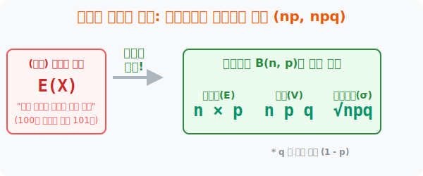

# 7. 기적의 치트키: 이항분포의 기댓값과 분산 ($np$, $npq$)

## [도입부] 학습 목표 (Learning Objectives)
- 100칸, 1000칸짜리 그리기조차 불가능한 거대한 확률분포표를 갈기갈기 찢어버리고, 단 1초 만에 평균(기댓값)을 찍어내는 통계학 최고 존엄 공식 **$E(X) = np$** 를 체화합니다.
- 복잡하기 짝이 없던 [제평-평제] 계산조차도 이항분포 안에서는 단 3글자의 알파벳, **$V(X) = npq$** 로 초압축 되어 연산이 폭발적으로 단축되는 메커니즘을 배웁니다.
- 파이썬(Python)의 단 2줄 코드로 이항분포의 평균, 분산, 리스크(표준편차) 렌더링을 완전히 박살 내는 데이터 과학 베이스캠프를 구상해 냅니다.

---

## 1. 100개의 표 그리기? 미친 짓이다!

우리는 앞서 3장에서, 기댓값을 구하려면 표를 반듯하게 그린 뒤 '위 칸($X$)과 아래 칸($P$)을 박치기하여' 싹 다 더하라고 배웠습니다.
하지만 여러분이 동전을 **100번** 던진다고 칩시다. 
이 짓거리를 확률분포표로 그리려면 $X=0, 1, 2, ..., 100$ 까지 칸이 무려 **101칸**짜리 괴물 표가 탄생합니다. 인간의 손으로는 도저히 이 위아래 박치기를 101번 해서 싹 다 더할 수가 없습니다.

그런데 수학자들은 이 $B(n, p)$ 라는 옵션 2개(성공 아니면 실패)짜리 이항분포에서 수백 번 노가다를 돌리다 보니, 충격적인 비밀을 발견했습니다. 101칸의 노가다 계산 결과가 어이없게도 그냥 **"$n$(몇 번 던졌냐) 이랑 $p$(성공 확률이 몇이냐) 둘을 곱한 값"과 소름 돋게 똑같았던 것**입니다!



<br>

## 2. 3대 치트키: $np$, $npq$, $\sqrt{npq}$

이항분포 $B(n, p)$ 세계에 들어오는 순간, 그 어떤 무식한 통계학 노가다도 이 3대 치트키 앞에서는 밀리초 컷으로 터져버립니다.
(여기서 알파벳 $q$ 는 게임에서 패배(실패)할 확률, 즉 $1 - p$ 를 뜻합니다)

- **[치트키 1] 기댓값(평균) $E(X) = np$** 
  "동전을 100번($n$) 던진다. 앞면 나올 확률반($p$=$1/2$). 그럼 대체 평균 몇 번 앞면 터지냐?" $\rightarrow 100 \times \frac{1}{2} = 50$번! (1초 컷)
- **[치트키 2] 분산 $V(X) = npq$**
  "리스크 파워, 즉 분산은 얼마냐?" $\rightarrow 100 \times \frac{1}{2}\text{(성공)} \times \frac{1}{2}\text{(실패)} = \mathbf{25}$
- **[치트키 3] 표준편차 $\sigma(X) = \sqrt{npq}$**
  "위험도인 표준편차는?" $\rightarrow$ 방금 구한 25에 루트를 씌우면 뚝딱! $\mathbf{5}$

이 세 가지 치트키 공식은 이항분포의 거대한 숲을 뚫고 지나가는 가장 압도적인 수학 머신건입니다. 수능 수학이나 데이터 사이언스에서 가장 많이 사랑받는 이유입니다.

---

## 3. 💻 파이썬(Python)으로 $n$, $p$, $q$ 즉시 산출기

파이썬 환경에서는 이 놀라운 공식을 `math` 기능 하나만 호출하여 순식간에 구현할 수 있으며, 이 논리 코드는 훗날 딥러닝에서 '노드(Node)' 의 평균 분산 편향 모델링을 할 때 단골 뼈대로 재사용됩니다.

### 🐍 파이썬 예제: 타율 3할 타자의 150타석 렌더링 봇

```python
import math

print("--- ⚾ 이항분포 타격 시뮬레이터 (치트키 On) ---")

# (데이터 셋) B(150, 0.3) 도출 완료
# 야구 선수가 이번 시즌 150번(n) 타석에 들어섭니다.
n_trials = 150
# 선수의 타율(안타칠 확률 p)은 3할 (0.3)
p_hit = 0.3
# 못 칠 확률(q) = 1 - p (0.7)
q_miss = 1 - p_hit  

print(f"▶ 타석 횟수 n = {n_trials}, 타율 p = {p_hit}, 불발 q = {q_miss}")
print("-" * 50)

# 치트키 1: 기댓값 (np) - 시즌 끝날 때쯤 평균적으로 칠 안타 수
expected_hits = n_trials * p_hit
print(f"1. 선수 기댓값(E): {expected_hits:.0f} 개의 안타를 뽑아낼 운명입니다! (np)")

# 치트키 2: 분산 (npq) - 리스크 팩터
variance_hits = n_trials * p_hit * q_miss
print(f"2. 안타 편차 스코어(V): {variance_hits:.1f} 의 리스크를 가집니다 (npq)")

# 치트키 3: 표준편차 (루트npq)
std_dev_hits = math.sqrt(variance_hits)
print(f"3. 💥 표준편차(σ): 평균 안타 수에서 위아래로 ±{std_dev_hits:.1f} 개 정도 요동칩니다.")

# 결과창:
# --- ⚾ 이항분포 타격 시뮬레이터 (치트키 On) ---
# ▶ 타석 횟수 n = 150, 타율 p = 0.3, 불발 q = 0.7
# --------------------------------------------------
# 1. 선수 기댓값(E): 45 개의 안타를 뽑아낼 운명입니다! (np)
# 2. 안타 편차 스코어(V): 31.5 의 리스크를 가집니다 (npq)
# 3. 💥 표준편차(σ): 평균 안타 수에서 위아래로 ±5.6 개 정도 요동칩니다.
```

데이터 컨설턴트들은 150타석에 대한 복잡무쌍한 확률 엑셀 표를 단 1줄도 그리지 않습니다. B($n$, $p$)라는 사건의 핵심만 빨아들인 뒤 즉석에서 치트키 3줄 공식을 코딩하여 "평균 45안타가 뜰 것이며, 오차는 $\pm 5.6$입니다!" 라고 깔끔한 보고서를 날리는 것입니다.

---

## [결론] 학습 정리 (Summary)

1. **지옥의 노가다 해방**: 이항분포($O$ 아니면 $X$) 임이 판명 나는 순간, 위아래 칸을 곱하고 더하는 지루함 대신 오직 횟수($n$) 와 확률($p$) 만을 뜯어내 수식에 투입하는 파격적인 지름길 렌더링이 성립합니다.
2. **$np$ 와 $npq$**: 이 세상에서 가장 많이 쓰이는 통계 산식입니다. 평균을 내려면 당장 "$n \times p$"를 타격하고, 흩어진 폭을 알고 싶으면 거기다가 실패 확률 "$q$" 를 한번 더 곱하는 놀라운 디자인입니다 (표준편차는 루트 착용 마무으리).
3. **이항분포의 미학**: 세상엔 무한한 경우의 수가 난립하지만, 통계학자들은 $B(n,p)$ 이항분포라는 단순 무식한 뼈대를 덮어씌움으로써 슈퍼컴퓨터 없이도 가장 확률 높은 미래(평균 45안타)를 $100$% 의 수학적 아름다움으로 뽑아내게 됩니다.
