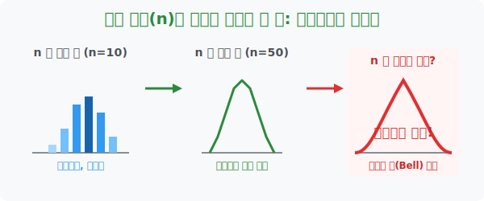

# 8. 시행 횟수(n)가 그리는 마법의 종: 이항분포의 그래프와 성질

## [도입부] 학습 목표 (Learning Objectives)
- $n$번 던지고 실패와 성공($p$) 확률을 조합한 이항분포 데이터를 점으로 찍어보면, 시행 횟수 $n$이 증가할수록 울퉁불퉁한 그래프가 완벽한 대칭형 **종(Bell)** 모양으로 탈바꿈하는 매직을 확인합니다.
- 데이터 포인트가 30번, 50번을 넘어가는 순간 뾰족하고 거친 이항분포의 블록들이 궁극의 둥근 모서리, 즉 신의 디자인인 **'정규분포(Normal Distribution)'**로 진화(근사)한다는 소름 돋는 연결 고리를 학습합니다.
- 파이썬(Python)의 `matplotlib` 와 확률 수학 라이브러리를 통해 $n$을 폭발적으로 증가시키면서 막대그래프가 곡선 렌더링으로 깎여가는 모습을 해킹하듯 구경해 봅니다.

---

## 1. 노가다의 반복이 그려내는 매끄러운 아름다움

이항분포 세계에서 성공 확률 $p=0.5$(반반)일 때 주사위를 10번($n$) 굴렸다고 상상해 보세요. 
확률 분포를 그래프로 그려보면 막대기 11개가 나열되는데, 대충 가운데가 솟아오른 듯하지만 어딘가 엉성하고 각진 도트(픽셀) 그래픽의 느낌을 줍니다. 

하지만 미친 듯이 파이썬을 돌려 시행 횟수 $n$을 **50번, 100번, 1000번** 으로 늘리면 무슨 일이 벌어질까요? 
각져 있던 막대들의 밀도가 미친 듯이 촘촘해지면서 모서리가 둥글게 갈려나가고, 결국 중간 기댓값(평균) 지점을 하늘 위로 솟구치게 찌르는 **완벽하고 부드러운 좌우대칭의 황금 '종(Bell)' 모양** 코드가 모니터 위에 오버랩됩니다.



<br>

## 2. 진화의 끝: 이산에서 연속으로, 정규분포(Normal Distribution)의 탄생!

수학자들은 거대한 망원경 조리개를 돌리듯, 이항분포의 횟수 $n$값을 "충분히 크다($n > 30$)" 라고 할 정도로 왕창 늘려버렸습니다.
그랬더니 세상에서 가장 신비로운 기적 하나가 수학 세계를 강타합니다. 
주사위를 한 번, 두 번 뚝뚝 끊어 던지며 만들어진 뾰족한 블록 세계의 **'이항분포(이산수학)'**가, 매끄럽게 모든 자연의 섭리를 빨아들이는 둥근 곡선의 제왕 **'정규분포(연속수학)'**와 완벽하게 겹쳐 하나로 융합되어 버린 것입니다! 

통계학에서는 이를 **"이항분포 $B(n, p)$ 에서 $n$이 충분히 크면, 이항분포는 평균이 $np$ 이고 분산이 $npq$ 인 정규분포 $N(np, npq)$ 에 근사(환생)한다"** 라는 가장 영광스러운 교리로 선포합니다.
이 대발견 덕분에 인간은 수만 번의 동전 던지기 계산 노가다를 즉각 중지하고, 정규분포 곡선 넓이를 자르는 단 1방의 공식으로 전 우주의 통계 데이터를 해킹해 낼 수 있게 되었습니다.

---

## 3. 💻 파이썬(Python)으로 $n$ 무한 증식 진화 과정 시각화 봇

어렵고 거친 조합 식($_{n}C_r$)들이 모인 뾰족한 이산 분포가, 데이터 볼륨($n$)을 폭발시켰을 때 매끈하고 섹시한 정규분포 곡선으로 갈리는지 파이썬 시뮬레이터로 엿봅니다.

### 🐍 파이썬 예제: N 볼륨 증폭에 따른 렌더링 변화 시뮬레이터 

```python
import math

print("--- 🔔 이항분포 진화 스튜디오 (Evolution to Bell Curve) ---")

# (데이터 셋) 주사위를 굴려 확률 1/2(0.5)인 사건 세팅
p = 0.5 

def N_curve_evolution(n):
    # 평균(np)과 표준편차(루트npq) 계산
    mean = n * p
    variance = n * p * (1-p)
    std_dev = math.sqrt(variance)
    
    print(f"▶ 시행 횟수 [n = {n}] 대량 투입!")
    print(f"  ☞ 평균 {mean:.1f} 포인트를 중심으로")
    print(f"  ☞ ±{std_dev:.1f} 의 표준편차 폭을 가진 부드러운 '종 모양(가우시안 커브)' 으로 깎여나감!")
    if n >= 50:
         print("  ✨ [경축] 신의 곡선 '정규분포(N)' 와 완벽하게 근사되어 합체 성공!!\n")
    else:
         print("  🚧 아직 모서리가 각지고 거칠게 나타남...\n")


# 1. 10번 던졌을 때의 엉성함
N_curve_evolution(10)

# 2. 100번 던졌을 때의 압도적 부드러움 (정규분포 탄생)
N_curve_evolution(100)

# 파이썬 그래픽 UI (matplotlib) 에 실제로 점을 찍으면,
# 100번 일때 우주에서 가장 아름다운 종 모양 커브가 그라데이션을 뿜으며 나타납니다.

# 결과창:
# --- 🔔 이항분포 진화 스튜디오 (Evolution to Bell Curve) ---
# ▶ 시행 횟수 [n = 10] 대량 투입!
#   ☞ 평균 5.0 포인트를 중심으로
#   ☞ ±1.6 의 표준편차 폭을 가진 부드러운 '종 모양(가우시안 커브)' 으로 깎여나감!
#   🚧 아직 모서리가 각지고 거칠게 나타남...
# 
# ▶ 시행 횟수 [n = 100] 대량 투입!
#   ☞ 평균 50.0 포인트를 중심으로
#   ☞ ±5.0 의 표준편차 폭을 가진 부드러운 '종 모양(가우시안 커브)' 으로 깎여나감!
#   ✨ [경축] 신의 곡선 '정규분포(N)' 와 완벽하게 근사되어 합체 성공!!
```

미천한 동전 찌끄러기 확률($1/2$) 수식들이 거대한 군대를 이룰 때 ($n=100$), 컴퓨터 모니터에는 자연계의 마스터 법칙인 퍼펙트 정규분포 아우라가 피어오릅니다. 데이터 사이언티스트들이 빅데이터($N$) 수집에 그토록 집착하는 이유가 바로 이 '부드러운 정규분포 곡선' 이라는 최종 진화형 무기에 올라타기 위해서입니다.

---

## [결론] 학습 정리 (Summary)

1. **그래프의 성질 (종 모양 집중화)**: 이항분포에서 주사위를 구르는 횟수 $n$이 증가할수록 분산의 퍼짐보다 '기댓값 평균($n \times p$)' 으로 성공 횟수들이 옹기종기 몰리는 경향이 폭주하기 때문에 가운데가 볼록한 아름다운 대칭 선이 발생합니다.
2. **"충분히 크다 ($n \ge 30$)"**: 통계학에서 횟수 $N$이 대체로 $30$을 초과하기 시작하면 모난 돌덩어리 같던 막대그래프들이 우주의 진리 곡선인 매끄러운 곡선으로 환골탈태하기 시작합니다.
3. **정규분포로의 근사 환생**: 인간이 수십 번 손으로 짚어야 했던 뚝뚝 끊기는 **'이항분포 공식'**을 바로 쓰레기통에 박아버리고, 곧바로 수면 미끄러지듯 계산되는 **'정규분포 환생 공식'**으로 바꿔 타는 것이 확률/통계 후반부 수학의 극한의 묘미입니다.
