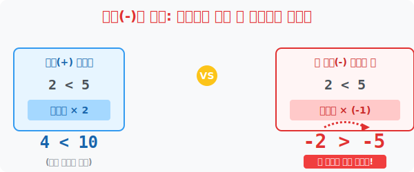

# 3. 음수(-)의 배신: 곱하거나 나눌 때 뒤집히는 부등호

## [도입부] 학습 목표 (Learning Objectives)
- 기울어진 부등식 저울에 '양수(+)'를 곱하고 나누는 것은 안전하지만, **'음수(-)'**를 곱하는 순간 저울의 승패가 완전히 뒤바뀌어 **부등호 입 방향이 까뒤집히는 폭력적 현상**을 각인합니다.
- 왜 마이너스가 곱해지면 큰 놈이 작은 놈으로, 작은 놈이 큰 놈으로 역전되는지 '수직선 대칭 이동' 의 원리로 시각화합니다.
- 파이썬(Python)의 비교 연산 렌더링을 통해 음수를 강제 곱셈했을 때 `True(참)` 였던 명제가 `False(거짓)` 로 폭파되는 아찔한 버그 생성 과정을 시뮬레이션으로 방어합니다.

---

## 1. 양수(+) 곱하기: 평화로운 뻥튀기 

부등식에서 양변에 **양수($+$)**를 곱하거나 나누면, 기존의 무거웠던 놈이 더 압도적으로 무거워질 뿐이라 **부등호 방향(악어 입)은 절대 변하지 않습니다.**
- 형은 5살, 동생은 2살입니다. $5 > 2$
- 10년이 지나 나이에 2배씩 뻥튀기가 일어났다고 가정해 봅시다. 형은 10살, 동생은 4살. $10 > 4$
- 여전히 형 쪽이 압도적으로 큰 숫자를 유지하며, $5$와 $2$의 부등호 방향($>$)이 $10$과 $4$의 부등호 방향($>$)으로 그대로 복사됩니다.

이처럼 양수를 곱하거나(뻥튀기), 나누면(축소) 그냥 비례 축소/확대가 일어날 뿐 저울의 근본적인 승패에는 아무런 영향을 주지 못합니다.



<br>

## 2. 🚨 긴급 비상: 음수(-)를 곱하면 뒤집어지는 세계

문제는 부등식의 양변에 **음수($-$)**를 곱하거나 나눌 때 발생합니다. 수학 역사상 가장 많은 중학생들을 구렁텅이로 빠뜨린 그 저주받은 함정입니다!

기존의 팩트를 봅시다. 
**$5 > 2$ (5가 2보다 큽니다. 진실!)**
여기서 양변에 똑같이 우주의 배신자, **$-1$ 을 곱해봅시다.**

- 왼쪽: $5 \times (-1) = \mathbf{-5}$
- 오른쪽: $2 \times (-1) = \mathbf{-2}$

수직선 세계에서는 음수 마을로 넘어가는 순간 "숫자 덩치(절댓값)가 큰 놈일수록 더 가난하고 더 작은 숫자"라는 미친 룰이 발동합니다. 0에서 더 멀리 처박히기 때문입니다.
따라서 빚이 5억( $-5$ )인 사람보다 빚이 2억( $-2$ )인 사람이 훨씬 부자입니다. 
결과적으로 둘을 비교하면 무조건 **$-5 < -2$** 가 성립합니다!

- (원래) **$5 \mathbf{>} 2$** 
- (음수 곱한 뒤) **$-5 \mathbf{<} -2$**

방금 전까지 우측으로 벌렸던 악어 입이 **좌측으로 완전히 뒤집혀(Flip) 버렸습니다.**
부등식을 풀 때 양변을 마이너스($-$)로 나누거나 곱하는 그 1초 찰나에, 여러분은 반사적으로 부등호 방향을 화들짝 까뒤집어야만 정답의 문턱을 통과할 수 있습니다!

---

## 3. 💻 파이썬(Python)의 버그 창출: 음수 폭탄 투하

프로그래머가 조건문 논리연산에서 `(-1)`을 곱하는 수학 연산을 할 때, 비교 연산자 방향(`>`, `<`)을 수동으로 플립(뒤집기)해 주지 않으면 멀쩡하던 시스템이 즉각 `False` 에러를 토해냅니다.

### 🐍 파이썬 예제: 음수 공격 시 부등호가 파괴되는 에러 로케이터

```python
print("--- 💣 마이너스(-)의 배신: 부등식 뒤집기 엔진 스캔 ---")

# (초기 팩트 세팅) 5 는 2 보다 크다
left_num = 5
right_num = 2

initial_state = (left_num > right_num)
print(f"1. [원본 팩트] {left_num} > {right_num} : {initial_state} (참)")

# 🚨 양변에 마이너스 1 무차별 폭격!
bomb = -1

new_left = left_num * bomb
new_right = right_num * bomb

# 코더가 실수로 부등호 방향(>)을 그대로 두었을 경우의 참극
failure_state = (new_left > new_right)
print(f"2. [음수 폭격, 기호 유지 시] {new_left} > {new_right} : {failure_state} (거짓!)")
print(" ☞ [에러] 빚 5억(-5)이 빚 2억(-2)보다 크다고 우기는 논리적 모순 발생!")

# ✅ 코더가 정신을 차리고 부등호 방향(<) 을 화들짝 뒤집었을 경우
success_state = (new_left < new_right)
print(f"\n3. [음수 폭격, 기호 뒤집힘!] {new_left} < {new_right} : {success_state} (다시 참!)")

# 결과창:
# --- 💣 마이너스(-)의 배신: 부등식 뒤집기 엔진 스캔 ---
# 1. [원본 팩트] 5 > 2 : True (참)
# 2. [음수 폭격, 기호 유지 시] -5 > -2 : False (거짓!)
#  ☞ [에러] 빚 5억(-5)이 빚 2억(-2)보다 크다고 우기는 논리적 모순 발생!
# 
# 3. [음수 폭격, 기호 뒤집힘!] -5 < -2 : True (다시 참!)
```

파이썬과 우주의 수학 물리법칙은 절대로 오류를 봐주지 않습니다. 부등식에서 음수($-$)라는 스위치가 곱해지거나 나뉘는 순간, **부등호는 무조건, 이유 불문하고 반대 방향으로 뒤집어진다($> \rightarrow <$, $\le \rightarrow \ge$)**는 룰을 손과 뇌에 박아넣어야만 합니다.

---

## [결론] 학습 정리 (Summary)

1. **양수의 비례 뻥튀기**: 부등식 양변에 양수($+$)를 더하든 빼든, 곱하든 나누든 본래 뚱뚱했던 애가 계속 뚱뚱하기 때문에 승패의 저울('부등호 방향')은 요지부동입니다.
2. **음수의 저주 (뒤집기 본능)**: 양변에 음수($-$)를 곱하거나 나누면 플러스(+)이던 덩치들이 갑자기 수직선의 마의 지옥 세계인 마이너스(-) 칸으로 떨어지기 때문에, 원래 컸던 놈이 가장 빚이 많은 찌질이 숫자로 역전당해 버립니다.
3. **핵심 연산 방어막**: 결국 **"음수를 곱하거나 나눌 때 눈을 부릅뜨고 부등호 방향을 화들짝 반대로 뒤집는다!"** 라는 단 1개의 철칙만이 부등식 계산에서 오답을 피하는 유일무이한 백신입니다.
