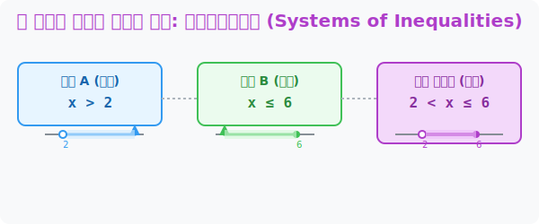

# 5. 두 조건의 완벽한 합의점 찾기: 연립일차부등식 (Systems of Inequalities)

## [도입부] 학습 목표 (Learning Objectives)
- "$A$조건도 만족하고 동시에 $B$조건도 만족해야 통과!" 라는 잔혹한 필터링 시스템인 **'연립부등식(AND 논리)'** 의 개념을 이해합니다.
- 수직선 위에 $A$영역과 $B$영역의 색칠된 셀로판지를 나란히 올려놓고, 두 색깔이 겹쳐지는 '교집합' 을 시각적으로 그물망 치듯 찾아내는 기법을 체화합니다.
- 파이썬(Python)의 `and` 논리 연산자(교집합 `&`)를 사용하여 여러 개의 조건 필터를 동시에 부숴버리고 합의점 코드를 뽑아내는 해킹 로직을 익힙니다.

---

## 1. 깐깐한 엄마와 아빠를 동시에 만족시켜라

여러분이 주말에 게임을 하려면 엄마와 아빠, 두 명의 결재를 모두 받아야 하는 최악의 상황이 발생했습니다.
- **아빠의 조건 (식A):** "수학 문제집($x$) 최소 **2장 초과($x > 2$)** 풀어오면 허락!"
- **엄마의 조건 (식B):** "눈 나빠지니까. 수학 문제집, 아무리 많이 풀어도 최대 **6장까지만($x \le 6$)** 풀어라!"

이처럼 위아래로 묶인 두 개 이상의 부등식이 등장하는 것을 **'연립일차부등식'**이라고 합니다. 
핵심은 $A$와 $B$ 중 하나만 만족해서는 절대 게임을 할 수 없다는 것입니다. 무조건 **"$\text{조건 } A \;\text{AND}\; \text{조건 } B$" 둘 다 동시에 만족하는 황금 겹침 구간(교집합)**을 찾아내야 살아남을 수 있습니다.



<br>

## 2. 수직선 위의 셀로판지 겹치기 (교집합)

머리로 두 조건을 동시에 생각하려고 하면 인간의 뇌는 꼬이기 시작합니다. 그래서 연립부등식의 100% 정답 해법은 바로 도화지에 **가로선(수직선)을 긋고 눈으로 스캔**하는 것입니다.

1. **아빠의 영역 스캔:** 수직선 위에 숫자 $2$를 찾습니다. 구멍을 뻥 뚫고($>$ 이므로) 오른쪽 무한대 방향으로 **파란색** 영역을 칠합니다.
2. **엄마의 영역 스캔:** 같은 수직선 위에 숫자 $6$을 찾습니다. 색칠로 꽉 채운 뒤($\le$ 이므로) 왼쪽 무한대 방향으로 **초록색** 영역을 칠합니다.
3. **정답 커팅:** 수직선을 가만히 노려보면 파란색과 초록색이 섞여서 만들어진 좁디좁은 밴드 구간이 바로 눈에 보입니다. 바로 $2$와 $6$ 사이의 구역입니다.
   **최종 정답:** **$2 < x \le 6$** (2장 초과, 6장 이하!)

수직선 렌더링 한 번이면 아무리 꼬인 문장제 문제도 겹치는 영토를 순식간에 칼질해 낼 수 있습니다.

---

## 3. 💻 파이썬(Python)으로 이중 감시망(AND 필터링) 구축

파이썬의 인공지능 추천 알고리즘이나 검색 필터가 바로 이 연립부등식의 겹침 원리(AND 연산)를 코어 엔진으로 삼고 있습니다. 

### 🐍 파이썬 예제: 연립부등식 수직선 교집합 필터링 매크로

```python
print("--- 🔍 연립부등식 교집합 자동 색출기 (AND 연산) ---")

# (데이터 셋) 주말에 푼 수학 문제 수 후보들
test_x_candidates = [1, 2, 3, 4, 5, 6, 7, 8]

# 아빠의 조건: x > 2 
# 엄마의 조건: x <= 6

passed_game_list = [] # 필터를 통과하고 살아남은 정답(겹침) 리스트

for x in test_x_candidates:
    # 🚨 파이썬의 'and' 명령어 = 연립부등식의 '교집합' 을 뜻함
    if (x > 2) and (x <= 6):   
        passed_game_list.append(x)
        print(f"[{x}장] 🟢 양쪽 부모님 모두 만족 => 게임 허가!")
    else:
        print(f"[{x}장] 🔴 어느 한쪽에서 컷당함 => 게임 금지!")

print("-" * 50)
print(f"💡 최종적으로 조건문(연립부등식)을 뚫은 정답 영역: {passed_game_list}")
# 이것은 수학계에서 2 < x <= 6 영역의 정수 근과 정확히 일치함

# 결과창:
# --- 🔍 연립부등식 교집합 자동 색출기 (AND 연산) ---
# [1장] 🔴 어느 한쪽에서 컷당함 => 게임 금지!
# [2장] 🔴 어느 한쪽에서 컷당함 => 게임 금지!
# [3장] 🟢 양쪽 부모님 모두 만족 => 게임 허가!
# [4장] 🟢 양쪽 부모님 모두 만족 => 게임 허가!
# [5장] 🟢 양쪽 부모님 모두 만족 => 게임 허가!
# [6장] 🟢 양쪽 부모님 모두 만족 => 게임 허가!
# [7장] 🔴 어느 한쪽에서 컷당함 => 게임 금지!
# [8장] 🔴 어느 한쪽에서 컷당함 => 게임 금지!
# --------------------------------------------------
# 💡 최종적으로 조건문(연립부등식)을 뚫은 정답 영역: [3, 4, 5, 6]
```

웹사이트 쇼핑몰에서 "가격은 **1만 원 이상**(조건A) + 별점은 **4점 이상**(조건B)" 이라는 스마트 검색 콤보를 먹일 때, 서버 뒷편에서는 위 파이썬 코드의 이중 부등식 교집합 엔진이 눈썹 휘날리게 돌아가며 상품을 필터링해 주는 것입니다.

---

## [결론] 학습 정리 (Summary)

1. **연립의 본질 (AND 로직)**: 각각 떨어진 우주에 있던 $A$부등식과 $B$부등식을 밧줄로 묶어놓고, "무조건 양쪽 모두가 `True` 를 띄우는 황금 교차점만 통과시킨다!"라는 지독한 양방향 검문소입니다.
2. **수직선 렌더링**: 연립된 식을 머리로만 돌리면 뇌세포가 박살 납니다. 반드시 수직선을 그리고 위에서 아래로 벽을 내리찍어 **"두 화살표 범위 천장이 포개어지는 샌드위치 영토"** 를 가시적으로 잘라내는 것이 최고의 풀이 정석입니다.
3. **데이터 과학의 필터**: 파이썬 코딩에서 `if (A > 10) and (B <= 5):` 같은 논리 연산자 블럭은 실생활에서 쏟아지는 방대한 빅데이터를 연립부등식의 그물로 수차례 걸러내어, 인간이 원하는 보석(정보) 만을 남기는 체 망의 역할을 수행합니다.
