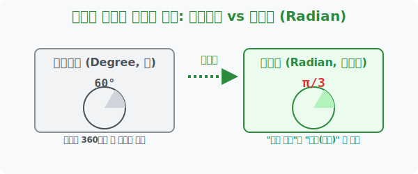

# 1. 인간의 각도와 수학의 언어: 일반각과 호도법 (Radians)

## [도입부] 학습 목표 (Learning Objectives)
- $360^{\circ}$ 라는 빙글빙글 도는 각도의 굴레를 박살 내고, 몇 바퀴를 돌았든 회전의 역사 전체를 담아내는 **'일반각(General Angle)'**의 스케일업을 경험합니다.
- 왜 고등수학과 컴퓨터는 우리가 평생 써온 친숙한 육십분법($30^{\circ}, 60^{\circ}$)을 쓰레기통에 버리고 기괴한 **'호도법($\pi$ 라디안)'**으로 갈아타는지 그 철학적 이유를 깨닫습니다.
- 파이썬(Python)의 `math.radians()` 함수를 이용해 디그리(Degree) 각도를 라디안(Radian)이라는 실수 체계로 실시간 번역하는 좌표 시스템을 렌더링 합니다.

---

## 1. 360도를 돌파하다: 일반각(General Angle)

초등학교 시절 각도기는 $0^{\circ}$에서 $180^{\circ}$ 까지만 잴 수 있었고, 기껏해야 피자 한 판인 $360^{\circ}$ 가 세상 각도의 끝이었습니다.
그런데 피겨 스케이팅 선수가 점프해서 빙글빙글 3바퀴를 돕니다. 이것은 $360^{\circ} \times 3 = \mathbf{1080^{\circ}}$ 입니다! 이처럼 360도라는 거울방에 갇혀 원래 자리로 리셋되는 각도가 아니라, **몇 바퀴를 회전했는지(회전수 $n$)까지 모조리 기록하여 수직선 무한대까지 뻗어 나가는 각도**를 통계학에서는 **일반각** 이라고 부릅니다. 
수식으로는 기정각(기본 각도) $\alpha$ 에 바퀴 수 $\mathbf{360^{\circ}n}$ 을 합체시켜 표현합니다.

<br>

## 2. 각도를 '숫자'로 진화시키다: 호도법 (Radian)

여기서 고등수학 최대의 진입 장벽이 등장합니다. 수학자들은 갑자기 "이제부터 $180^{\circ}$ 같은 건 잊어! 우리는 앞으로 각도를 $\mathbf{\pi}$ (파이) 라고 부르겠다!" 라고 선언합니다.

왜 이따위 귀찮은 짓을 할까요? $30^{\circ}, 60^{\circ}$ 는 고대 바빌로니아인들이 1년을 360일로 착각해서 원을 360등분한 '인간의 자의적 단위'일 뿐, 진짜 자연의 숫자(실수 1, 2, 3...)가 아니기 때문입니다. 방정식 $y = x + 30^{\circ}$ 같은 수식은 수학계에선 물과 기름처럼 섞이지 않는 불법입니다. 

그래서 천재들은 **"반지름의 길이와 원 테두리(호)의 길이가 똑같아질 때 벌어진 각도"** 를 숫자 **1 (라디안)** 이라고 정의해버렸습니다.
이 놀라운 번역법 덕분에 각도는 비로소 $x$축, $y$축 그래프 위에 올려서 함수로 자유롭게 연산할 수 있는 강력한 '실수' 세계로 환생했습니다.

- **$180^{\circ} = \pi \text{ (라디안)}$** (그냥 $\pi$ 라고 씁니다)
- **$360^{\circ} = 2\pi$**
- **$90^{\circ} = \frac{\pi}{2}$**



---

## 3. 💻 파이썬(Python)의 디그리-라디안 번역 엔진

인공지능, 자율주행, 3D 게임 물리엔진 모두 각도를 입력받을 때 $360^{\circ}$ 표기법을 완전히 거부합니다. 파이썬의 `math` 삼각함수 명령어는 오로지 '라디안($\pi$)' 만을 먹이로 취합니다.

### 🐍 파이썬 예제: 인간의 각도를 수학의 언어(라디안)로 번역하기

```python
import math # 파이썬 수학 아카이브 로드

print("--- 📐 파이썬 디그리(Degree) ↔ 라디안(Radian) 번역기 ---")

# (인간의 각도 데이터)
human_angles = [30, 45, 60, 90, 180, 360]

print("[파이썬 변환 결과 스캐닝]")
for deg in human_angles:
    # math.radians() : 육십분법(도)을 호도법(실수 라디안)으로 강제 변환!
    rad_value = math.radians(deg)
    
    # 뽀너스: π(파이)를 기준으로 몇 배인가?
    pi_ratio = rad_value / math.pi
    
    print(f"인간 각도 {deg}°  =>  기계 각도 {rad_value:.4f} rad  (약 {pi_ratio:.2f}π)")

# 결과창:
# --- 📐 파이썬 디그리(Degree) ↔ 라디안(Radian) 번역기 ---
# [파이썬 변환 결과 스캐닝]
# 인간 각도 30°  =>  기계 각도 0.5236 rad  (약 0.17π)
# 인간 각도 45°  =>  기계 각도 0.7854 rad  (약 0.25π)
# 인간 각도 60°  =>  기계 각도 1.0472 rad  (약 0.33π)
# 인간 각도 90°  =>  기계 각도 1.5708 rad  (약 0.50π)
# 인간 각도 180° =>  기계 각도 3.1416 rad  (약 1.00π)
# 인간 각도 360° =>  기계 각도 6.2832 rad  (약 2.00π)
```

이 번역기를 뚫고 나온 `0.5236` 같은 소수점 데이터(라디안)만이 훗날 우리가 그릴 $\sin(x)$ 그래프의 순수한 $x$축 위치로 당당하게 안착할 수 있습니다.

---

## [결론] 학습 정리 (Summary)

1. **일반각의 확장**: "제자리로 돌아오면 0도"라는 함정에서 벗어나, 몇 바퀴 회전했는지의 히스토리($360n$)를 합산함으로써 나사못의 회전값이나 피겨 점프 같은 누적 회전 데이터를 컴퓨터에 안전하게 보관합니다.
2. **호도법(Radian)의 탄생**: 인류가 마음대로 정한 $360$조각($^{\circ}$) 기호를 폐기하고, 원의 호 길이와 반지름 비율을 측정한 **'순수한 실수 숫자'**로 각도를 리팩토링한 혁명적인 렌더링 방식입니다. 
3. **$\mathbf{180^{\circ} = \pi}$ 의 통일**: 이 한 줄의 교환 비율 공식이 바로 인간계의 디그리 세계와 컴퓨터 수학계의 라디안 세계를 자유자재로 넘나들게 해주는 영혼의 포탈 역할을 합니다.
