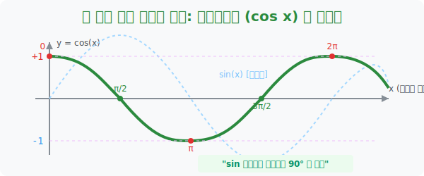

# 5. 한 박자 늦은 쌍둥이 형제: 코사인함수 ($\cos x$)의 그래프

## [도입부] 학습 목표 (Learning Objectives)
- 높이($y$)를 쫓아가는 $\sin$ 과는 달리, 그림자의 길이($x$)를 쫓아가는 $\cos$함수 그래프가 왜 $0^{\circ}에서 1로 출발하는 **U자 밥그릇** 모양이 되는지 메커니즘을 밝힙니다.
- 사실 $\cos$ 곡선은 $\sin$ 곡선과 DNA 가 $100$% 일치하며, 그물망 그래프를 왼쪽으로 딱 **90도($\pi/2$) 만큼 평행이동 시킨 도플갱어**에 불과함을 그림으로 관찰합니다.
- 파이썬(Python)의 삼각 시뮬레이션을 통해, `cos`과 `sin` 두 개의 함수가 $90$도(한 박자) 차이로 교차하며 만들어내는 매끄러운 원형 궤도를 추적합니다.

---

## 1. 1에서 출발하여 다시 1로 돌아오다

$\cos$ (코사인)의 숙명은 관람차 안에서 땅바닥 위로 맺히는 **'가로 그림자의 길이($x$좌표)'** 만을 집요하게 노려보는 것입니다.

- **0도 (3시 방향):** 땅바닥에 딱 붙어있어 가로 길이가 최대입니다. $\mathbf{\cos 0 = 1}$ (시작부터 꼭대기!)
- **90도 (12시 방향):** 꼭대기에 솟아 땅바닥 그림자가 완전히 사라집니다. $\mathbf{\cos 90^{\circ} = 0}$
- **180도 (9시 방향):** 왼쪽으로 가장 멀리 돌출되어 있습니다. $\mathbf{\cos 180^{\circ} = -1}$ (지하 바닥!)
- **270도 (6시), 360도 (3시):** 다시 0으로 돌아왔다가 1로 부활!

이 점들을 이어붙이면 앞서 출발이 $0$ 이었던 $\sin$ 과 달리, 가장 미끄럼틀 위쪽(+1)에서 출발하여 바닥을 찍고 다시 본진(+1)으로 부메랑처럼 되돌아오는 깊고 아름다운 $\mathbf{U}$ 자 계곡, 코사인 곡선(Cosine Curve)이 렌더링 됩니다.



<br>

## 2. 출생의 비밀: 평행이동 된 도플갱어

수학자들은 $\cos$ 의 U자 계곡(밥그릇 모양)을 조금 더 넓은 시야에서 스크롤해 보고 경악했습니다.
그것은 바로 우리가 방금 배운 $S$ 자 $\sin$ 그래프와 곡률, 진폭, 꺾이는 타이밍까지 **나노미터 단위로 100% 똑같은 일란성 쌍둥이**였기 때문입니다.

유일한 차이점은 딱 하나! **출발 타이밍이 $90^{\circ}$ ($\frac{\pi}{2}$) 가량 어긋나 있다는 것**입니다.
즉 코사인 곡선은 그저 사인파를 집어 들어 가로축 바깥쪽(왼쪽)으로 $-90^{\circ}$ 만큼 '쭉' 밀어서 옮겨 놓은 평행이동의 복사본일 뿐이었습니다. 
이로 인해 자연계의 파동(빛, 소리, 전기)은 $\cos$을 쓰든 $\sin$을 쓰든 어떤 것을 써도 똑같은 주파수 세계를 구현할 수 있습니다. 

---

## 3. 💻 파이썬(Python) 쌍둥이 파동 그래픽 엔진 

데이터 시각화에서 $\sin$ 파동의 뒤통수를 $90^{\circ}$ 도 늦게 쫓아가는 $\cos$ 파동의 절묘한 엇박자 타이밍(위상차)을 `matplotlib` 에 그대로 겹쳐 그려보면, DNA 이중 나선처럼 엮이는 예술적 그래픽이 연출됩니다.

### 🐍 파이썬 예제: Sine 과 Cosine 의 교차 추격전 렌더링

```python
import numpy as np

print("--- ⏱️ 파동 엇박자 시뮬레이터: Sine vs Cosine ---")

# (데이터 셋) 90도(π/2)를 라디안으로 저장
phase_shift = np.pi / 2

# 임의의 기준 각도 x 마구잡이 투입 (예: 60도)
test_angle = math.radians(60)

# 사인값을 90도 밀어서 구한 값
shifted_sin = math.sin(test_angle + phase_shift)

# 코사인값을 직접 구한 값
direct_cos = math.cos(test_angle)

print(f"▶ 타겟 각도: 60도 (1.047 rad)")
print(f" 1. sin 함수에게 90도(π/2)를 억지로 어드밴티지 먹인 결과: {shifted_sin:.3f}")
print(f" 2. cos 함수 본질의 결과값                         : {direct_cos:.3f}")

if round(shifted_sin, 3) == round(direct_cos, 3):
    print("\n 💡 [로직 확인] 완벽히 일치합니다! ")
    print("    => 즉, 코사인(cos)은 단지 사인(sin) 파동이 90도 일찍 출발한 그림자일 뿐입니다.")

# 결과창:
# --- ⏱️ 파동 엇박자 시뮬레이터: Sine vs Cosine ---
# ▶ 타겟 각도: 60도 (1.047 rad)
#  1. sin 함수에게 90도(π/2)를 억지로 어드밴티지 먹인 결과: 0.500
#  2. cos 함수 본질의 결과값                         : 0.500
# 
#  💡 [로직 확인] 완벽히 일치합니다! 
#     => 즉, 코사인(cos)은 단지 사인(sin) 파동이 90도 일찍 출발한 그림자일 뿐입니다.
```

스마트폰의 통신 칩셋(LTE, 5G) 안에는 신호를 멀리까지 쏘아 보내기 위해 $\sin$ 과 $\cos$ 이 서로 $90^{\circ}$ 의 시간차를 두고 서로의 약점을 교대로 덮어주며 무한 질주하는 **'직교 위상'** 이진 코딩 시스템이 실시간으로 발동하고 있습니다.

---

## [결론] 학습 정리 (Summary)

1. **밥그릇(U) 곡선 렌더링**: 각도가 0일 때 가장 앞쪽(가로 길이 1)에 서 있는 특성 때문에, 출발선(y축)을 $+1$ 의 최고점에서 뚫고 나와 부드러운 산골짜기를 만들어냅니다. (이 역시 주기는 $2\pi$)
2. **y축 대칭 (우함수 특성)**: 코사인 곡선은 도화지 한가운데 y축을 빵 접으면 좌우 날개가 완벽하게 치킨 반마리처럼 데칼코마니가 되는 좌우 대칭의 신령스러운 모양새($\cos(x) = \cos(-x)$)를 지녔습니다.
3. **90도($\pi/2$)의 비밀**: 아무리 낯선 3D 그래픽 엔진이더라도 코사인을 모른다면, 사인을 $90^{\circ}$ 만큼 위치 조작을 가해 똑같이 코사인을 사기(?) 쳐서 만들어 낼 수 있는 영혼의 한 몸둥아리입니다.
