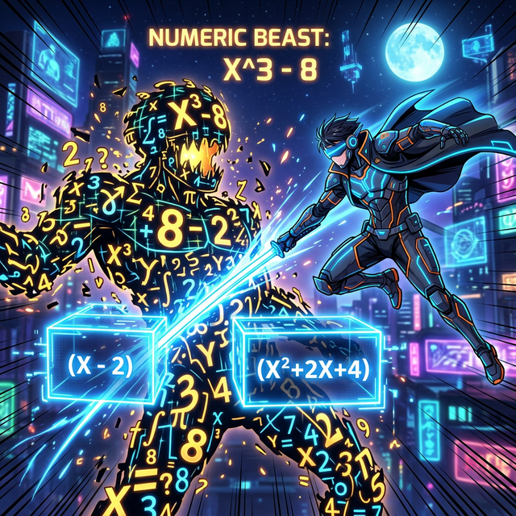

# 00. 인트로: 복잡함과의 전쟁, 특수 해킹 장비들 (Intro)

1부(모듈 27)에서 우리는 공통인수 묶기, 완전제곱식 만들기, 그리고 합차 데칼코마니 공식을 써서 예쁘고 반듯한 $2$차 방정식($x^2\dots$) 들을 깔끔한 상자로 포장하는 방법을 마스터했습니다.

하지만 실전 프로그래밍, 3D 게임 물리 엔진, 또는 우주 항공 시뮬레이션에서 쏟아지는 방정식 코드를 열어보면 이딴 예쁜 $2$차식은 애들 장난에 불과합니다. $x^4$ (4차 차원) 이 튀어나오고, 알파벳 $a, b, c, x, y, z$ 가 한 줄기 안에 10개씩 뒤엉켜 뭉쳐 있고, 괄호 덩어리 자체가 제곱되어 날뛰는 거대한 메가트론 로봇 같은 수식 덩어리가 나타납니다.

  

## 1. 2차원의 한계와 해커의 새로운 무기

우리가 가진 평범한 눈동자와 십자가 대각선 찍기 스킬만으로는 항이 5~6개씩 늘어진 긴 수식을 절대 파악할 수 없습니다. 
이 혼돈을 찢어 발기기 위해 수학자들은 컴퓨터 과학의 "모듈화(Modularization)" 와 똑같은 개념의 고차원 특수 검(Sword) 들을 발명했습니다.

1. **치환(Substitution):** 끔찍하게 긴 괄호 더미 코드 조각을 "대문자 $X$ 한 글자" 스티커로 덮어 가려버리는 압축 은폐술.
2. **조립제법(Synthetic Division)과 인수정리:** 수식 안에 어떤 숫자(예: $x=1$) 하나를 암호 키로 때려 넣어서, 그 식이 $0$(제로) 으로 붕괴해버리는 틈새를 찾아낸 뒤, 그 구멍 안으로 망치를 밀어 넣어 한 방울도 남김없이 가루로 분해하는 무식하지만 극상급의 강력한 해체용 망치 시스템. 

이번 2부에서는 ఈ 괴물 방정식들의 뚝배기를 깨부술 이 특수 고급 코딩 스킬들을 하나하나 손에 쥐어 드리겠습니다. 무기를 들고 1강으로 오십시오!
