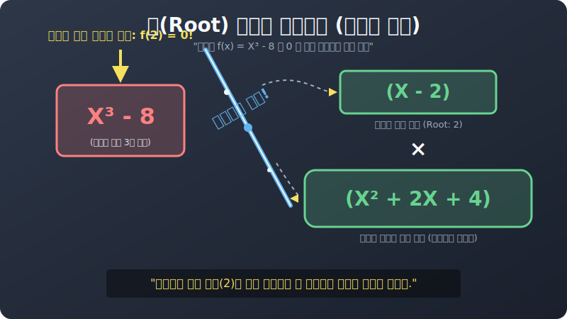

# 05. 다섯 번째 수업: 궁극의 해머 조립제법과 인수정리 (Synthetic Division)

2차, 3차, 복이차, 섞인 문자 내림차순까지. 지금까지 당신은 모든 기만적인 다항식 껍데기를 해제 방어막으로 분리했습니다.
하지만 만약 어떤 사기꾼 공식으로도 도저히 아귀가 안 맞는, 길고 긴 **$3$차 나 $4$차 방정식 통뼈** 하나가 당신 모니터 앞에 길을 막고 있다면 최후의 해커 해머(Hammer) 무기를 꺼내 들어야 합니다.

**"인수정리(Factor Theorem)" 와 "조립제법(Synthetic Division)"** 의 파워 연동 시스템입니다.

---

## 1. 틈새를 찾아내는 레이더 (인수정리)

다항식 $f(x) = x^3 - 4x^2 + x + 6$ 이 있습니다.
어떤 곱셈 공식, 치환을 때려 박아도 이 녀석은 모양이 맞아떨어지지 않습니다. 

이때 인수정리라는 무식한 레이더 스크립트를 돌립니다. 당신이 할 일은 저 $x$ 의 구멍에다가 $1$, $-1$, $2$, $-2$, $3$, $-3$... 을 무식하게 하나씩 대입해 보며 엑셀 함수를 돌리는 것입니다. 

1. $x = 1$ 대입: $1 - 4 + 1 + 6 = 4$  (실패, 0이 안 나옴)
2. $\mathbf{x = -1}$ **대입:** $-1 - 4 - 1 + 6 = \mathbf{0}!!!$ (**빙고! 기계 작동 중지!!**)

방금 아주 미친 틈새 약점을 찾아냈습니다. 이 덩어리는 $x$ 자리에 $-1$ 이 들어오면 폭발하여 결과가 제로(0) 가 되어버리는 심각한 로직 취약점을 가진 상태입니다.
수학자들은 이 취약점($x=-1$) 을 보면 $0.1$초 만에 이렇게 확신합니다. 
> "**"아! 저 거대한 $x^3$ 덩어리는 분명히 $\mathbf{(x + 1)}$ 이라는 아주 강력하고 작고 딴딴한 1차식 곱셈 박스를 자신의 뱃속 가장 깊은 인수로 몰래 품고 있는 껍데기 풍선이 확실하구나!"**"

이를 두고 "**$f(x)$ 는 $(x+1)$ 로 나누어떨어진다 (인수를 가진다)**" 라고 말하며, 이것이 위대한 **인수정리** 의 핵심입니다.

## 2. 틈새를 후벼 파는 망치 (조립제법)

자, 뱃속에 $\mathbf{(x+1)}$ 이라는 확실한 핵심 부품이 들어있다는 걸 확인했습니다.
그러면 원래 거대했던 $3$차 몬스터 $x^3 - 4x^2 + x + 6$ 을 그냥 $\mathbf{(x+1)}$ 이라는 부품 코드로 무작정 '나눗셈(Devide)' 해버리면, 나머지 떨거지 덩어리($2$차식 몫) 가 통째로 뽑아져 나오지 않겠습니까?!

이 나눗셈을 귀찮은 다항식 글자를 치워버리고 '숫자 계수' 조각들만 ㄴ 자 모양 선 위에 올려놓고 미친 듯이 빠르고 기계적으로 탁탁탁 더하고 곱해서 뽑아내는 전동 망치 스킬을 **조립제법 (Synthetic Division)** 이라고 부릅니다. 

 
(2강 썸네일을 참고하십시오. 어떤 숫자를 넣었을 때 툭 하고 치명적으로 쪼개져 나가는 바로 그 쾌감입니다)

**[조립제법 매뉴얼 동작]**
1. 다항식의 앞자리 숫자만 딴다: `1  -4   1   6`
2. 왼쪽에 아까 발견한 취약점 열쇠 `(-1)` 을 적어둔다.
3. 첫 숫자는 그냥 떨어지고, 곱해서 올리고, 위아래 더하고... 기계적 루틴을 끝까지 $3$번 돌린다.
4. 마지막 끝자리가 완벽히 `0` 으로 떨어지면 퀘스트 대성공! 
5. 남은 숫자들 `1, -5, 6` 은 완전히 부서져 내린 **새로운 몫 이차식 찌꺼기**가 탄생한 것입니다! $\rightarrow \mathbf{x^2 - 5x + 6}$

## 3. 대압축 종료

자, 원래의 $3$차 다항식은 이 엄청난 조립제법 해머 한 방에 두 조각의 작은 곱셈으로 깔끔하게 타격 분리되었습니다.

> **$x^3 - 4x^2 + x + 6 \quad \rightarrow \quad \mathbf{(x+1)(x^2 - 5x + 6)}$**

어라? 뒤쪽에 남은 나머지 $2$차 떨거지 괄호 $(x^2 - 5x + 6)$ 는, 우리가 길거리에서도 십자가로 암산하는 $(x-2)(x-3)$ 의 허저비 아니겠습니까? 그조차 마저 마이크로 분해시켜 버립니다!

> **최종 연쇄 폭발 결과:**
> **$(x+1)(x-2)(x-3)$**

어떤가요? 그 난공불락 같던 거대한 $3$차원 다항식이 가장 정직하고 작은 $1$차 코드 박스 3개의 부품으로 완전히 산쇄되어 버렸습니다. 
인수정리를 위한 틈새 찌르기(대입)와 그것을 후벼파는 조립제법 톱니바퀴는 컴퓨터 프로그래머가 복잡한 데이터 곡선 함수를 분석하여 $1$차 선형 방정식 부품(Vector Component) 으로 찢어발길 때 그 논리 그대로 적용되는 가장 아름다운 듀얼 스킬 엔진입니다!
