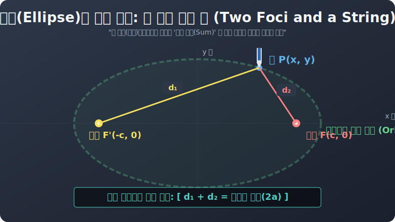

# 02. 두 번째 수업: 타원, 두 개의 못과 실이 그리는 우주 (Ellipse)

우주의 제왕 케플러(Kepler) 에 의해 정원의 궤도가 부정당하고 찌그러진 달걀인 '타원(Ellipse)' 이 우주의 주인공 자리에 등극했습니다.
그렇다면 프로그래머인 우리는 모니터 화면상에 도대체 어떻게 이 기묘하게 양옆으로 퍼진 타원 궤적 곡선을 컴퓨터 그래픽스(CG) 로 오차 없이 렌더링 해낼 수 있을까요? 

코딩 이전에 수학 기하학에서 렌더링을 걸었던, 원시적이지만 가장 우아한 **"두 개의 못과 실 장난"** 정의를 알아야 합니다.

---

## 1. 목수가 타원 테이블을 자를 때 쓰는 스킬

당신이 둥글고 납작한 대형 타원 모양의 회의용 원목 테이블을 주문받은 목수라고 생각해 봅시다. 어떻게 합판 위에 자국을 그을 수 있을까요? 원처럼 중심에 못 하나 박아두고 컴퍼스로 휙 돌려버리면 정원밖에 안 나오는데 말입니다.

1. 합판 위에 **두 개의 대못(압정)** 을 허공에 띄엄띄엄 박습니다. 
   (이것이 타원 우주가 가진 두 개의 빛나는 블랙홀 태양! **'초점(Foci)'** 입니다.)
2. 이 박혀있는 두 개의 못 사이에 약간 **느슨하고 넉넉한 길이의 털실 끈(String)** 하나를 연결해 양쪽 끝을 묶습니다.
3. 이제 **연필(Pencil Point)** 뒷동으로 이 털실을 밖으로 팽팽하게 바깥쪽으로 당겨 건(Tension) 상태로 만듭니다.
4. 연필에 힘을 줘서 이 털실이 팽팽한 $V$ 자 트라이앵글 텐션을 유지한 상태 그대로, 못 가장자리를 합판에 둥글게 빙그르르 돌려가며 선을 긋습니다!

  

와! 놀랍게도 연필이 슥슥 지나간 합판 위에는 완벽하게 좌우로 길쭉한 럭비공 모양의 **'타원(Ellipse)'** 우주가 렌더링 되어 그려져 있습니다.

## 2. 렌더링 스크립트 필터 조건 (합이 일정!)

목수의 연필이 움직이며 남긴 물리적 제약 조건을, 프로그래밍 `if` 분기 조건문 필터로 해킹해 볼까요?

* $F$ 와 $F'$ 이 박아놓은 두 개의 태양 블랙홀(초점) 좌표 위치입니다.
* $P(x,y)$ 는 마우스 커서인 우주선의 좌표 위치입니다.
* 목수가 묶어둔 털실의 길이는 우주가 멸망해도 '늘어나지 않는 끈' 이었기 때문에 렌더링 내내 길이가 똑같습니다!
* 즉, **"왼쪽 태양에서 내 우주선까지의 거리$(d1)$ + 오른쪽 태양에서 내 우주선까지의 거리$(d2)$" 의 '거리의 합산 값' 이 화면 어디서든 무조건 자로 붙여놓은 듯 똑같은 숫자 상숫값** 으로 락(Lock) 이 걸려있는 기괴한 공간이라는 뜻입니다!

> **타원의 궁극적 좌표 정의:** 
> **화면 위의 두 정점 $F, F'$ (초점) 으로부터 [거리의 합이 일정한] 점 $P$ 들의 렌더링 집합 궤적!**

포물선이 "$1:1$ 지점의 줄다리기" 였다면, 타원은 **"양쪽 블랙홀에서 당기는 밧줄 길이의 누적 SUM 수치가 영원히 똑같은 감옥"** 이라는 뜻입니다. 
다음 장에서는 이 미치도록 아름답고 피곤한 밧줄 길이 누적 SUM 공식을 파이썬 데카르트 대수학 $XY$ 방정식 수식으로 대폭발 번역을 해보겠습니다.
