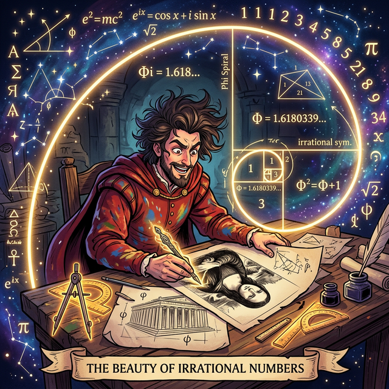

# 00. 인트로: 신이 숨겨놓은 아름다운 무리수 (Intro)

고대인들은 무리수를 규칙 없는 이단아 취급하며 끔찍히 두려워했지만, 시간이 흐르면서 천재 예술가들과 건축가들은 오히려 이 "비율로 딱 떨어지지 않는" 난수표 같은 무리수들 속에 우주의 궁극적인 아름다움이 숨겨져 있다는 사실을 깨달았습니다.

---

## 1. 황금비 (Golden Ratio) 의 마법

르네상스 시대의 천재 레오나르도 다빈치의 '모나리자'나 고대 그리스의 장엄한 '파르테논 신전'에는 공통점이 하나 있습니다. 시각적으로 사람이 보기에 가장 안정적이고 아름다움을 느끼는 특별한 가로세로 비율을 가지고 있다는 것입니다.

이 마법의 비율을 사람들은 **황금비(Golden Ratio)**라고 불렀고, 무수히 많은 건축가와 화가들이 자와 컴퍼스를 들고 이 비율을 작품 속에 때려 넣었습니다.

그런데 수학자들이 그 황금비를 계산해 보니 충격적인 결과가 나왔습니다.
황금비의 정확한 값은 대략 $1 : 1.6180339887...$ 로, 그 정체는 바로 **무리수 탑재형 방정식의 결과인 $\frac{1 + \sqrt{5}}{2}$** 였습니다!

  

## 2. 자연계에 스며든 무리수들

황금비뿐만이 아닙니다!
* 솔방울의 비늘 배열, 해바라기 씨앗의 나선 패턴, 심지어 우주 은하의 소용돌이는 피보나치 수열이라는 규칙을 따르는데, 이 규칙이 영원히 팽창하면 결국 무리수인 '황금비'에 완벽히 수렴합니다.
* 둥근 해, 찰랑거리는 동전, 관람차 등 세상의 모든 둥근 원에는 **원주율 $\pi$ (파이)** 라는 무리수가 심장처럼 박혀있습니다. $\pi$ 가 없다면 우주에 굴러가는 바퀴 자체가 존재할 수 없죠.

## 3. 실수 세계의 확장된 지배자, 무리수를 조각하다!

무리수는 단순히 괴팍한 숫자가 아닙니다. 이들은 자연을 구성하는 가장 정교하고 아름다운 설계도의 부품입니다. 
그렇다면 우리는 이 무서운 생김새의 무리수($\sqrt{2}$, $\sqrt{3}$, $\frac{1+\sqrt{5}}{2}$)들을 과연 어떻게 더하고 빼고 곱해야 할까요?

마치 불을 다루는 방법을 배웠듯, 이번 단원에서는 무리수라는 야생마에 안장을 얹어 **본격적으로 복잡한 사칙연산을 통제(연산과 유리화)**하고, 이들을 이용해 신비로운 **방정식**과 **파이썬 기하학 프로그래밍**을 설계하는 경지로 나아가 보겠습니다!
