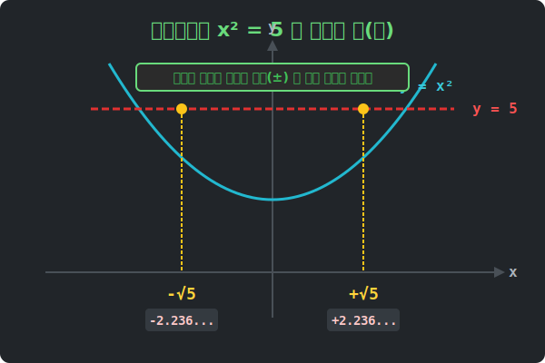

# 05. 다섯 번째 수업: 무리수 방정식 풀이 (Irrational Equations)

황금비를 도출해 낸 과정, 그리고 피타고라스 정리에서 빗변을 구한 대수학적인 풀이는 모두 "어떤 미지의 수($x$)를 제곱했더니 $k$ 가 되더라"는 논리 구조를 띄고 있습니다. 
이 형태가 바로 앞으로 수학에서 눈물 나게 많이 보게 될 **'이차방정식'** 의 가장 기초적이고 파괴적인 원형입니다.

---

## 1. 제곱수감옥 탈출 공식 : $x^2 = k$

$$ x^2 = 5 $$

위 공식에서 주인공인 $x$가 입고 있는 갑옷(제곱 $2$)을 벗게 만들고 오로지 $x$ 혼자만 깔끔하게 남겨두려면 어떻게 해야 할까요?
첫 시간에 거듭제곱을 벗겨내는 "되감기 버튼(Undo)"은 곧 **마법의 루트($\sqrt{\quad}$)**를 씌우는 것이라고 배웠습니다.

하지만 여기서 양변에 루트라는 마법을 씌울 때 반드시 기억해야 할 치명적인 부작용이 있습니다.
바로 $5$를 만드는 재료숫자가 $x$ 측에 두 명(양수, 음수) 살고 있다는 사실입니다!

**따라서 제곱을 벗기는 순간, 반대쪽 숫자(5) 앞에는 반드시 $\pm$ (플러스마이너스) 기호와 루트 바가지가 동시에 씌워집니다.**

$$
x^2 = 5 \quad \rightarrow \quad x = \pm\sqrt{5}
$$
이차방정식($2$차)은 항상 정답(해, Root)이 최대 $2$개가 튀어나오는 무서운 성질을 가졌습니다!

<div align="center">
  
</div>

## 2. 응용: 완전제곱식 감옥 탈출

만약 $x$가 아니라 덩어리에 제곱이 씌워져 있다면 어떨까요?
$$ (x - 3)^2 = 7 $$

당황할 필요 없습니다. 덩어리 자체를 아까처럼 통째로 벗겨버리면 됩니다.
1. 지붕(제곱) 벗기기: 오른쪽 숫자($7$)에 마법($\pm\sqrt{}$)을 씌웁니다.
   $$ x - 3 = \pm\sqrt{7} $$
2. 왼쪽의 찌꺼기 넘기기: $x$만 혼자 남기고 싶으므로, 양변에 $+3$ 을 해줍니다(이항).
   $$ x = 3 \pm \sqrt{7} $$

끝났습니다! 이 무시무시한 방정식의 해는 두 개입니다:
하나는 $x = 3 + \sqrt{7} \approx 5.645$
다른 하나는 $x = 3 - \sqrt{7} \approx 0.354$

## 3. 파이썬 `sympy` 로 순식간에 탈출하기

컴퓨터 대수 시스템 모듈인 `sympy`는 인간이 종이에 방정식을 푸는 바로 그 $x^2$ 감옥 탈출 방식 그대로 무리수 정답을 깔끔하게 반환해 줍니다. 코드로 방정식을 터뜨려 볼까요?

```python
# [Python] 2차 방정식의 감옥에서 루트로 x값 탈출시키기!
import sympy as sp

# 파이썬에게 x 라는 문자가 수학 미지수라는 것을 선언합니다.
x = sp.Symbol('x')

print("[방정식 1번 미션]")
print("x^2 = 5 의 해(Roots) 를 구하라!")

# sympy 의 Eq 를 써서 방정식: x^2 == 5 를 만듭니다.
equation_1 = sp.Eq(x**2, 5)

# solve() 함수에 밀어 넣으면 파이썬이 해답을 배열리스트[] 로 뱉어냅니다!
solution_1 = sp.solve(equation_1, x)
print(f"-> 정답: {solution_1}\n")

print("[방정식 2번 미션]")
print("(x - 3)^2 = 7 의 해(Roots) 를 구하라!")

equation_2 = sp.Eq((x - 3)**2, 7)
solution_2 = sp.solve(equation_2, x)
print(f"-> 정답: {solution_2}")
```

**[실행 결과]**
```text
[방정식 1번 미션]
x^2 = 5 의 해(Roots) 를 구하라!
-> 정답: [-sqrt(5), sqrt(5)]

[방정식 2번 미션]
(x - 3)^2 = 7 의 해(Roots) 를 구하라!
-> 정답: [3 - sqrt(7), 3 + sqrt(7)]
```

마이너스($-$) 해와 플러스($+$) 해 두 개가 완벽히 한정식처럼 예쁘게 서빙되어 나오죠? `float` 형태의 근삿값 `3.14159...` 이 아닌, 분자와 루트 기호를 그대로 보존하여 단 $1\%$의 오차도 없는 원형의 모습 그대로 말입니다. 이것이 바로 컴퓨터로 실무 대수학을 컨트롤하는 정석입니다.
