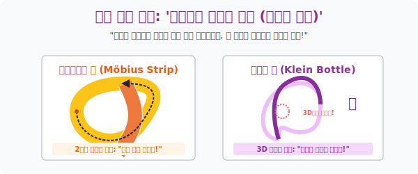

# 5. 방향성이 사라진 괴물들: '뫼비우스의 띠와 클라인 병'

## [도입부] 학습 목표 (Learning Objectives)
- 인류가 가지고 있던 "세상 모든 물체에는 겉과 속(안과 밖) 이 분리되어 존재한다" 라는 상식을 완전히 박살 내는 위상공간의 기형아, **비가향 곡면(Non-orientable Surface)** 의 공포를 체험합니다.
- 긴 종이 띠를 한 번 비틀어 붙여 만든 2차원 평면의 트릭 '뫼비우스의 띠(Möbius Strip)' 와, 그 사상을 3차원/4차원 공간 튜브로 확대시킨 영겁의 플라스크 '클라인 병(Klein Bottle)' 의 구조를 비교합니다.
- 파이썬(Python)으로 $x, y, z$ 좌표계의 벽(경계) 을 순간 이동(포탈) 시켜버리는 팩맨(Pac-Man) 스크린 룰을 코딩하여, 뚫고 나간 방향이 상하 반전되어 들어오는 **위상학적 버그맵 체계**를 렌더링합니다.

---

## 1. 뫼비우스 개미의 영원한 걷기

당신의 눈앞에 커다란 훌라후프(원기둥의 일부) 모양의 넓은 종이 띠가 있습니다. 
당신이 개미를 파란색 페인트통에 빠뜨린 뒤 종이 띠의 '바깥쪽 면' 에 올려놓았습니다. 개미가 띠를 따라 앞만 보고 무한히 걷는다고 칩시다. 
훌라후프 구조에서는 파란 개미가 띠의 **'바깥쪽'** 만 빙글빙글 돌며 새파랗게 칠할 뿐, **'안쪽 면'** 은 영원히 깨끗한 흰색으로 남습니다. 안과 밖이 완벽히 단절(구별) 되어 있기 때문입니다. 

그런데 종이 띠를 붙일 때 **딱 한 번 $180^\circ$ 꼬아서(비틀어서)** 붙이면 상황이 반전됩니다. (이것이 뫼비우스의 띠!)
똑같이 파란 개미를 바깥(이라고 믿는) 면에 올려놓고 걷게 합니다. 개미는 모서리를 넘어가지 않고 그저 앞만 보고 직진했습니다.
놀랍게도 한 바퀴를 돌고 나자, 개미는 자기도 모르는 사이에 띠의 **'안쪽 면'** 을 걷고 조우하게 됩니다! 다시 한 바퀴를 더 돌면 원래의 출발점으로 돌아옵니다.

수학적으로 이것은 "면이 두 개(안/밖) 가 아니라, 사실 하나다(단면)" 라는 뜻입니다. 
우주를 걷고 걷고 직진만 했는데, 어느새 우주의 바깥 껍질에 도달했다가 다시 안쪽으로 들어오는 미친 기하학, 바로 **'방향성(안/밖) 이 파괴된 우주(Non-orientable)'** 의 탄생입니다.



<br>

## 2. 4차원 우주의 도자기: 클라인 병(Klein Bottle)

뫼비우스의 띠가 '2차원 띠(면)' 를 3차원 공간에서 살짝 비틀어 만든 마술이라면, 이 똑같은 짓을 '3차원 튜브(공간)' 전체에다 걸어버리면 어떻게 될까요?
그것이 바로 **클라인 병(Klein Bottle)** 입니다. 

원기둥 튜브의 한쪽 끝을 길게 늘려서, 다른 한쪽 입구로 꽂아 넣습니다. 그런데 그냥 꽂으면 튜브 형태의 도넛(Torus) 이 될 뿐입니다. 클라인 병의 조건은:
> **"튜브의 한쪽 목을 쭈욱 반대로 비틀어서, 자기 자신의 옆구리 벽을(4차원 공간으로 통과해) 뚫고 들어가 바닥 구멍과 결합해라!"**

이렇게 되면 당신이 병의 '바깥쪽 껍질' 벽을 타고 기어가다가 목구멍 속으로 미끄러져 들어갑니다. 계속 튜브 터널을 타고 전진하는데, 터널을 빠져나오는 순간 당신은 **병의 '가장 깊은 내부 바닥' 에 도달해 있습니다.** 
뫼비우스의 띠 입체 버전입니다. **병의 안과 밖이 하나로 융합되어 물을 부으면 밖으로 흐르고, 밖으로 흐르는 물이 안을 채웁니다.**

우리가 현실(3차원) 에서 유리로 이 병을 만들면 어쩔 수 없이 튜브가 유리 벽(옆구리) 을 **물리적으로 뚫고 지나가는 교차점(Self-intersection)** 이 생깁니다. 하지만 고등 위상수학(4차원 우주) 에서는 벽이 겹치지 않고 온전하게 자기 자신과 꼬여서 합체된 완전 무결의 셰이프(Shape) 로 계산됩니다.

---

## 3. 💻 파이썬(Python) 뫼비우스 월드 시뮬레이터 (공간 순간 이동)

오락실 '팩맨(Pac-Man)' 게임에서 캐릭터가 화면 왼쪽 끝 밖으로 나가면, 오른쪽 끝에서 튀어나옵니다(이것은 평범한 원통 우주).
만약 화면 오른쪽 끝의 위에서 나갔는데, 왼쪽 끝의 **아래(상하가 반전되어)** 에서 튀어나오게 코딩한다면? 당신은 플랫포머 게임의 맵 우주를 뫼비우스의 띠로 구부려버린 창조자가 됩니다!

### 🐍 파이썬 예제: 뫼비우스 공간 순간 포탈(Wrap-around) 로직

```python
print("--- 👾 레트로 기하학 렌더링: 뫼비우스 공간 엔진(Pac-Man) 가동 ---")

# 게임 맵(우주) 의 크기 설정: y축(위아래 고도 높이) 은 -10.0 ~ 10.0
# x축(수평) 으로 100을 넘어가면 반대편(0) 으로 순간 이동(포탈 타기)

class MobiusWorld:
    def __init__(self, start_y):
        self.y = start_y   # 현재 고도 상태 (양수면 위 / 음수면 아래결)
        self.x = 0         # 앞으로 직진하는 가로 위치
        
    def move_forward(self, distance):
        print(f" 🐜 [직진 보행] {distance} 단위만큼 앞만 보고 전진합니다...")
        self.x += distance
        
        # 뫼비우스 포탈 시스템 체크!
        if self.x >= 100:
            print(" ⚠️ [경고] 세계의 끝자락(x=100) 도달! 포탈 왜곡 효과 발동!")
            # 1. 위치는 반대편 처음으로 롤백 (원기둥 특성)
            self.x = self.x - 100
            
            # 2. [뫼비우스의 핵] 비틀림 때문에 고도(위아래 부호)가 반전 당함!!
            self.y = self.y * -1 
            print(" 🌀 [공간 반전] 종이가 180도로 꼬여 있어서 위/아래(안/밖)가 역전당했습니다!")

# 테스트 시작
ant = MobiusWorld(start_y=5.0)  # 초기 셋팅: 개미는 띠 표면 위(양수 고도 5m) 에 스폰됨

print(f" [시작 상태] 개미 위치: x={ant.x}, y={ant.y} (안쪽 면)")
print("-" * 50)

# 한 바퀴를 돈다
ant.move_forward(105) 
print(f" [1회전 후 상태] 개미 위치: x={ant.x}, y={ant.y} (바깥 면으로 뒤집힘!!!)")

print("-" * 50)
# 또 한 바퀴를 더 돈다!
ant.move_forward(100)
print(f" [2회전 후 상태] 개미 위치: x={ant.x}, y={ant.y} (다시 안쪽 원상 복구!!!)")

# 결과창:
# --- 👾 레트로 기하학 렌더링: 뫼비우스 공간 엔진(Pac-Man) 가동 ---
#  [시작 상태] 개미 위치: x=0, y=5.0 (안쪽 면)
# --------------------------------------------------
#  🐜 [직진 보행] 105 단위만큼 앞만 보고 전진합니다...
#  ⚠️ [경고] 세계의 끝자락(x=100) 도달! 포탈 왜곡 효과 발동!
#  🌀 [공간 반전] 종이가 180도로 꼬여 있어서 위/아래(안/밖)가 역전당했습니다!
#  [1회전 후 상태] 개미 위치: x=5, y=-5.0 (바깥 면으로 뒤집힘!!!)
# --------------------------------------------------
#  🐜 [직진 보행] 100 단위만큼 앞만 보고 전진합니다...
#  ⚠️ [경고] 세계의 끝자락(x=100) 도달! 포탈 왜곡 효과 발동!
#  🌀 [공간 반전] 종이가 180도로 꼬여 있어서 위/아래(안/밖)가 역전당했습니다!
#  [2회전 후 상태] 개미 위치: x=5, y=5.0 (다시 안쪽 원상 복구!!!)
```

이 "y 좌표 배열 부호 반전(-1 다중 곱셈)" 스크립트는 컨베이어 벨트에 부착된 뫼비우스의 띠 모양 연마기가 벨트 양면을 골고루 닳게 만들어 마모 수명을 2배로 연장시킬 때 돌아가는 산업용 기계공학 수학 코드입니다.

---

## [결론] 학습 정리 (Summary)

1. **뫼비우스의 띠(Möbius Strip)**: 직사각형 띠를 180도 꼬아서 붙여 만든 2차원 평면 모델로, 겉과 속(안/밖) 면 2개가 사실은 끊임없이 이어진 1개의 면으로 통일된 기하학적 돌연변이입니다.
2. **클라인 병(Klein Bottle)**: 뫼비우스의 단면 현상을 3차원 입체 파이프에 적용한 것으로, 물체의 내부 공간과 외부 표면의 구별이 사라져 영원히 한곳으로 이어지는 4차원 우주의 도면입니다.
3. 이 괴기스러운 위상 구조들은 물리적 현실에서는 자기 관통(Self-Intersection) 이나 겹침을 요구하지만, 게임이나 프로그래밍 소프트웨어 아키텍처 모델(토폴로지 데이터맵) 에서는 그저 `* $(-1)$` 역연산 배열 포탈 스크립트 한 줄로 손쉽게 창조되는 데이터베이스의 파라미터입니다.
