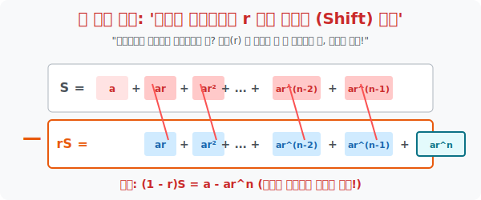

# 2. 융단폭격과 연쇄 폭발: '등비수열의 합'

## [도입부] 학습 목표 (Learning Objectives)
- $2 + 4 + 8 + 16 + \dots$ 과 같이 괴물처럼 기하급수적으로 부풀어 오르는 등비수열의 덧셈을 풀기 위해, 원본 배열 전체에 공비 $r$ 을 한 번 더 곱해서 **'한 칸 우측으로 밀어버린 섀도 카피(Shadow Copy)'** 를 창조합니다.
- 복제된 $rS$ 배열을 원본 $S$ 배열 바로 밑에 배치하고 마이너스($-$) 뺄셈 폭탄을 터뜨리면, 겉보기엔 무한해 보이던 중간 몸통 항들이 서로를 완전히 소멸(Cancel-out) 시키는 카타르시스를 경험합니다.
- 파이썬(Python)의 `pop()` 과 `insert()` 배열 밀어내기 구조를 통해, 거대한 메모리 쓰레기통을 단 2개의 항($a$ 와 $ar^n$) 만 남기고 진공 청소하는 렌더링을 체험합니다.

---

## 1. 가우스의 마법이 통하지 않는 상대

전 시간에 가우스는 '순서 뒤집어 접기' 신공으로 덧셈의 노예들을 해방시켰습니다. 
그런데 우주 바이러스처럼 증식하는 **등비수열(Geometric Sequence)** 앞에서는 이 치트키가 먹히지 않습니다.
만약 $S = 1 + 2 + 4 + 8 + 16$ 을 반대로 뒤집어서 더하면?
- 1열: $1 + 16 = 17$
- 2열: $2 + 8 = 10$
- 3열: $4 + 4 = 8$
높이가 들쑥날쑥 제멋대로입니다! 덧셈 꼬리표가 붙은 등비수열은 역순으로 접어봤자 직사각형이 만들어지지 않습니다.

이 무지막지한 지수승($r^n$) 항들을 박살 내기 위해, 수학자들은 완전히 새로운 개념의 해킹 시스템인 **'시프트 폭파(Shift & Eliminate)'** 를 창안해 냅니다.

<br>

## 2. 한 칸 옆으로 밀어서 몸통을 잘라내다

우주 돌연변이 합, $S$ 를 선언해 봅시다.
$S = a + ar + ar^2 + ar^3 + \dots + ar^{n-1}$

**[Step 1. 섀도 카피 생성 (Shift Right)]**
핵심 아이디어: "양변에 공통으로 곱해지는 배수 $r$(공비) 을 한 번 싹 다 곱해버리자!"
모든 항이 $r$ 을 먹고 진화하면서 몸집이 한 칸씩 **오른쪽으로 밀려납니다.**
$rS = \phantom{a + \text{ }} ar + ar^2 + ar^3 + \dots + ar^{n-1} + \mathbf{ar^n}$

**[Step 2. 위에서 아래를 뺀다 (빼기 폭탄 투하!)]**
이제 두 식을 수직으로 나란히 놓고, 원본 $S$ 에서 $rS$ 를 통째로 뺍니다 ($S - rS$).
무슨 일이 일어날까요? **소름 돋는 연쇄 폭발(Cancel-Out) 이 터집니다!**
가운데 길고 길었던 울퉁불퉁한 허리 항들($ar, ar^2, ar^3 \dots$) 이 위아래가 똑같기 때문에 모조리 $0$ 이 되어 증발합니다!

남는 생존자는 단 두 명:
- 위쪽 끝의 **맨 처음 외톨이 ($a$)**
- 아래쪽 끝의 **우측으로 삐져나간 괴물 ($ar^n$)**

결론: $(1 - r)S = a - ar^n$



> **[등비수열의 합 공식 도출]**
> $(1 - r)S = a(1 - r^n)$ 이므로, $S$ 를 구하기 위해 양변을 $(1 - r)$ 로 나눕니다.
> **$\mathbf{S = \frac{a(1 - r^n)}{1 - r}}$**  (또는 **$\frac{a(r^n - 1)}{r - 1}$**)
> (무한대로 막노동을 해야 할 식을 곱셈 딱 한 번으로 끝내버렸습니다!)

---

## 3. 💻 파이썬(Python) 배열 시프트(Shift) 와 상수 시간 지우개

컴퓨터 메모리 상에 `[2, 4, 8, 16, 32]` 같은 데이터를 쌓아 두고 빼는 시연을 통해, 중간 항들이 어떻게 완전히 휘발하는지를 파이썬 배열 인덱싱으로 연출합니다. 

### 🐍 파이썬 예제: 등비수열 시프트 감산(Subtraction) 엔진

```python
print("--- 💥 데이터 렌더링 코어: 배열 시프트 캔슬 스크립트 가동 ---")

first_term = 3      # 첫 항 a = 3
common_ratio = 2    # 공비 r = 2
n = 5               # 5개의 항

# 1. 뼈대 배열 생성 S
# [3, 6, 12, 24, 48]
S_array = [first_term * (common_ratio ** i) for i in range(n)]

# 2. r을 곱해 섀도 배열 생성 rS
# [6, 12, 24, 48, 96]
rS_array = [x * common_ratio for x in S_array]

print(f" [원본 우주 S]   :       {S_array}")
print(f" [(r)증폭 우주 rS]:           {rS_array}")
print("-" * 50)
print(" 🚀 위 배열에서 아래 배열을 수직으로 뺍니다 (S - rS)!")

# 3. 가운데 교집합을 날려버리는 제거 로직
# 남는 건 S배열의 맨 앞놈, 그리고 뺄셈 부호를 맞은 rS배열의 맨 뒷놈
leftover_from_S = S_array[0]          # 3
leftover_from_rS = -rS_array[-1]      # -96

print(f"    -> [펑!] 중간의 6, 12, 24, 48 은 모두 파괴되었습니다.")
print(f"    -> 생존 데이터: S의 머리[{leftover_from_S}] 와 rS의 꼬리[{leftover_from_rS}]")

# 방정식: (1 - r) * S = a - ar^n
final_sum = (leftover_from_S + leftover_from_rS) // (1 - common_ratio)

print("-" * 50)
print(f" 🏁 방정식 연산 종료. 1차원 합결과: S = {final_sum}")

# 진짜 더해본 결과 검증 (3 + 6 + 12 + 24 + 48 = 93)
assert final_sum == sum(S_array)

# 결과창:
# --- 💥 데이터 렌더링 코어: 배열 시프트 캔슬 스크립트 가동 ---
#  [원본 우주 S]   :       [3, 6, 12, 24, 48]
#  [(r)증폭 우주 rS]:           [6, 12, 24, 48, 96]
# --------------------------------------------------
#  🚀 위 배열에서 아래 배열을 수직으로 뺍니다 (S - rS)!
#     -> [펑!] 중간의 6, 12, 24, 48 은 모두 파괴되었습니다.
#     -> 생존 데이터: S의 머리[3] 와 rS의 꼬리[-96]
# --------------------------------------------------
#  🏁 방정식 연산 종료. 1차원 합결과: S = 93
```

이 시프트 감산법(Shift & Subtract) 은 신호 처리(Signal Processing) 에서 배경 백색 소음(Noise) 마진을 복사본과 위상 차이를 두어 더해 상쇄시키는 '노이즈 캔슬링(Noise Canceling)' 이어폰의 핵심 수학 알고리즘이 됩니다!

---

## [결론] 학습 정리 (Summary)

1. **지수 증가의 공포**: 등비수열의 합은 덧셈만으로는 절대로 블록 단위로 끼워 맞춰지지 않는 다루기 까다로운 짐승입니다.
2. **배수 시프트 (Shift)**: 양변에 똑같이 공비 $r$ 을 곱하면, 배열 전체의 서열 번호가 한 칸씩 뒤로 밀리면서 원본 배열과 몸통(가운데 항들) 이 완벽히 겹치는 섀도 카피가 창조됩니다.
3. **가운데 날리기 (Cancel-Out)**: 두 거대 우주식을 하나로 빼버리면 골치 아픈 무한 허리가 모조리 $0$ 으로 소멸하며, 오직 맨 앞의 찌꺼기 $a$ 와 맨 뒤의 찌꺼기 $ar^n$ 만 남아 단 한 줄의 강력한 공식을 선사합니다.
